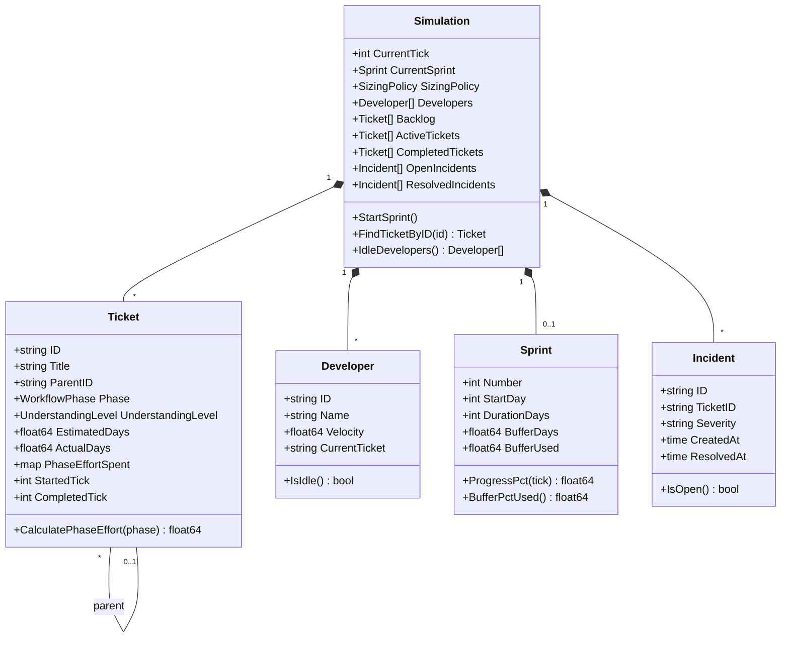
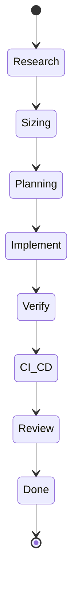
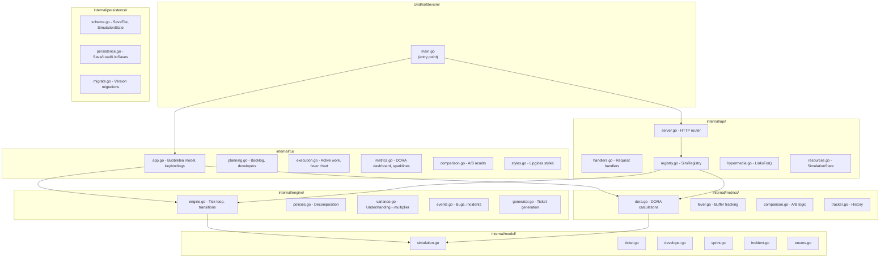
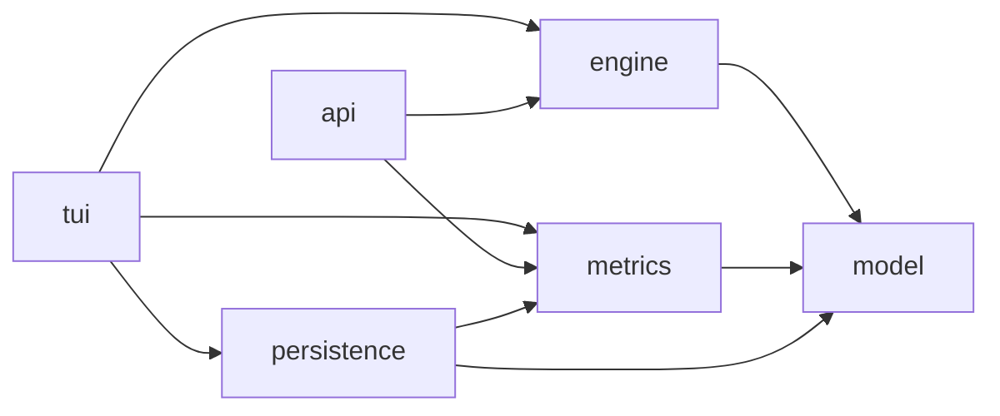
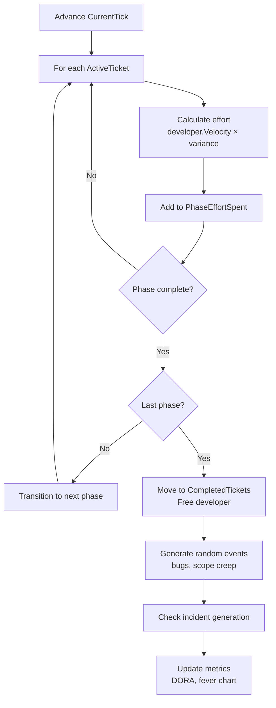
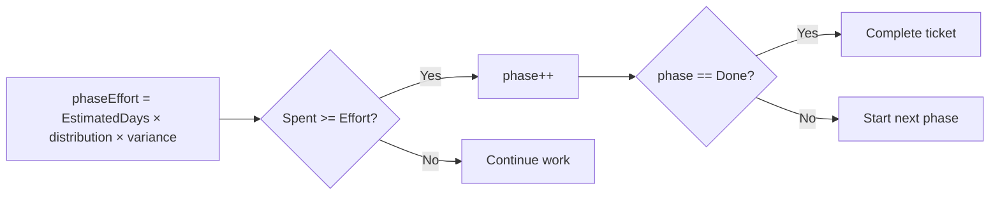
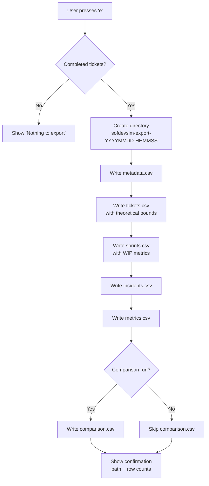
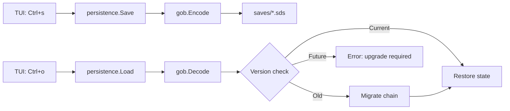
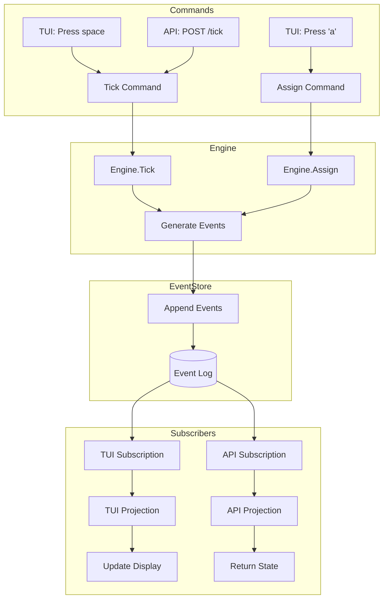

# Design Document

## Overview

### What This Simulation Does

The Software Development Simulation models an 8-phase ticket workflow to test competing theories about optimal ticket sizing:

- **DORA Research** suggests that batch size matters: tickets taking longer than one week correlate with worse delivery outcomes
- **TameFlow** argues that cognitive load (understanding level) is the real discriminant: uncertain work causes variance regardless of size

This simulation lets you run controlled experiments to see which approach produces better DORA metrics.

### The Hypothesis

| Policy | Rule | Theory |
|--------|------|--------|
| DORA-Strict | Decompose tickets > 5 days | Time-based ceiling reduces batch size |
| TameFlow-Cognitive | Decompose tickets with Low understanding | Reducing uncertainty improves predictability |
| Hybrid | Both conditions | Belt and suspenders |
| None | No decomposition | Baseline for comparison |

### Why This Matters

Sizing policy affects:
- **Lead Time** - How long from start to deploy?
- **Quality** - How many incidents per deploy?
- **Predictability** - Can we trust our estimates?

---

## Domain Model



### Workflow Phases



### Enumerations

**Understanding Levels:** Low | Medium | High

**Sizing Policies:** None | DORA-Strict | TameFlow-Cognitive | Hybrid

---

## Key Algorithms

### Variance Model (Core Hypothesis)

The variance model is the heart of the simulation. It maps understanding level to outcome predictability:

| Understanding | Multiplier Range | Meaning |
|---------------|------------------|---------|
| High | 0.95 - 1.05x | Predictable, minimal surprise |
| Medium | 0.80 - 1.20x | Some unknowns, moderate variance |
| Low | 0.50 - 1.50x | High uncertainty, frequent surprise |

**Implementation:** Each tick, actual effort = estimated effort × random multiplier from the range above.

### Phase Effort Distribution

Total ticket effort is distributed across phases:

| Phase | % of Total Effort |
|-------|-------------------|
| Research | 5% |
| Sizing | 2% |
| Planning | 3% |
| Implement | 55% |
| Verify | 20% |
| CI/CD | 5% |
| Review | 10% |
| Done | 0% |

### Decomposition Algorithm

When a ticket is decomposed:

1. **Children count:** 2-4 (weighted 40%/40%/20%)
2. **Children sum:** 90-110% of parent estimate (decomposition reveals scope)
3. **Each child:** Varies ±30% from base estimate
4. **Understanding improves:** 60% chance each child has better understanding than parent

### Incident Generation

Incidents are generated when tickets complete, based on understanding:

| Understanding | Base Fail Rate |
|---------------|----------------|
| High | 5% |
| Medium | 12% |
| Low | 25% |

**Large ticket multiplier:** Tickets > 5 days have 1.5x incident rate.

### DORA Metrics Calculation

| Metric | Formula | Better |
|--------|---------|--------|
| Lead Time | Average of (CompletedTick - StartedTick) | Lower |
| Deploy Frequency | Deploys in last 7 ticks ÷ 7 | Higher |
| MTTR | Average of (ResolvedAt - CreatedAt) for incidents | Lower |
| Change Fail Rate | Total incidents ÷ Total deploys | Lower |

---

## Architecture



### Package Dependencies



**Dependency Rule:** Packages only depend downward. Model has no dependencies.

### TUI Header Bar

```
[Planning] [Execution] [Metrics] [Comparison]  Policy: DORA-Strict | RUNNING | Day 42 | Backlog: 5 | Done: 12 | Seed 1234567890
```

| Element | Description |
|---------|-------------|
| View tabs | Current view highlighted |
| Policy | Active sizing policy |
| Status | RUNNING or PAUSED |
| Day | Current simulation tick |
| Backlog | Count of tickets awaiting assignment |
| Done | Count of completed tickets |
| Seed | RNG seed for reproducibility |

---

## Data Flow

### Tick Loop



### Phase Transition Logic



### Comparison Mode

1. Generate backlog with seed N
2. Clone simulation state
3. Run Simulation A with DORA-Strict for 3 sprints
4. Run Simulation B with TameFlow-Cognitive for 3 sprints (same seed)
5. Compare final DORA metrics
6. Declare winner based on metric wins (4 metrics, majority wins)

---

## Key Design Decisions

| Decision | Rationale |
|----------|-----------|
| Tick = 1 day | Simplifies mental model; matches sprint planning |
| 8 phases | Based on Unified Workflow Rubric from industry research |
| Variance by understanding | Core hypothesis: uncertainty causes unpredictability |
| Seed-based RNG | Enables reproducible experiments |
| Gob-based persistence | Versioned binary saves for research workflows (see CLAUDE.md) |
| Bubbletea TUI | Elm architecture, well-maintained, ntcharts compatible |

---

## Data Export

### Purpose

Enable external validation of simulation hypotheses and teaching of TOC/DORA principles. The export provides raw data for:

| Goal | How Export Supports It |
|------|------------------------|
| **Teaching TOC** | sprints.csv: buffer_pct, fever_status, max_wip, avg_wip |
| **DORA integration** | metrics.csv: all 4 metrics; incidents.csv: MTTR detail |
| **Unified Ticket Workflow Rubric validation** | tickets.csv: 8 phase timing columns enable testing effort distribution |
| **Sizing hypothesis** | comparison.csv + tickets.csv: variance by understanding, policy comparison |

### Output Structure

```
sofdevsim-export-20260103-143052/
├── metadata.csv      # Seed, policy, export timestamp, phase distribution
├── tickets.csv       # Per-ticket data with theoretical validation + phase timing
├── sprints.csv       # Per-sprint buffer/flow/WIP data (TOC concepts)
├── incidents.csv     # Per-incident MTTR detail
├── metrics.csv       # DORA metrics summary
└── comparison.csv    # Policy A vs B results (if comparison run)
```

### CSV Schemas

```csv
# metadata.csv - Reproducibility and context
seed,policy,sprints_run,export_timestamp,simulation_version,phase_effort_distribution

# tickets.csv - Core hypothesis validation + 8-phase effort distribution
ticket_id,title,understanding,estimated_days,actual_days,variance_ratio,expected_var_min,expected_var_max,within_expected,policy,sprint_number,started_tick,completed_tick,lead_time_days,phase_research_days,phase_sizing_days,phase_planning_days,phase_implement_days,phase_verify_days,phase_cicd_days,phase_review_days,phase_done_days

# sprints.csv - TOC concepts (buffer, flow, WIP)
sprint_number,duration_days,buffer_days,buffer_used,buffer_pct,fever_status,tickets_started,tickets_completed,incidents_generated,max_wip,avg_wip

# incidents.csv - MTTR detail
incident_id,ticket_id,severity,created_tick,resolved_tick,mttr_days,sprint_number

# metrics.csv - DORA integration
policy,lead_time_avg,lead_time_stddev,deploy_frequency,mttr_avg,change_fail_rate,total_tickets,total_incidents

# comparison.csv - Sizing hypothesis test
seed,sprints_run,metric,dora_strict_value,tameflow_value,winner,difference,difference_pct
```

### Theoretical Bounds

For hypothesis validation, tickets.csv includes expected variance bounds:

| Understanding | expected_var_min | expected_var_max |
|---------------|------------------|------------------|
| High | 0.95 | 1.05 |
| Medium | 0.80 | 1.20 |
| Low | 0.50 | 1.50 |

The `within_expected` column is `true` if `expected_var_min <= variance_ratio <= expected_var_max`.

### Phase Effort Distribution

Stored in metadata.csv as JSON for Unified Ticket Workflow Rubric validation:

```json
{"research":0.10,"sizing":0.05,"planning":0.10,"implement":0.40,"verify":0.15,"cicd":0.05,"review":0.10,"done":0.05}
```

Compare actual `phase_*_days` columns against `estimated_days × distribution` to validate the 8-phase model.

### Export Algorithm



---

## Persistence

Enables pause/resume for long-running experiments. Full state is captured including metrics history.

### Architecture



### Design Decisions

| Decision | Rationale |
|----------|-----------|
| Gob format | Go-native, efficient binary, handles all model types |
| Schema versioning | Forward compatibility for research data |
| Auto-migration | Seamless upgrades without user intervention |
| Most-recent load | Simple UX for common case (Ctrl+o loads latest) |

For API details and keybindings, see CLAUDE.md § Persistence.

---

## HTTP API

Enables programmatic simulation testing without TUI interaction. Supports UC9 (Test Simulation Behavior Programmatically).

### Design: HATEOAS

The API follows REST with hypermedia (HATEOAS). Each response includes `_links` that tell the client what actions are available based on current state.

**Why HATEOAS for testing:**

| Benefit | How It Helps Testing |
|---------|---------------------|
| Self-verifying | Link presence/absence proves state correctness |
| Discoverable | Agent follows links, no hardcoded URLs |
| State-driven | Links change when state changes (sprint ends → tick link disappears) |

### Endpoints

| Method | Path | Purpose | Links Returned |
|--------|------|---------|----------------|
| GET | `/` | Entry point | `simulations` |
| POST | `/simulations` | Create simulation | `self`, `start-sprint` |
| GET | `/simulations/{id}` | Get simulation state | `self`, `tick` or `start-sprint` |
| POST | `/simulations/{id}/sprints` | Start sprint | `self`, `tick` |
| POST | `/simulations/{id}/tick` | Advance one tick | `self`, `tick` or `start-sprint` |
| POST | `/simulations/{id}/assignments` | Assign ticket to developer | `self`, `tick` |

### Example Response (HAL+JSON style)

```json
{
  "id": "sim-42",
  "currentTick": 5,
  "sprintActive": true,
  "backlogCount": 8,
  "sprint": {
    "number": 1,
    "startDay": 1,
    "durationDays": 10,
    "bufferPctUsed": 0.23
  },
  "_links": {
    "self": "/simulations/sim-42",
    "tick": "/simulations/sim-42/tick",
    "assign": "/simulations/sim-42/assignments"
  }
}
```

**Link transitions:**
- Sprint ends → `tick` disappears, `start-sprint` appears
- Backlog empty → `assign` disappears (nothing to assign)

### Assignment Request

```json
POST /simulations/{id}/assignments

// Explicit assignment
{ "ticketId": "TKT-001", "developerId": "dev-1" }

// Auto-assign to first idle developer
{ "ticketId": "TKT-001" }
```

**Success:** Returns updated simulation state (same format as GET).

**Errors:**
- 400: Ticket not in backlog
- 400: Developer not found
- 400: Developer is busy
- 400: No idle developers (auto-assign only)

### Architecture: Value Semantics (No Mutex)

```
┌─────────────────────────────────────────────────┐
│                   main.go                       │
├─────────────────────────────────────────────────┤
│  ┌─────────────┐          ┌─────────────────┐   │
│  │   TUI       │          │    HTTP API     │   │
│  │ (Bubbletea) │          │   (net/http)    │   │
│  └──────┬──────┘          └────────┬────────┘   │
│         │                          │            │
│         ▼                          ▼            │
│  ┌─────────────┐          ┌─────────────────┐   │
│  │ TUI's own   │          │  SimRegistry    │   │
│  │ Simulation  │          │ map[id]SimInst  │   │
│  └─────────────┘          └─────────────────┘   │
│                                    │            │
│                           ┌────────┴────────┐   │
│                           ▼                 ▼   │
│                    ┌───────────┐     ┌───────────┐
│                    │ SimInst 1 │     │ SimInst 2 │
│                    │ (seed 42) │     │ (seed 99) │
│                    └───────────┘     └───────────┘
└─────────────────────────────────────────────────┘
```

**Why no mutex?**

1. Each API simulation is independent (POST `/simulations` creates new instance)
2. TUI doesn't share state with API (separate simulations)
3. HTTP is request-per-goroutine (within handler, exclusive access)
4. No concurrent access to same simulation = no mutex needed

### SimRegistry

```go
// SimRegistry manages independent simulation instances
type SimRegistry struct {
    instances map[string]*SimInstance
}

// SimInstance owns its simulation - value semantics internally
type SimInstance struct {
    id      string
    sim     model.Simulation  // Value, not pointer
    engine  engine.Engine
    tracker metrics.Tracker
}
```

### Startup Sequence

1. Create SimRegistry (empty, API creates simulations on demand)
2. Start HTTP server on configurable port in goroutine
3. Run TUI on main goroutine (Bubbletea requirement)
4. Process exit terminates both (no graceful shutdown yet)

### Hypermedia Logic (Pure, Unit Testable)

```go
// LinksFor is pure: state → links (unit testable)
func LinksFor(state SimulationState) map[string]string {
    links := map[string]string{
        "self": "/simulations/" + state.ID,
    }
    if state.SprintActive {
        links["tick"] = "/simulations/" + state.ID + "/tick"
        if state.BacklogCount > 0 {
            links["assign"] = "/simulations/" + state.ID + "/assignments"
        }
    } else {
        links["start-sprint"] = "/simulations/" + state.ID + "/sprints"
    }
    return links
}
```

This pure function enables unit testing of link logic without HTTP.

### Test Strategy (Khorikov Quadrants)

| Component | Quadrant | Complexity | Collaborators | Strategy |
|-----------|----------|------------|---------------|----------|
| `LinksFor()` | Domain | Medium | Few (state only) | Unit test heavily |
| `ToState()` | Trivial | Low | Few | Don't test |
| `resources.go` | Trivial | Low | Few | Don't test |
| HTTP handlers | Controller | Low | Many | ONE integration test |
| `SimRegistry` | Controller | Low | Many | Covered by integration |

**Domain (unit test):** `LinksFor()` - test all state→link rules (sprint active = tick link, sprint ended = start-sprint link)

**Controller (ONE integration test):** Full lifecycle test - create simulation, start sprint, tick until sprint ends, verify links change. HATEOAS link presence = correct behavior.

---

## Event Sourcing Architecture

### Overview

The simulation uses event sourcing to enable shared access between TUI and API. Instead of mutating state directly, the engine emits events. State is derived by replaying events through a projection.

```
Commands (Tick, Assign, Decompose)
    │
    ▼
┌─────────────────────────────────────────┐
│           Event Store                    │
│  (append-only log per simulation)        │
│                                          │
│  sim-1: [Created, SprintStarted, Tick,  │
│          Assigned, Tick, Completed...]   │
└─────────────────────────────────────────┘
    │
    ├──→ TUI (subscribes, projects state)
    └──→ API (subscribes, returns state)
```

### Why Event Sourcing?

| Benefit | How It Helps |
|---------|--------------|
| **Shared state** | TUI and API see same simulation via same event stream |
| **Audit trail** | Every action recorded; replay for debugging |
| **Decoupling** | No `p.Send()` coupling between engine and TUI |
| **Replay** | Recreate any historical state by replaying events |

Per Martin Fowler: "CQRS is suited to complex domains" - simulation qualifies.

### Event Types

```go
// Event is the base interface for all simulation events
type Event interface {
    SimulationID() string
    Timestamp() time.Time
    EventType() string
}

// Simulation lifecycle
type SimulationCreated struct {
    ID     string
    Seed   int64
    Policy model.SizingPolicy
}

// Sprint lifecycle
type SprintStarted struct {
    SprintNumber int
    StartDay     int
    DurationDays int
    BufferDays   float64
}

type SprintEnded struct {
    SprintNumber     int
    EndDay           int
    TicketsCompleted int
}

// Tick events
type Ticked struct {
    Day int
}

// Ticket events
type TicketAssigned struct {
    TicketID    string
    DeveloperID string
}

type TicketPhaseChanged struct {
    TicketID  string
    FromPhase model.WorkflowPhase
    ToPhase   model.WorkflowPhase
}

type TicketCompleted struct {
    TicketID   string
    ActualDays float64
}

type TicketDecomposed struct {
    ParentID  string
    ChildIDs  []string
}

// Incident events
type IncidentCreated struct {
    IncidentID string
    TicketID   string
    Severity   string
}

type IncidentResolved struct {
    IncidentID string
}
```

### EventStore Interface

```go
// EventStore provides append-only storage and subscription
type EventStore interface {
    // Append adds events to a simulation's stream
    Append(simID string, events ...Event) error

    // Replay returns all events for a simulation in order
    Replay(simID string) ([]Event, error)

    // Subscribe returns a channel that receives new events
    Subscribe(simID string) <-chan Event

    // Unsubscribe stops receiving events
    Unsubscribe(simID string, ch <-chan Event)
}
```

### Projection

The projection rebuilds simulation state from events:

```go
// Projection applies events to build current state
type Projection struct {
    sim     *model.Simulation
    tracker *metrics.Tracker
}

// Apply processes a single event, updating internal state
func (p *Projection) Apply(event Event) {
    switch e := event.(type) {
    case *SimulationCreated:
        p.sim = model.NewSimulation(e.Seed, e.Policy)
    case *SprintStarted:
        p.sim.CurrentSprint = &model.Sprint{
            Number:       e.SprintNumber,
            StartDay:     e.StartDay,
            DurationDays: e.DurationDays,
            BufferDays:   e.BufferDays,
        }
    case *Ticked:
        p.sim.CurrentTick = e.Day
    case *TicketAssigned:
        // Update ticket and developer state
    case *TicketCompleted:
        // Move ticket, update metrics
    // ... other event types
    }
}

// State returns the current projected state
func (p *Projection) State() *model.Simulation {
    return p.sim
}
```

### Data Flow with Event Sourcing



### TUI Integration

The TUI subscribes to events and uses `p.Send()` to inject them into Bubbletea's update loop:

```go
func (a *App) subscribeToEvents() {
    ch := a.store.Subscribe(a.simID)
    go func() {
        for event := range ch {
            a.program.Send(eventMsg{event})
        }
    }()
}

func (a *App) Update(msg tea.Msg) (tea.Model, tea.Cmd) {
    switch m := msg.(type) {
    case eventMsg:
        a.projection.Apply(m.event)
        return a, nil
    // ... other message handling
    }
}
```

### API Integration

The API rebuilds state from events on each request:

```go
func (h *Handler) GetSimulation(w http.ResponseWriter, r *http.Request) {
    events, _ := h.store.Replay(simID)
    projection := NewProjection()
    for _, e := range events {
        projection.Apply(e)
    }
    state := projection.State()
    // Return state as JSON with HATEOAS links
}
```

### Package Structure

```
internal/
├── events/
│   ├── types.go      # Event type definitions
│   ├── store.go      # EventStore interface + in-memory impl
│   └── projection.go # State projection from events
├── engine/
│   └── engine.go     # Modified to emit events
├── tui/
│   └── app.go        # Subscribe and project
└── api/
    └── handlers.go   # Replay and project
```

### Migration Strategy

1. Define event types (no breaking changes)
2. Implement EventStore with in-memory storage
3. Implement Projection
4. Modify engine to emit events (alongside existing mutations)
5. Wire TUI to subscribe
6. Wire API to replay
7. Remove direct state mutations (events become source of truth)
