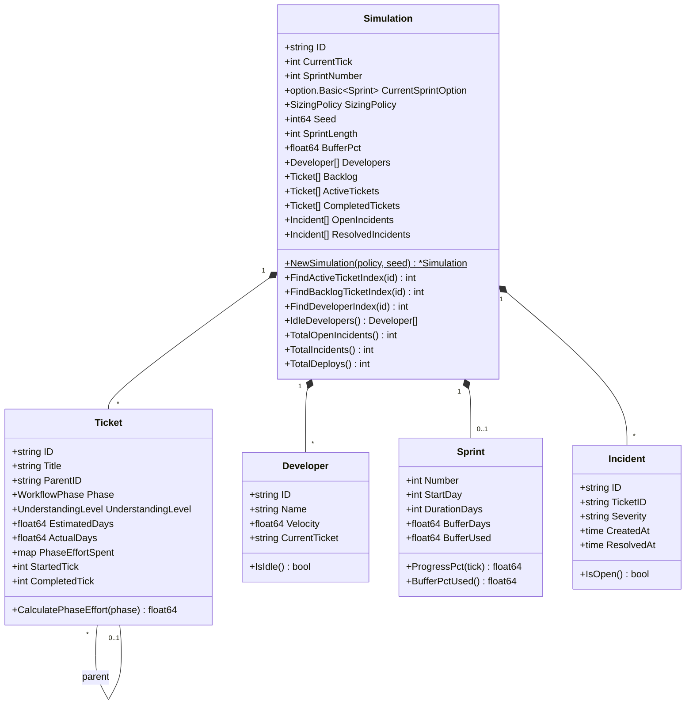
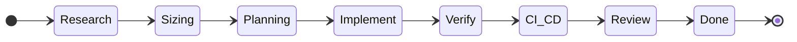
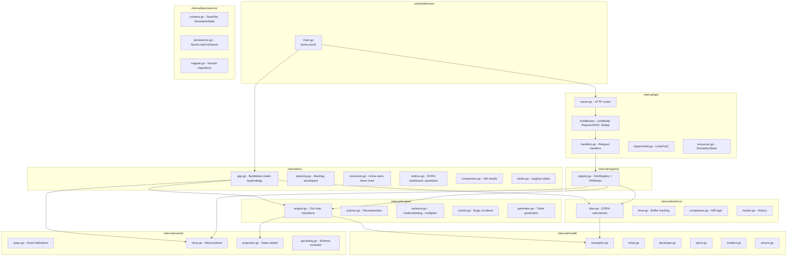
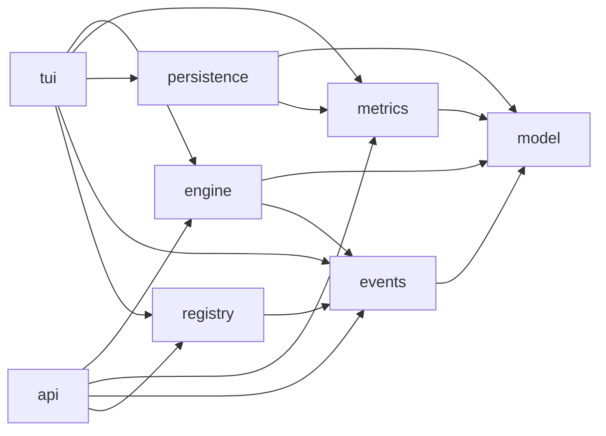
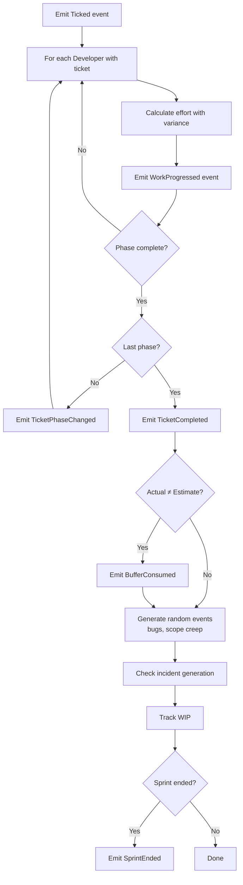
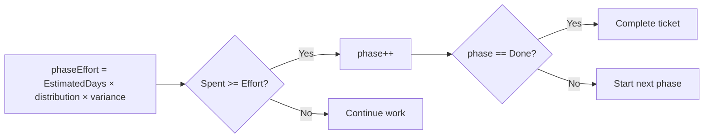
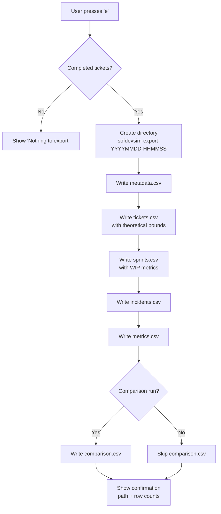
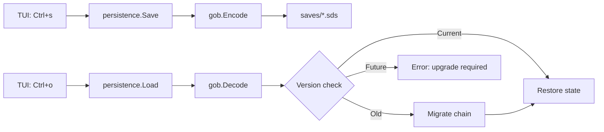
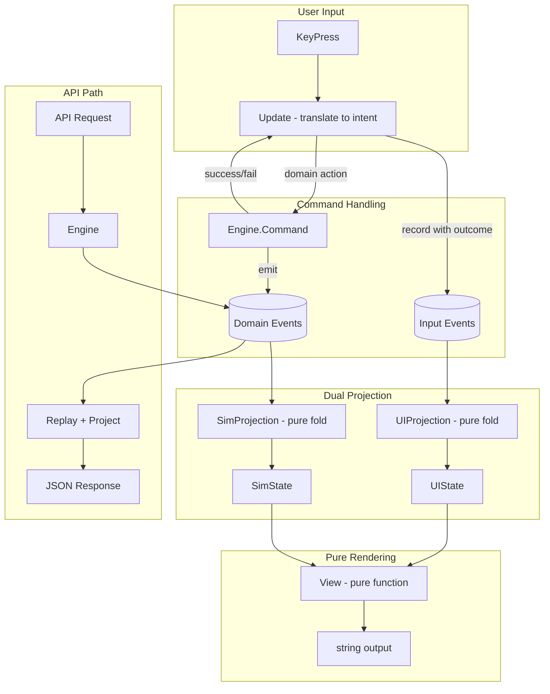
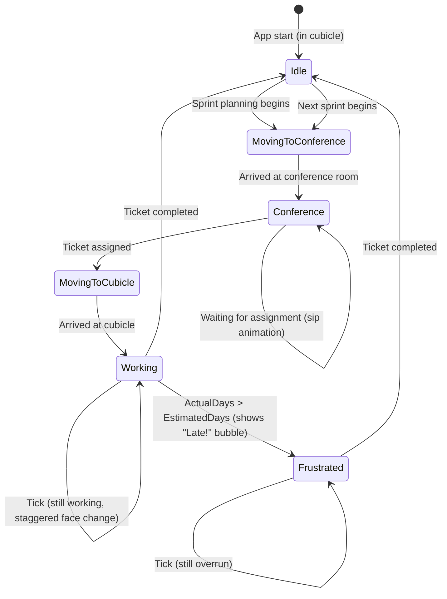

# Design Document

## Overview

### What This Simulation Does

The Software Development Simulation models an 8-phase ticket workflow with configurable sizing policies. It produces DORA metrics (lead time, deployment frequency, change failure rate) for policy comparison.

### Domain Context

The simulation tests competing theories about optimal ticket sizing:

| Policy | Rule | Theory |
|--------|------|--------|
| DORA-Strict | Decompose tickets > 5 days | Time-based ceiling reduces batch size |
| TameFlow-Cognitive | Decompose tickets with Low understanding | Reducing uncertainty improves predictability |
| Hybrid | Both conditions | Belt and suspenders |
| None | No decomposition | Baseline for comparison |

### Why This Matters

Sizing policy affects:
- **Lead Time** - How long from start to deploy?
- **Quality** - How many incidents per deploy?
- **Predictability** - Can we trust our estimates?

---

## Conceptual Model

**Scope:** Single-aggregate architecture. An **aggregate** is a self-contained unit that receives commands, enforces business rules, and emits events (ES Guide §20). Each simulation instance is one aggregate—commands operate on one simulation at a time, and everything inside stays consistent together. No cross-simulation coordination needed; this is the simplest event-sourcing setup.

### How State Works in This Simulation

Traditional applications store state directly: when you change something, you update a variable or database record. This simulation takes a different approach borrowed from accounting and version control—we store *what happened* rather than *what is*.

Think of a bank account. You could store just the current balance ($1,234), but banks don't do that. They store every transaction: deposit $500, withdraw $100, deposit $834. The balance is computed by replaying the transactions. This is **event sourcing** (see ES Guide §6).

### Events: The Source of Truth

An **event** is an immutable fact about something that happened: "Developer Alice was assigned to ticket TKT-42" or "Sprint 3 ended with 12 tickets completed." Events are never modified or deleted—they're historical records.

The simulation stores these events in sequence. To know the current state (who's working on what, which tickets are done), we replay the events from the beginning and compute the answer. This replay process uses a **projection**—both a function that transforms events into state, and a persistent read model optimized for queries. Multiple projections can exist, each serving different query patterns (ES Guide §8).

### Why This Matters

Event sourcing enables several things this simulation needs:

- **Shared access**: The TUI and HTTP API can both observe the same simulation by watching the same event stream
- **Reproducibility**: Same seed + same commands = same event sequence = same outcome
- **Debugging**: Every state change has a recorded cause

### The Engine and Mutations

The simulation separates *what data looks like* from *how it changes*. This follows the Actions/Calculations/Data taxonomy from functional programming (FP Guide §3).

**Pure Data types** (like `Simulation`, `Ticket`, `Developer`) are immutable structures with query methods only—they describe state but never change it. When you need a modified version, you create a new copy (copy-on-write). This discipline is what makes reproducibility possible: immutable data plus deterministic calculations means replaying the same events always yields the same state.

**Engine** produces events when you invoke commands:

```
engine.Tick()  →  emits [Ticked, WorkProgressed, TicketCompleted, ...]
```

**Projection** rebuilds state by replaying events—a pure calculation:

```
projection.Apply(events)  →  current Simulation state
```

Commands flow through Engine; queries read from Projection. This separation is CQRS (ES Guide §1-2).

### Reading the Domain Model

With this context, the diagrams below make more sense. When you see a note like "Simulation is a pure Data type with query methods only—mutation happens via Engine," it means:

1. `Simulation` holds state but has no methods that change it (immutable)
2. To change anything, go through `Engine`, which emits events
3. The events flow through `Projection` to produce new state

---

## Domain Model



> **Note:** Simulation is a pure Data type with query methods only. Mutation happens via Engine, which emits events that update state through Projection.

### Workflow Phases



### Enumerations

**Understanding Levels:** Low | Medium | High

**Sizing Policies:** None | DORA-Strict | TameFlow-Cognitive | Hybrid

---

## Key Algorithms

### Variance Model (Core Hypothesis)

The variance model is the heart of the simulation. It maps understanding level to outcome predictability:

| Understanding | Multiplier Range | Meaning |
|---------------|------------------|---------|
| High | 0.95 - 1.05x | Predictable, minimal surprise |
| Medium | 0.80 - 1.20x | Some unknowns, moderate variance |
| Low | 0.50 - 1.50x | High uncertainty, frequent surprise |

**Implementation:** Each tick, actual effort = estimated effort × random multiplier from the range above. The multiplier calculation is pure (Calculation); the RNG call that selects a value is an Action. Together they form an Action per FP Guide §4.

### Phase Effort Distribution

Total ticket effort is distributed across phases:

| Phase | % of Total Effort |
|-------|-------------------|
| Research | 5% |
| Sizing | 2% |
| Planning | 3% |
| Implement | 55% |
| Verify | 20% |
| CI/CD | 5% |
| Review | 10% |
| Done | 0% |

### Decomposition Algorithm

When a ticket is decomposed:

1. **Children count:** 2-4 (weighted 40%/40%/20%)
2. **Children sum:** 90-110% of parent estimate (decomposition reveals scope)
3. **Each child:** Varies ±30% from base estimate
4. **Understanding improves:** 60% chance each child has better understanding than parent

### Incident Generation

Incidents are generated when tickets complete, based on understanding:

| Understanding | Base Fail Rate |
|---------------|----------------|
| High | 5% |
| Medium | 12% |
| Low | 25% |

**Large ticket multiplier:** Tickets > 5 days have 1.5x incident rate.

### DORA Metrics Calculation

| Metric | Formula | Better |
|--------|---------|--------|
| Lead Time | Average of (CompletedTick - StartedTick) | Lower |
| Deploy Frequency | Deploys in last 7 ticks ÷ 7 | Higher |
| MTTR | Average of (ResolvedAt - CreatedAt) for incidents | Lower |
| Change Fail Rate | Total incidents ÷ Total deploys | Lower |

### Fever Chart (TameFlow)

The fever chart tracks project health by comparing work progress to buffer consumption. Based on Critical Chain Project Management and TameFlow methodology.

**Inputs:**
- `progress` = sum(completed sprint ticket estimates) ÷ sum(all sprint ticket estimates) (0.0 to 1.0)
- `bufferPct` = buffer consumed ÷ total buffer (can be negative if buffer reclaimed, or >1.0 if overrun)

**Ratio:**
```
ratio = bufferPct ÷ progress
```
- Ratio < 1: Buffer use is less than progress (good)
- Ratio ≈ 1: Balanced
- Ratio > 1: Buffer use exceeds progress (bad)

**Zone Boundaries (diagonal lines per Prof. Holt method):**

| Zone | Condition | Meaning |
|------|-----------|---------|
| 🟢 Green | `bufferPct ≤ progress × 0.66` | Ahead of schedule |
| 🟡 Yellow | Between green and red thresholds | On track |
| 🔴 Red | `bufferPct ≥ 0.33 + progress × 0.67` | Behind schedule |

**Why diagonal boundaries?** Early buffer consumption is more dangerous than late buffer consumption. At 20% progress, using 40% buffer is alarming. At 80% progress, using 90% buffer is acceptable.

**Special cases:**
- Progress = 0, Buffer = 0: Green (no work done, no buffer used)
- Progress = 0, Buffer > 0: Red (consuming buffer with no progress—shouldn't happen with CCPM semantics since buffer only changes at completion)
- Progress < 5%: Ratio not displayed (insufficient data)
- Buffer < 0: Green (team ahead—buffer has been reclaimed beyond initial allocation; mathematically, negative bufferPct always satisfies `bufferPct ≤ progress × 0.66`)

**Source:** TameFlow book "Hyper-Productive Knowledge Work" Chapter 23; [TameFlow blog](https://tameflow.com/blog/2017-03-30/how-to-draw-buffer-fever-charts/)

**Buffer Adjustment (CCPM Semantics):**

Buffer is the shared safety margin for estimation uncertainty. Per CCPM methodology, buffer is adjusted **at task completion** based on variance from estimate:

| Task Outcome | Buffer Effect |
|--------------|---------------|
| Estimated 5d, actual 7d | Buffer consumed by 2d (overage) |
| Estimated 5d, actual 4d | Buffer reclaimed by 1d (savings) |
| Estimated 5d, actual 5d | Buffer unchanged |

This reflects CCPM's core principle: buffer absorbs estimation variance bidirectionally.

**When buffer is NOT adjusted:**
- Time passing during active work
- Tasks progressing at any rate
- Task completing exactly on estimate

**Reclaimed buffer:** Early completion credits the buffer only when follow-on work benefits. In this simulation, developers who finish early pick up new tickets, so reclaimed buffer represents real schedule protection.

**Buffer can grow:** If many tasks complete early, buffer can exceed its initial allocation. This is correct CCPM behavior—the team is ahead of schedule and has built additional safety margin.

**Worked Example:**

Sprint with 3 tickets (total estimate: 12d), initial buffer: 2.4d (20%)

| Ticket | Estimate | Actual | Buffer Δ | Buffer Total | Progress |
|--------|----------|--------|----------|--------------|----------|
| Start  | —        | —      | —        | 2.4d         | 0%       |
| A      | 5d       | 6d     | +1d      | 3.4d         | 42% (5/12) |
| B      | 3d       | 2d     | −1d      | 2.4d         | 67% (8/12) |
| C      | 4d       | 4d     | 0        | 2.4d         | 100%     |

Final state: 100% progress, 100% buffer remaining (2.4d). Ticket A's overage was offset by B's early completion. Fever chart stayed Green throughout because buffer% never exceeded progress × 0.66.

**Progress Calculation:**

Progress for fever chart is work-based and sprint-scoped:

```
progress = sum(completed sprint ticket estimates) / sum(all sprint ticket estimates)
```

Where "sprint tickets" means tickets assigned to the current sprint (tracked in `Sprint.Tickets`). This ensures:
- Progress reflects deliverables, not calendar time
- Each sprint's fever chart is independent
- Backlog tickets don't affect current sprint's progress calculation

**Implementation:**

Buffer adjustment happens in Engine when a ticket completes:

1. Engine compares `ticket.ActualDays` to `ticket.EstimatedDays`
2. If different, Engine emits `BufferConsumed` event with signed adjustment (positive = consumed, negative = reclaimed)
3. Projection applies event: updates `Sprint.BufferConsumed` and recalculates fever status

**Note:** The event is named `BufferConsumed` for historical reasons but carries a signed `DaysConsumed` value. Negative values indicate buffer reclaimed (early completion).

Sprint owns buffer state but not progress (Sprint doesn't know total work). Therefore:

1. `Sprint.WithUpdatedFeverStatus(progress float64)` - accepts progress as parameter
2. `Projection.calculateSprintProgress(sprint)` - computes completed ÷ total for sprint tickets only
3. When `BufferConsumed` event is applied, Projection calculates sprint progress and passes to Sprint

**Implementation note:** `calculateSprintProgress(sprint)` filters by `sprint.Tickets` for correct sprint-scoped fever charts. The old global `calculateProgress()` has been removed.

```go
// In Engine, after TicketCompleted:
variance := ticket.ActualDays - ticket.EstimatedDays
if variance != 0 {
    emit(BufferConsumed{DaysConsumed: variance})  // negative = reclaimed
}

// In Projection.Apply() for BufferConsumed:
progress := p.calculateSprintProgress(sprint)  // completed ÷ total for sprint tickets
sprint = sprint.WithConsumedBuffer(e.DaysConsumed, progress)
```

This keeps Sprint focused on buffer math while Projection handles cross-ticket calculations.

**Data Available for UI Projections:**

Any UI (TUI, lesson, API) can compute fever chart display from Sprint state:

| Data | Source |
|------|--------|
| Progress % | `Sprint.Progress` (stored when fever status updated) |
| Buffer % | `Sprint.BufferPctUsed()` |
| Ratio | `bufferPct ÷ progress` (undefined when progress < 5%) |
| Zone | `Sprint.FeverStatus` |
| Remaining | `Sprint.BufferRemaining()` |

Each UI decides its own presentation format.

---

## Architecture



### Package Dependencies



**Dependency Rule:** Packages only depend downward. Model has no dependencies. Events is a central hub connecting TUI, API, Engine, and Registry.

### TUI Header Bar

```
[Planning] [Execution] [Metrics] [Comparison]  Policy: DORA-Strict | RUNNING | Day 42 | Backlog: 5 | Done: 12 | Seed 1234567890
```

| Element | Description |
|---------|-------------|
| View tabs | Current view highlighted |
| Policy | Active sizing policy |
| Status | RUNNING or PAUSED |
| Day | Current simulation tick |
| Backlog | Count of tickets awaiting assignment |
| Done | Count of completed tickets |
| Seed | RNG seed for reproducibility |

### Lessons Panel

Contextual teaching that adapts to current view and simulation state. Press 'h' to toggle.

**Architecture:**
```
┌────────────────────────────────┬──────────────────┐
│                                │ 💡 Lesson Title  │
│   View Content (2/3 width)     │                  │
│                                │ Content...       │
│                                │                  │
│                                │ • Tip 1          │
│                                │ • Tip 2          │
│                                │                  │
│                                │ Progress: 3/13   │
└────────────────────────────────┴──────────────────┘
```

**State (value semantics):**

| Field | Type | Purpose |
|-------|------|---------|
| Visible | bool | Toggle with 'h' key |
| SeenMap | map[LessonID]bool | Progress tracking (which lessons viewed) |
| Current | LessonID | Currently displayed lesson |

**Lesson Selection (pure function):**

`lessons.Select(view, state, hasActiveSprint, hasComparisonResult) → Lesson`

| View | Condition | Lesson |
|------|-----------|--------|
| (any) | First enable | Orientation (simulation intro) |
| Planning | — | Understanding levels (±5%, ±20%, ±50%) |
| Execution | Sprint active | Fever chart (progress vs buffer ratio) |
| Execution | Sprint ended | Phase progress (ticket phases) |
| Metrics | — | DORA metrics (4 metrics + direction) |
| Comparison | Has results | Policy comparison (DORA vs TameFlow) |
| Comparison | No results | Comparison intro (how to run) |
| Execution | Buffer >66% + LOW ticket | UncertaintyConstraint (aha moment) |
| Metrics | Phase queue >2× avg | ConstraintHunt (find the constraint) |
| Metrics | Child ratio >1.3 | ExploitFirst (exploit before elevate) |
| Metrics | 3+ sprints + prereqs | FiveFocusing (5FS framework) |
| Comparison | UC22 seen | ManagerTakeaways (Monday questions) |

**13 Teaching Concepts:**

*Original 8 (UC13):*
1. **Orientation** — Simulation intro, understanding→variance insight
2. **Understanding** — Understanding levels and their variance bounds
3. **Fever Chart** — TameFlow progress-vs-buffer ratio with diagonal zone boundaries
4. **Phase Progress** — 8-phase ticket workflow
5. **DORA Metrics** — Four DevOps Research metrics
6. **Policy Comparison** — DORA-Strict vs TameFlow-Cognitive
7. **Variance Expected** — Per-ticket variance prediction
8. **Variance Analysis** — Post-sprint actual vs estimated

*TOC/DBR Extension (UC19-23):*
9. **UncertaintyConstraint** — "Understanding IS the Constraint" (UC19 aha moment)
10. **ConstraintHunt** — "Finding the Constraint" (UC20 symptom vs cause)
11. **ExploitFirst** — "Exploit Before Elevate" (UC21 decomposition lesson)
12. **FiveFocusing** — "The Five Focusing Steps" (UC22 TOC framework)
13. **ManagerTakeaways** — "Monday Morning Questions" (UC23 transfer to practice)

**Lesson Dependencies (pedagogical order):**

```
UncertaintyConstraint (first, Sprint 1)
        ↓
   ┌────┴────┐
   ↓         ↓
ConstraintHunt  ExploitFirst (parallel, after UC19)
   ↓         ↓
   └────┬────┘
        ↓
   FiveFocusing (after UC20 + UC21)
        ↓
  ManagerTakeaways (after UC22 + comparison)
```

**API Endpoint:**

`GET /simulations/{id}/lessons` returns current lesson for external UI consumers (UC10 compatible).

```json
{
  "currentLesson": {
    "id": "orientation",
    "title": "Welcome to the Simulation",
    "content": "...",
    "tips": ["Tab switches views", "Space pauses/resumes"]
  },
  "progress": "0/13 concepts",
  "_links": {
    "self": "/simulations/sim-1/lessons",
    "simulation": "/simulations/sim-1"
  }
}
```

**Package Structure:**

- `internal/lessons/` — Shared types and Select() logic (avoids import cycle)
- `internal/tui/lessons.go` — Re-exports + lessonsPanel() rendering
- `internal/api/handlers.go` — HandleGetLessons endpoint

---

## Data Flow

### Tick Loop



> **Note:** All state changes happen through events. The Projection applies each event to rebuild simulation state. The tick loop itself is an Action (advances simulation time); calculations within it (phase effort, variance bounds) are pure.

> **Note:** BufferConsumed is emitted only when a ticket completes with variance from estimate (CCPM semantics). Positive variance (actual > estimate) consumes buffer; negative variance (actual < estimate) reclaims buffer. Buffer is NOT adjusted on every tick.

### Phase Transition Logic



### Comparison Mode

1. Generate backlog with seed N
2. Clone simulation state
3. Run Simulation A with DORA-Strict for 3 sprints
4. Run Simulation B with TameFlow-Cognitive for 3 sprints (same seed)
5. Compare final DORA metrics
6. Declare winner based on metric wins (4 metrics, majority wins)

**Auto-decomposition:** Before each sprint's ticket assignment (in `autoAssignForComparison`), the comparison auto-decomposes all backlog tickets that match the policy criteria. This happens per-sprint so children created by decomposition can be decomposed in subsequent sprints if they also match. This ensures policies produce different outcomes:
- DORA-Strict: Decomposes tickets > 5 days
- TameFlow-Cognitive: Decomposes tickets with Low understanding

---

## Key Design Decisions

| Decision | Rationale |
|----------|-----------|
| Tick = 1 day | Simplifies mental model; matches sprint planning |
| 8 phases | Based on Unified Workflow Rubric from industry research |
| Variance by understanding | Core hypothesis: uncertainty causes unpredictability |
| Seed-based RNG | Enables reproducible experiments |
| Gob-based persistence | Versioned binary saves for research workflows (see CLAUDE.md) |
| Bubbletea TUI | Elm architecture, well-maintained, ntcharts compatible |
| Decomposition doesn't change understanding | See detailed rationale below |

### Decomposition and Understanding Levels

**Decision:** Decomposing a ticket does not change the understanding level of child tickets. Children inherit or have their own understanding levels independent of the decomposition act.

**Rationale:**

Research distinguishes two types of uncertainty that affect estimation:

1. **Scope uncertainty** ("How much work?"): Decomposition addresses this by revealing the true size/shape of work. Breaking tasks to <2 day granularity improves estimation accuracy (Jørgensen et al.).

2. **Technical uncertainty** ("How do I do it?"): This requires investigation—spikes, prototypes, research, expert consultation. The cognitive work of learning, not just splitting.

The simulation models understanding levels (HIGH/MEDIUM/LOW) as proxies for technical uncertainty, which drives variance. Decomposition may provide incremental scope clarity, but doesn't produce the step-change in understanding needed to move between levels.

**Alternatives considered:**

| Alternative | Tradeoff |
|-------------|----------|
| Decomposition gives small understanding boost | Could be gamed ("just decompose everything"); conflates scope and technical uncertainty |
| Children reveal heterogeneous understanding | More realistic but adds complexity; parent understanding becomes misleading |
| Spikes as explicit mechanism | Would require modeling time cost vs. understanding gain; future feature candidate |

**Pedagogical justification:** The simulation teaches that variance comes from technical uncertainty, not scope. Keeping decomposition separate from understanding reinforces that lesson: if you want predictability, you need actual investigation, not just smaller tickets.

**Future consideration:** A "spike" feature could model explicit time-boxed investigation that increases understanding, distinct from decomposition. This would let users experiment with the tradeoff between spending time on spikes vs. accepting variance.

---

## Data Export

### Purpose

Enable external validation of simulation hypotheses and teaching of TOC/DORA principles. The export provides raw data for:

| Goal | How Export Supports It |
|------|------------------------|
| **Teaching TOC** | sprints.csv: buffer_pct, fever_status, max_wip, avg_wip |
| **DORA integration** | metrics.csv: all 4 metrics; incidents.csv: MTTR detail |
| **Unified Ticket Workflow Rubric validation** | tickets.csv: 8 phase timing columns enable testing effort distribution |
| **Sizing hypothesis** | comparison.csv + tickets.csv: variance by understanding, policy comparison |

### Output Structure

```
sofdevsim-export-20260103-143052/
├── metadata.csv      # Seed, policy, export timestamp, phase distribution
├── tickets.csv       # Per-ticket data with theoretical validation + phase timing
├── sprints.csv       # Per-sprint buffer/flow/WIP data (TOC concepts)
├── incidents.csv     # Per-incident MTTR detail
├── metrics.csv       # DORA metrics summary
└── comparison.csv    # Policy A vs B results (if comparison run)
```

### CSV Schemas

```csv
# metadata.csv - Reproducibility and context
seed,policy,sprints_run,export_timestamp,simulation_version,phase_effort_distribution

# tickets.csv - Core hypothesis validation + 8-phase effort distribution
ticket_id,title,understanding,estimated_days,actual_days,variance_ratio,expected_var_min,expected_var_max,within_expected,policy,sprint_number,started_tick,completed_tick,lead_time_days,phase_research_days,phase_sizing_days,phase_planning_days,phase_implement_days,phase_verify_days,phase_cicd_days,phase_review_days,phase_done_days

# sprints.csv - TOC concepts (buffer, flow, WIP)
sprint_number,duration_days,buffer_days,buffer_used,buffer_pct,fever_status,tickets_started,tickets_completed,incidents_generated,max_wip,avg_wip

# incidents.csv - MTTR detail
incident_id,ticket_id,severity,created_tick,resolved_tick,mttr_days,sprint_number

# metrics.csv - DORA integration
policy,lead_time_avg,lead_time_stddev,deploy_frequency,mttr_avg,change_fail_rate,total_tickets,total_incidents

# comparison.csv - Sizing hypothesis test
seed,sprints_run,metric,dora_strict_value,tameflow_value,winner,difference,difference_pct
```

### Theoretical Bounds

For hypothesis validation, tickets.csv includes expected variance bounds:

| Understanding | expected_var_min | expected_var_max |
|---------------|------------------|------------------|
| High | 0.95 | 1.05 |
| Medium | 0.80 | 1.20 |
| Low | 0.50 | 1.50 |

The `within_expected` column is `true` if `expected_var_min <= variance_ratio <= expected_var_max`.

### Phase Effort Distribution

Stored in metadata.csv as JSON for Unified Ticket Workflow Rubric validation:

```json
{"research":0.10,"sizing":0.05,"planning":0.10,"implement":0.40,"verify":0.15,"cicd":0.05,"review":0.10,"done":0.05}
```

Compare actual `phase_*_days` columns against `estimated_days × distribution` to validate the 8-phase model.

### Export Algorithm



---

## Persistence

Enables pause/resume for long-running experiments. Full state is captured including metrics history.

### Architecture



### Design Decisions

| Decision | Rationale |
|----------|-----------|
| Gob format | Go-native, efficient binary, handles all model types |
| Schema versioning | Forward compatibility for research data |
| Auto-migration | Seamless upgrades without user intervention |
| Most-recent load | Simple UX for common case (Ctrl+o loads latest) |

For API details and keybindings, see CLAUDE.md § Persistence.

---

## HTTP API

Enables programmatic simulation testing without TUI interaction. Supports UC9 (Test Simulation Behavior Programmatically).

### Design: HATEOAS

The API follows REST with hypermedia (HATEOAS). Each response includes `_links` that tell the client what actions are available based on current state.

**Why HATEOAS for testing:**

| Benefit | How It Helps Testing |
|---------|---------------------|
| Self-verifying | Link presence/absence proves state correctness |
| Discoverable | Agent follows links, no hardcoded URLs |
| State-driven | Links change when state changes (sprint ends → tick link disappears) |

### Endpoints

| Method | Path | Purpose | Links Returned |
|--------|------|---------|----------------|
| GET | `/` | Entry point | `simulations`, `comparisons` |
| GET | `/simulations` | List active simulations | `self`, per-simulation links |
| POST | `/simulations` | Create simulation | `self`, `start-sprint` |
| GET | `/simulations/{id}` | Get simulation state | `self`, `tick` or `start-sprint` |
| POST | `/simulations/{id}/sprints` | Start sprint | `self`, `tick` |
| POST | `/simulations/{id}/tick` | Advance one tick | `self`, `tick` or `start-sprint` |
| POST | `/simulations/{id}/assignments` | Assign ticket to developer | `self`, `tick` |
| POST | `/simulations/{id}/decompose` | Decompose ticket into children | `self` |
| GET | `/simulations/{id}/lessons` | Get current lesson for teaching | `self`, `simulation` |
| POST | `/comparisons` | Run policy comparison | `self` |

### Example Response (HAL+JSON style)

```json
{
  "id": "sim-42",
  "currentTick": 5,
  "sprintActive": true,
  "backlogCount": 8,
  "sprint": {
    "number": 1,
    "startDay": 1,
    "durationDays": 10,
    "bufferPctUsed": 0.23
  },
  "_links": {
    "self": "/simulations/sim-42",
    "tick": "/simulations/sim-42/tick",
    "assign": "/simulations/sim-42/assignments"
  }
}
```

**Link transitions:**
- Sprint ends → `tick` disappears, `start-sprint` appears
- Backlog has tickets → `assign` appears (regardless of sprint state, for sprint planning)
- Backlog empty → `assign` disappears (nothing to assign)

### Assignment Request

```json
POST /simulations/{id}/assignments

// Explicit assignment
{ "ticketId": "TKT-001", "developerId": "dev-1" }

// Auto-assign to first idle developer
{ "ticketId": "TKT-001" }
```

**Success:** Returns updated simulation state (same format as GET).

**Errors:**
- 400: Ticket not in backlog
- 400: Developer not found
- 400: Developer is busy
- 400: No idle developers (auto-assign only)

### Comparison Request

```json
POST /comparisons

{
  "seed": 12345,
  "sprints": 3
}
```

**Fields:**
- `seed`: Random seed for reproducibility (optional, defaults to current time)
- `sprints`: Sprints per policy (optional, defaults to 3)

**Success:** Returns comparison result with full DORA metrics for each policy.

**Note:** Blocking, synchronous operation. Runs both policy simulations to completion before returning.

**Errors:**
- 400: Invalid sprints count
- 500: Simulation error

### Comparison Response

```json
{
  "seed": 12345,
  "sprints": 3,
  "policyA": {
    "name": "dora-strict",
    "ticketsComplete": 15,
    "incidentCount": 2,
    "metrics": {
      "leadTimeAvgDays": 4.2,
      "deployFrequency": 1.8,
      "mttrAvgDays": 0.5,
      "changeFailRatePct": 13.3
    }
  },
  "policyB": {
    "name": "tameflow-cognitive",
    "ticketsComplete": 12,
    "incidentCount": 1,
    "metrics": {
      "leadTimeAvgDays": 5.1,
      "deployFrequency": 1.4,
      "mttrAvgDays": 0.3,
      "changeFailRatePct": 8.3
    }
  },
  "winners": {
    "leadTime": "dora-strict",
    "deployFrequency": "dora-strict",
    "mttr": "tameflow-cognitive",
    "changeFailRate": "tameflow-cognitive",
    "overall": "tie"
  },
  "winsA": 2,
  "winsB": 2,
  "_links": {
    "self": "/comparisons"
  }
}
```

**Note:** Response mirrors `metrics.ComparisonResult` struct. See `internal/metrics/comparison.go:8-26`.

### Architecture: Registry with Mutex Protection

```
┌─────────────────────────────────────────────────┐
│                   main.go                       │
├─────────────────────────────────────────────────┤
│  ┌─────────────┐          ┌─────────────────┐   │
│  │   TUI       │          │    HTTP API     │   │
│  │ (Bubbletea) │          │   (net/http)    │   │
│  └──────┬──────┘          └────────┬────────┘   │
│         │                          │            │
│         ▼                          ▼            │
│  ┌─────────────┐          ┌─────────────────┐   │
│  │ TUI's own   │          │  SimRegistry    │   │
│  │ Simulation  │          │ RWMutex + map   │   │
│  └─────────────┘          └─────────────────┘   │
│                                    │            │
│                           ┌────────┴────────┐   │
│                           ▼                 ▼   │
│                    ┌───────────┐     ┌───────────┐
│                    │ SimInst 1 │     │ SimInst 2 │
│                    │ (seed 42) │     │ (seed 99) │
│                    └───────────┘     └───────────┘
└─────────────────────────────────────────────────┘
```

**Concurrency model:**

1. SimRegistry uses `sync.RWMutex` to protect the shared instances map
2. Engine uses immutable value semantics (value receivers, returns new Engine)
3. No shared mutable state = no races (FP Guide §7, ES Guide §11)

### SimRegistry

```go
// SimRegistry manages independent simulation instances
// Pointer receiver required: contains sync.RWMutex (must not be copied)
type SimRegistry struct {
    mu        sync.RWMutex
    instances map[string]SimInstance
    store     events.Store
}

// SimInstance holds simulation state (value semantics per FP Guide §7)
type SimInstance struct {
    Sim     model.Simulation
    Engine  engine.Engine
    Tracker metrics.Tracker
}
```

> **Note:** `Engine.Sim()` returns a value copy of current state for safe read access.

### TUI/API Shared Access

TUI and API share simulation state through the registry. This enables API clients to query and control the running TUI simulation.

**Startup:**
1. Create SimRegistry with shared event store
2. Start HTTP server in goroutine
3. TUI initializes App, which populates simulation and calls `SetInstance`
4. Run TUI on main goroutine (Bubbletea requirement)

**Runtime updates:**
After any state-mutating operation (tick, assign, decompose), the owner must call `SetInstance` to publish the new engine state.

**Invariant:** Registry always holds the fully-populated engine. Never store empty state.

### Hypermedia Logic (Pure, Unit Testable)

**Why HATEOAS, not API Composition (ES Guide §13):** Single-aggregate scope means no cross-instance queries. Each simulation is self-contained; clients discover available actions through hypermedia links, not by composing data from multiple services.

```go
// LinksFor is pure: state → links (unit testable)
func LinksFor(state SimulationState) map[string]string {
    links := map[string]string{
        "self": "/simulations/" + state.ID,
    }

    // Assign link available whenever backlog has tickets (UC11: sprint planning)
    // Not gated on sprint state - allows planning before sprint starts
    if state.BacklogCount > 0 {
        links["assign"] = "/simulations/" + state.ID + "/assignments"
    }

    if state.SprintActive {
        links["tick"] = "/simulations/" + state.ID + "/tick"
    } else {
        links["start-sprint"] = "/simulations/" + state.ID + "/sprints"
    }
    return links
}
```

This pure function enables unit testing of link logic without HTTP. Key insight: `assign` is not nested under `SprintActive` because UC11 requires sprint planning before the sprint starts.

### Response Building (Query Phase)

Handlers separate command execution from query response using a dedicated helper:

```go
// respondWithSimulation writes the HAL response for a simulation instance.
// Query: builds read model from instance state.
// Per ES Guide §5: queries should be clearly separated from commands.
func respondWithSimulation(w http.ResponseWriter, inst registry.SimInstance, status int) {
    state := ToState(inst.Engine.Sim(), inst.Tracker)
    response := HALResponse{State: state, Links: LinksFor(state)}
    writeJSON(w, status, response)
}
```

**Pattern:** Commands mutate state via Engine, then delegate to this helper for the query phase. Per ES Guide §5, queries should be clearly separated from commands. The helper builds a read model (ES Guide §8) then performs I/O - an acceptable boundary layer per FP Guide.

**Components:**

| Function | Classification | Purpose |
|----------|---------------|---------|
| `ToState()` | Calculation (pure) | Builds read model from simulation + tracker |
| `LinksFor()` | Calculation (pure) | Computes HATEOAS links from state |
| `writeJSON()` | Action | HTTP I/O |
| `respondWithSimulation()` | Action | Orchestrates calculations → I/O |

**Call sites:** HandleCreateSimulation (164), HandleGetSimulation (178), HandleStartSprint (207), HandleTick (244), HandleAssignTicket (294), HandleSetPolicy (508).

**Exception:** HandleDecompose (529) uses `DecomposeResponse` at line 564 (includes decomposition-specific fields).

### Test Strategy (Khorikov Quadrants)

| Component | Quadrant | Complexity | Collaborators | Strategy |
|-----------|----------|------------|---------------|----------|
| `LinksFor()` | Domain | Medium | Few (state only) | Unit test heavily |
| `ToState()` | Trivial | Low | Few | Don't test |
| `resources.go` | Trivial | Low | Few | Don't test |
| HTTP handlers | Controller | Low | Many | ONE integration test |
| `SimRegistry` | Controller | Low | Many | Covered by integration |

**Domain (unit test):** `LinksFor()` - test all state→link rules (sprint active = tick link, sprint ended = start-sprint link)

**Controller (ONE integration test):** Full lifecycle test - create simulation, start sprint, tick until sprint ends, verify links change. HATEOAS link presence = correct behavior.

**Rebalancing (Khorikov):** Delete unit tests for Trivial code. Replace per-handler controller tests with ONE integration test covering the full lifecycle. Keep domain unit tests.

### Boundary Defense (Go Dev Guide §8)

HTTP middleware chain validates requests before handlers:

| Middleware | Purpose |
|------------|---------|
| `LimitBody` | 1MB request size limit |
| `RequireJSON` | Content-Type validation |
| `DedupMiddleware` | Request deduplication (see below) |

Input validation occurs at handler entry (seed validation, ID format checks). Existence checks before mutation prevent invalid state transitions.

### Request Deduplication

Clients may retry failed requests (network timeout, uncertain success). Without deduplication, retries could create duplicate state changes.

**Mechanism:** `DedupMiddleware` caches POST responses by `X-Request-ID` header:

1. Client includes `X-Request-ID: <unique-id>` header
2. First request executes normally; response cached with 5-minute TTL
3. Duplicate requests (same ID within TTL) return cached response without re-execution
4. Background goroutine cleans expired entries every minute

**Scope:** POST requests only (GET/PUT/DELETE are naturally idempotent or not applicable). Requests without `X-Request-ID` execute normally.

**Trade-offs:**

| Concern | Current Behavior | Implication |
|---------|------------------|-------------|
| Memory | Response buffered + cached (2× allocation) | 1MB response = 2MB memory per request |
| Cache size | Unbounded (TTL-based expiry only) | High request volume could exhaust memory |
| Cleanup | Every 60 seconds | Expired entries linger up to ~2 minutes worst case |
| Contention | Single mutex for all operations | Cleanup blocks request processing |
| Streaming | Not supported (response fully buffered) | Large responses must fit in memory |

This is acceptable for a reference implementation with low request volume. Production would need: max cache size with LRU eviction, sharded locks, or external cache (Redis).

**Benchmarking:** No benchmarks exist for this middleware. Hot path validation would measure: cache hit latency (<1μs target), cache miss overhead, memory growth under load, mutex contention at high concurrency.

---

## Event Sourcing Architecture

### Overview

The simulation uses event sourcing to enable shared access between TUI and API. Instead of mutating state directly, the engine emits events. State is derived by replaying events through a projection.

```
Commands (Tick, Assign, Decompose)
    │
    ▼
┌─────────────────────────────────────────┐
│           Event Store                    │
│  (append-only log per simulation)        │
│                                          │
│  sim-1: [Created, SprintStarted, Tick,  │
│          Assigned, Tick, Completed...]   │
└─────────────────────────────────────────┘
    │
    ├──→ TUI (subscribes, projects state)
    └──→ API (subscribes, returns state)
```

### Why Event Sourcing?

| Benefit | How It Helps |
|---------|--------------|
| **Shared state** | TUI and API see same simulation via same event stream |
| **Audit trail** | Every action recorded; replay for debugging |
| **Decoupling** | No `p.Send()` coupling between engine and TUI |
| **Replay** | Recreate any historical state by replaying events |

Per Martin Fowler: "CQRS is suited to complex domains" - simulation qualifies.

### Event Types

```go
// Event is the base interface for all simulation events
type Event interface {
    SimulationID() string
    Timestamp() time.Time
    EventType() string
}

// Simulation lifecycle
type SimulationCreated struct {
    ID     string
    Seed   int64
    Policy model.SizingPolicy
}

// Sprint lifecycle
type SprintStarted struct {
    SprintNumber int
    StartDay     int
    DurationDays int
    BufferDays   float64
}

type SprintEnded struct {
    SprintNumber     int
    EndDay           int
    TicketsCompleted int
}

// Tick events
type Ticked struct {
    Day int
}

// Ticket events
type TicketAssigned struct {
    TicketID    string
    DeveloperID string
}

type TicketPhaseChanged struct {
    TicketID  string
    FromPhase model.WorkflowPhase
    ToPhase   model.WorkflowPhase
}

type TicketCompleted struct {
    TicketID   string
    ActualDays float64
}

type TicketDecomposed struct {
    ParentID  string
    ChildIDs  []string
}

// Incident events
type IncidentCreated struct {
    IncidentID string
    TicketID   string
    Severity   string
}

type IncidentResolved struct {
    IncidentID string
}
```

### Input Events (UI Interaction)

While domain events record simulation state changes, **input events** record user interactions with their outcomes. This enables testing the TUI via event replay (UC25, UC26).

**Key principle:** Input events are recorded AFTER the outcome is known. This preserves ES semantics—events are immutable facts about what happened, not requests.

```go
// Outcome sum type for input events
type Outcome interface{ sealed() }
type Succeeded struct{}
type Failed struct{
    Category FailureCategory  // Enables proper retry/UI behavior
    Reason   string
}

// FailureCategory distinguishes error types (ES Guide §4)
type FailureCategory int
const (
    BusinessRule FailureCategory = iota  // Invariant violated, don't retry
    NotFound                              // Entity missing, try different ID
    Conflict                              // Concurrent modification, reload and retry
)

// Input events (past-tense facts, include outcome)
type SprintStartAttempted struct{ Outcome Outcome }
type TickAttempted struct{ Outcome Outcome }
type ViewSwitched struct{ To View }               // Always succeeds
type LessonPanelToggled struct{}                  // Always succeeds
type TicketSelected struct{ ID string }           // Always succeeds
type AssignmentAttempted struct{
    TicketID string
    Outcome  Outcome
}
```

**Recording flow:**
1. User presses key → `Update()` receives `tea.KeyMsg`
2. `Update()` translates to semantic intent
3. For domain-affecting actions: Engine processes, returns success/failure
4. Input event recorded WITH outcome
5. UIProjection applies event to produce new UIState

| Raw Key | Intent | Possible Events |
|---------|--------|-----------------|
| 's' | Start sprint | `SprintStartAttempted{Succeeded{}}` or `{Failed{BusinessRule, "Sprint already active"}}` |
| Space | Tick | `TickAttempted{Succeeded{}}` or `{Failed{BusinessRule, "No active sprint"}}` |
| Tab | Switch view | `ViewSwitched{To: Metrics}` (always succeeds) |
| 'h' | Toggle lessons | `LessonPanelToggled{}` (always succeeds) |
| 'j'/'k' | Select ticket | `TicketSelected{ID: "TKT-001"}` (always succeeds) |
| 'a' | Assign ticket | `AssignmentAttempted{..., Succeeded{}}` or `{..., Failed{Conflict, "Dev busy"}}` |

**Event lifecycle differences:**

| Aspect | Domain Events | Input Events |
|--------|---------------|--------------|
| Scope | Persistent (stored, replayed) | Session-scoped (ephemeral) |
| Purpose | Simulation state | UI state + test replay |
| Storage | EventStore | In-memory only (production) |
| Testing | Replay for state verification | Construct directly in tests |

**Event schema note:** Input events are ephemeral (in-memory only in production), so serialization compatibility is not a concern. Use Option types freely if needed.

### EventStore Interface

```go
// EventStore provides append-only storage and subscription
type EventStore interface {
    // Append adds events to a simulation's stream
    Append(simID string, events ...Event) error

    // Replay returns all events for a simulation in order
    Replay(simID string) ([]Event, error)

    // Subscribe returns a channel that receives new events
    Subscribe(simID string) <-chan Event

    // Unsubscribe stops receiving events
    Unsubscribe(simID string, ch <-chan Event)
}
```

### Event Versioning (ES Guide §11)

Events are immutable—once stored, they cannot be changed. When event structure evolves, upcasting transforms old versions to current schema on read:

```go
// Upcaster transforms old event versions to current schema.
// Key format: "EventType:vN" (e.g., "TicketAssigned:v1")
type Upcaster struct {
    transforms map[string]func(Event) Event
}

func (u Upcaster) Apply(evt Event) Event {
    // Loop until no transform matches (transitive: v1→v2→v3)
    // Panics on cycle detection (version chains must be DAG)
}
```

**How it works:**
1. Each event carries a `Version` field (default: 1)
2. On replay, `Upcaster.Apply()` checks for registered transforms
3. Transform bumps version and modifies fields as needed
4. Transitive chaining: v1→v2, v2→v3 automatically applies v1→v3

**Current state:** `DefaultUpcaster` has no transforms registered (no schema changes yet). Transforms are added as schema evolves.

### Request Tracing

Events carry OpenTelemetry-style tracing fields for correlating events from the same HTTP request:

```go
type TraceContext struct {
    TraceID      string // correlates all events from same request
    SpanID       string // this operation's span
    ParentSpanID string // parent span (empty if root)
}
```

**How it works:**

1. HTTP handler creates `TraceContext` at request start via `NewTraceContext()`
2. Engine receives trace context and applies it to all emitted events via `ApplyTrace()`
3. Child operations create nested spans via `tc.NewChildSpan()`
4. All events from one request share the same `TraceID`

**Use cases:**

| Field | Purpose |
|-------|---------|
| `TraceID` | Filter all events from one API call (debugging, audit) |
| `SpanID` | Identify specific operation for timing analysis |
| `ParentSpanID` | Reconstruct call hierarchy (which operation triggered which) |

**Example:** A single `/tick` request emits multiple events (Ticked, WorkProgressed, TicketCompleted). All share the same TraceID, enabling queries like "show me everything that happened in request X."

### Projection

The projection rebuilds simulation state from events:

```go
// Projection applies events to build current state
type Projection struct {
    sim     *model.Simulation
    tracker *metrics.Tracker
}

// Apply processes a single event, updating internal state
func (p *Projection) Apply(event Event) {
    switch e := event.(type) {
    case *SimulationCreated:
        p.sim = model.NewSimulation(e.Seed, e.Policy)
    case *SprintStarted:
        p.sim.CurrentSprint = &model.Sprint{
            Number:       e.SprintNumber,
            StartDay:     e.StartDay,
            DurationDays: e.DurationDays,
            BufferDays:   e.BufferDays,
        }
    case *Ticked:
        p.sim.CurrentTick = e.Day
    case *TicketAssigned:
        // Update ticket and developer state
    case *TicketCompleted:
        // Move ticket, update metrics
    // ... other event types
    }
}

// State returns the current projected state
func (p *Projection) State() *model.Simulation {
    return p.sim
}
```

### UI Projection

While the simulation projection (above) rebuilds domain state from domain events, the **UI projection** rebuilds UI state from input events. Both are pure folds—same events always produce same state.

```go
// UIState holds UI-specific state derived from input events
type UIState struct {
    CurrentView    View
    SelectedTicket string
    LessonVisible  bool
    ErrorMessage   string  // From most recent Failed outcome
}

// UIProjection applies input events to build UI state
// Calculation: []InputEvent → UIState
func (p *UIProjection) Apply(events []InputEvent) UIState {
    state := UIState{CurrentView: Planning}
    for _, e := range events {
        switch ev := e.(type) {
        case ViewSwitched:
            state.CurrentView = ev.To
            state.SelectedTicket = ""  // Clear selection on view change
            state.ErrorMessage = ""    // View switch clears error
        case SprintStartAttempted:
            state.ErrorMessage = errorFromOutcome(ev.Outcome)
        case TickAttempted:
            state.ErrorMessage = errorFromOutcome(ev.Outcome)
        case LessonPanelToggled:
            state.LessonVisible = !state.LessonVisible
            state.ErrorMessage = ""    // Any user action clears error
        case TicketSelected:
            state.SelectedTicket = ev.ID
            state.ErrorMessage = ""    // Any user action clears error
        case AssignmentAttempted:
            state.ErrorMessage = errorFromOutcome(ev.Outcome)
            if _, ok := ev.Outcome.(Succeeded); ok {
                state.SelectedTicket = ""  // Clear selection after successful assignment
            }
        }
    }
    return state
}

// errorFromOutcome extracts error message from Failed outcome, empty string for Succeeded
func errorFromOutcome(o Outcome) string {
    if f, ok := o.(Failed); ok {
        return f.Reason
    }
    return ""
}
```

**Key properties:**
- **Pure fold**: No side effects; same events produce same state every time
- **Error via projection**: Failed outcomes produce ErrorMessage; subsequent events clear it through projection (not mutation)
- **No cross-stream coupling**: UIProjection only reads input events, not domain events
- **Always valid**: Input events are constructed by tests or Update(); no corruption handling needed (ES Guide §15 corruption handling applies to domain projections, not test-constructed input events)

**The View() function composes both projections:**

```go
// Calculation: (SimState, UIState) → string
func View(sim SimState, ui UIState) string {
    // Render based on ui.CurrentView, using sim for data
    // Display ui.ErrorMessage if present
}
```

### Data Flow with Event Sourcing

The TUI operates as a dual projection of two event streams:



**Key flows:**
- **Domain actions** (space, 'a'): Update() → Engine → Domain Event → SimProjection → SimState
- **UI-only actions** (Tab, 'h'): Update() → Input Event → UIProjection → UIState
- **Failed actions**: Engine returns failure → Input Event with `Failed{Reason}` → UIState.ErrorMessage

**Alternate view (ASCII):**

```
┌─────────────────────────────────────────────────────────────────┐
│                         TUI Layer                                │
├─────────────────────────────────────────────────────────────────┤
│   ┌──────────┐     ┌─────────────┐     ┌──────────────────┐    │
│   │ KeyPress │────▶│  Update()   │────▶│ Engine.Command() │    │
│   └──────────┘     │ (translate) │     │ (domain action)  │    │
│                    └──────┬──────┘     └────────┬─────────┘    │
│                           │                      │               │
│                           │ record with outcome  │ success/fail  │
│                           ▼                      ▼               │
│              ┌────────────────────┐    ┌─────────────────┐      │
│              │   Input Events     │    │  Domain Events  │      │
│              │ (session-scoped)   │    │  (persistent)   │      │
│              └─────────┬──────────┘    └────────┬────────┘      │
│                        │                         │               │
│                        ▼                         ▼               │
│              ┌─────────────────┐      ┌──────────────────┐      │
│              │  UIProjection   │      │ SimProjection    │      │
│              │  (pure fold)    │      │ (pure fold)      │      │
│              └────────┬────────┘      └────────┬─────────┘      │
│                       │                         │                │
│                       ▼                         ▼                │
│              ┌─────────────┐          ┌─────────────┐           │
│              │  UIState    │          │  SimState   │           │
│              └──────┬──────┘          └──────┬──────┘           │
│                     └───────────┬────────────┘                   │
│                                 ▼                                │
│                        ┌──────────────┐                         │
│                        │   View()     │                         │
│                        │ (pure func)  │                         │
│                        └──────────────┘                         │
└─────────────────────────────────────────────────────────────────┘
```

### TUI Integration

The TUI translates key presses to semantic intents, routes domain actions to the Engine, and records input events with outcomes:

```go
func (a *App) Update(msg tea.Msg) (tea.Model, tea.Cmd) {
    switch m := msg.(type) {
    case tea.KeyMsg:
        return a.handleKeyPress(m)
    case eventMsg:
        // Domain events from Engine subscription
        a.simProjection.Apply(m.event)
        return a, nil
    }
    return a, nil
}

func (a *App) handleKeyPress(key tea.KeyMsg) (tea.Model, tea.Cmd) {
    switch key.String() {
    case "s":
        // Domain action: route to Engine, record with outcome
        err := a.engine.StartSprint()
        if err != nil {
            a.recordInputEvent(SprintStartAttempted{
                Outcome: Failed{Reason: err.Error()},
            })
        } else {
            a.recordInputEvent(SprintStartAttempted{
                Outcome: Succeeded{},
            })
        }

    case "tab":
        // UI-only action: record directly (always succeeds)
        nextView := a.currentView.Next()
        a.recordInputEvent(ViewSwitched{To: nextView})

    case "h":
        // UI-only action: toggle lesson panel
        a.recordInputEvent(LessonPanelToggled{})

    case "j", "k":
        // UI-only action: select ticket
        ticketID := a.getAdjacentTicket(key.String())
        a.recordInputEvent(TicketSelected{ID: ticketID})
    }

    // Rebuild UI state from input events
    a.uiState = a.uiProjection.Apply(a.inputEvents)
    return a, nil
}

func (a *App) recordInputEvent(evt InputEvent) {
    a.inputEvents = append(a.inputEvents, evt)
}

func (a *App) View() string {
    simState := a.simProjection.State()
    // View is pure function of both states
    return render(simState, a.uiState)
}
```

**Key principle:** `Update()` acts as the command handler layer. It translates raw input to semantic intent, processes domain actions through the Engine, and records input events AFTER outcomes are known.

### API Integration

The API rebuilds state from events on each request:

```go
func (h *Handler) GetSimulation(w http.ResponseWriter, r *http.Request) {
    events, _ := h.store.Replay(simID)
    projection := NewProjection()
    for _, e := range events {
        projection.Apply(e)
    }
    state := projection.State()
    // Return state as JSON with HATEOAS links
}
```

### Testing via Event Replay

The dual-projection architecture enables testing the TUI without terminal dependencies. Tests construct event sequences directly and assert on projection outputs.

**UC25: Verify UI Displays Correct State**

Feed domain events to SimProjection, verify state matches expected:

```go
func TestExecutionView_ShowsActiveTickets(t *testing.T) {
    events := []DomainEvent{
        SimulationCreated{ID: "test", Seed: 42},
        SprintStarted{SprintNumber: 1, BufferDays: 2.0},
        TicketAssigned{TicketID: "TKT-001", DeveloperID: "dev-1"},
    }

    proj := NewSimProjection()
    state := proj.Apply(events)

    if len(state.ActiveTickets) != 1 {
        t.Errorf("expected 1 active ticket, got %d", len(state.ActiveTickets))
    }
    if state.ActiveTickets[0].ID != "TKT-001" {
        t.Errorf("expected TKT-001, got %s", state.ActiveTickets[0].ID)
    }
}
```

**UC26: Verify Input Produces Correct State Change**

Feed input events to UIProjection, verify state transitions:

```go
func TestUIProjection_ViewSwitching(t *testing.T) {
    events := []InputEvent{
        ViewSwitched{To: Execution},
        ViewSwitched{To: Metrics},
    }

    proj := NewUIProjection()
    state := proj.Apply(events)

    if state.CurrentView != Metrics {
        t.Errorf("expected Metrics view, got %v", state.CurrentView)
    }
}

func TestUIProjection_FailedAction_SetsError(t *testing.T) {
    events := []InputEvent{
        SprintStartAttempted{Outcome: Failed{Reason: "Sprint already active"}},
    }

    proj := NewUIProjection()
    state := proj.Apply(events)

    if state.ErrorMessage != "Sprint already active" {
        t.Errorf("expected error message, got %q", state.ErrorMessage)
    }
}

func TestUIProjection_SuccessfulAction_ClearsError(t *testing.T) {
    events := []InputEvent{
        SprintStartAttempted{Outcome: Failed{Reason: "Sprint already active"}},
        ViewSwitched{To: Planning},  // Any successful action clears error
    }

    proj := NewUIProjection()
    state := proj.Apply(events)

    if state.ErrorMessage != "" {
        t.Errorf("expected empty error, got %q", state.ErrorMessage)
    }
}

func TestUIProjection_TicketSelection_ClearsOnViewSwitch(t *testing.T) {
    events := []InputEvent{
        TicketSelected{ID: "TKT-001"},
        ViewSwitched{To: Metrics},
    }

    proj := NewUIProjection()
    state := proj.Apply(events)

    if state.SelectedTicket != "" {
        t.Errorf("expected empty selection after view switch, got %q", state.SelectedTicket)
    }
}
```

**Key properties:**
- **Idempotent**: Same events always produce same state
- **No mocks needed**: Projections are pure functions, no external dependencies
- **Fast**: No terminal, no I/O, just data transformation
- **Comprehensive**: Can test error paths by constructing Failed outcomes

**Integration test: Full key → event → projection flow**

```go
func TestIntegration_SprintStart_UpdatesBothProjections(t *testing.T) {
    // Setup: Engine with event store
    store := NewInMemoryEventStore()
    engine := NewEngine(store, seed)

    // Simulate key press 's' through Update()
    app := NewApp(engine)
    inputEvent, domainEvents := app.HandleKey("s")

    // Verify input event recorded with outcome
    assert.Equal(t, SprintStartAttempted{Outcome: Succeeded{}}, inputEvent)

    // Verify domain event emitted
    assert.Len(t, domainEvents, 1)
    assert.IsType(t, SprintStarted{}, domainEvents[0])

    // Verify both projections updated
    simState := app.simProjection.State()
    assert.NotNil(t, simState.CurrentSprint)

    uiState := app.uiProjection.Apply(app.inputEvents)
    assert.Empty(t, uiState.ErrorMessage)  // Success clears any prior error
}
```

### Package Structure

```
internal/
├── events/
│   ├── types.go       # Domain event type definitions
│   ├── input.go       # Input event types (UI interactions)
│   ├── store.go       # EventStore interface + in-memory impl
│   └── projection.go  # SimProjection (domain events → SimState)
├── engine/
│   └── engine.go      # Emits domain events
├── tui/
│   ├── app.go         # Update() command handler, records input events
│   ├── uistate.go     # UIState struct
│   └── uiprojection.go # UIProjection (input events → UIState)
└── api/
    └── handlers.go    # Replay domain events, project
```

---

## TUI Office Animation

Animated visualization showing developers as emoji faces in ASCII cubicles with movement animations, working indicators, accessories, and frustration bubbles.

### Visual Layout

Office floor plan with conference room, hallway, and cubicles. Supports developer movement animations between locations.

```
Initial state (developers in cubicles, conference empty):

┌───────────────────────────────────────────────────────────────────────────────────┐
│  ┌─────────────────────┐        ┌───────┐  ┌───────┐  ┌───────┐                   │
│  │     📊 📈 📉        │        │ Mei   │  │ Amir  │  │ Suki  │                   │
│  │                     │        │ 🙂 🗑️│  │ 🙂 🗑️│  │ 🙂 🗑️│                   │
│  │  🪑  🪑  🪑         │        │  🖥️  │  │🖥️ ☕│  │  🖥️  │                   │
│  │    ╔══════╗         │        └───🚪──┘  └───🚪──┘  └───🚪──┘                   │
│  │  🪑 ╚══════╝ 🪑     🚪                    HALLWAY                              │
│  │                     │        ┌───🚪──┐  ┌───🚪──┐  ┌───🚪──┐                   │
│  └─────────────────────┘        │ Jay   │  │ Priya │  │ Kofi  │                   │
│                                 │ 🙂 🗑️│  │ 🙂 🗑️│  │ 🙂 🗑️│                   │
│                                 │🖥️ 🥤│  │  🖥️  │  │  🖥️  │                   │
│                                 └───────┘  └───────┘  └───────┘                   │
└───────────────────────────────────────────────────────────────────────────────────┘

During planning (developers gathered in conference room, 3x2 layout):

┌───────────────────────────────────────────────────────────────────────────────────┐
│  ┌─────────────────────┐        ┌───────┐  ┌───────┐  ┌───────┐                   │
│  │     📊 📈 📉        │        │ Mei   │  │ Amir  │  │ Suki  │                   │
│  │                     │        │    🗑️│  │    🗑️│  │    🗑️│                   │
│  │  🙂  🙂☕ 🙂         │        │  🖥️  │  │  🖥️  │  │  🖥️  │                   │
│  │    ╔══════╗         │        └───🚪──┘  └───🚪──┘  └───🚪──┘                   │
│  │ 🙂🥤╚══════╝ 🙂  🙂  🚪                    HALLWAY                              │
│  │                     │        ┌───🚪──┐  ┌───🚪──┐  ┌───🚪──┐                   │
│  └─────────────────────┘        │ Jay   │  │ Priya │  │ Kofi  │                   │
│                                 │    🗑️│  │    🗑️│  │    🗑️│                   │
│                                 │  🖥️  │  │  🖥️  │  │  🖥️  │                   │
│                                 └───────┘  └───────┘  └───────┘                   │
└───────────────────────────────────────────────────────────────────────────────────┘

During work (developers in cubicles, some frustrated):

┌───────────────────────────────────────────────────────────────────────────────────┐
│  ┌─────────────────────┐        ┌───────┐  ┌───────┐  ┌───────┐                   │
│  │     📊 📈 📉        │        │ Mei   │  │ Amir  │  │ Suki  │                   │
│  │                     │        │ 😊 🗑️│  │ 😄 🗑️│  │ 😁 🗑️│                   │
│  │  🪑  🪑  🪑         │        │  🖥️  │  │🖥️ ☕│  │  🖥️  │                   │
│  │    ╔══════╗         │        └───🚪──┘  └───🚪──┘  └───🚪──┘                   │
│  │  🪑 ╚══════╝ 🪑     🚪        ┌──────┐    HALLWAY                              │
│  │                     │        │Late! │                                          │
│  └─────────────────────┘        └──┬───┘                                          │
│                                 ┌───🚪──┐  ┌───🚪──┐  ┌───🚪──┐                   │
│                                 │ Jay   │  │ Priya │  │ Kofi  │                   │
│                                 │ 😤 🗑️│  │ 😄 🗑️│  │ 🙂 🗑️│                   │
│                                 │🖥️ 🥤│  │  🖥️  │  │  🖥️  │                   │
│                                 └───────┘  └───────┘  └───────┘                   │
└───────────────────────────────────────────────────────────────────────────────────┘
```

**Layout elements:**
- **Conference room**: 📊📈📉 charts, ╔══╗ table, 🪑 chairs (3×2 seating), 🚪 door
- **Cubicles**: 🖥️ desk, 🗑️ trash can, 🚪 door - arranged in 2 rows × 3 columns
- **Hallway**: Central open space between cubicle rows, connecting to conference room
- **Doors**: 🚪 emoji for all doorways
- **Room sizes are constant**: Conference room and cubicles never resize during simulation
- **Accessories**: ☕ and 🥤 sit on desk when in cubicle, carried beside developer when walking/in conference
- **Speech bubbles**: ASCII art (┌──┐│ │└┬─┘) for "Late!" and other callouts

**Fixed layout:** Room sizes are constant throughout simulation. Conference room always has 3×2 seating positions. Fewer developers use subset of positions (empty seats shown as 🪑).

**Minimum terminal width:** 80 characters (warn if narrower).

### Developer Accessories

Two developers carry beverages that persist throughout the simulation:

| Developer Index | Accessory | Emoji | Notes |
|-----------------|-----------|-------|-------|
| 1 (Amir) | Coffee | ☕ | Displayed next to face |
| 3 (Jay) | Soda | 🥤 | Displayed next to face |

Accessories render adjacent to the developer's face icon in their cubicle.

**Sip coordination:** Each developer with an accessory has an independent sip timer. If both want to sip simultaneously, both animate - this is acceptable since sip animations are brief and infrequent.

### Drink Sip Animation

While in the conference room waiting for ticket assignments, developers with beverages occasionally take sips:

```
Normal:     🙂☕     (neutral face with drink beside)
Preparing:  😙☕     (kissy/puckered lips - about to sip)
Sipping:     ☕      (drink emoji only - face hidden by drink)
Refreshed:  😌☕     (relieved "ahh" face - brief)
Normal:     🙂☕     (returns to neutral)
```

**Animation timing:**
- Normal → Preparing: random interval (3-8 seconds between sips)
- Preparing → Sipping: 200ms
- Sipping → Refreshed: 300ms
- Refreshed → Normal: 400ms

**When sipping occurs:**
- In conference room: frequently while waiting for assignments
- In cubicle: occasionally during work (less frequent, ~30 second intervals)
- While walking: never (hands busy moving)

**Event sourcing scope:** Sip *triggering* is event-sourced (`DevStartedSip`) for debuggability. Phase transitions (Preparing→Drinking→Refreshed→None) remain timer-driven ephemeral state. The `SipPhase` and `SipStartTime` fields live in `DeveloperAnimation`.

### Coordinate System

```go
// Data: Position represents a screen coordinate (value type)
type Position struct {
    X, Y int
}

// Calculation: CubicleLayout returns positions for n developers (1-6)
// Pure function: int → []Position
func CubicleLayout(n int) []Position {
    // 2 rows × 3 columns, right side of screen
    // Row 1: positions 0, 1, 2
    // Row 2: positions 3, 4, 5
}

// Calculation: ConferencePosition returns position in conference room
// Pure function: (int, int) → Position
func ConferencePosition(devIndex, total int) Position {
    // Evenly spaced along horizontal center of conference room
}

// Calculation: HallwayWaypoints returns path from cubicle to conference room
// Pure function: (Position, Position) → []Position
func HallwayWaypoints(cubicle, conference Position) []Position {
    // Returns intermediate positions for smooth path:
    // 1. Exit cubicle (move to hallway Y-level)
    // 2. Walk along hallway (horizontal movement)
    // 3. Enter conference room door
    // Movement interpolates between waypoints
}

// Calculation: Lerp interpolates between positions
// Pure function: (Position, Position, float64) → Position
func Lerp(from, to Position, t float64) Position {
    return Position{
        X: from.X + int(float64(to.X-from.X)*t),
        Y: from.Y + int(float64(to.Y-from.Y)*t),
    }
}
```

### Developer Color Palette

Six colorblind-friendly colors (distinguishable with deuteranopia/protanopia):

| Index | Name | Hex | ANSI 256 | Visual |
|-------|------|-----|----------|--------|
| 0 | Blue | #3B82F6 | 33 | 🔵 |
| 1 | Orange | #F97316 | 208 | 🟠 |
| 2 | Magenta | #D946EF | 165 | 🟣 |
| 3 | Cyan | #06B6D4 | 37 | 🔷 |
| 4 | Yellow | #EAB308 | 220 | 🟡 |
| 5 | Green | #22C55E | 34 | 🟢 |

Colors assigned by developer index (0-5), consistent across session.

### Developer Names

Diverse, inclusive defaults:

```go
var DefaultDeveloperNames = []string{
    "Mei",    // East Asian
    "Amir",   // Middle Eastern
    "Suki",   // Japanese
    "Jay",    // Gender-neutral English
    "Priya",  // South Asian
    "Kofi",   // West African
}
```

### Animation Icons

**Working animation** (cycles every 200ms):

```go
var WorkingFrames = []string{"😊", "😄", "😁", "🙂", "😀"}
// Happy/silly faces for on-schedule work
```

**Idle state:** `🙂` (neutral face)

**Frustrated animation** (when ActualDays > EstimatedDays):

```go
var FrustratedFrames = []string{"😤", "😠", "😡", "😩", "😖"}
// Steam, angry, weary for over-estimate work
```

**"Late!" transition bubble**: When transitioning to frustrated state, a "Late!" thought bubble appears above the developer for ~1 second (10 animation frames), then disappears. This draws attention to the transition without permanent clutter.

```
┌──────┐
│Late! │
└──┬───┘
   😤
```

**Ticket completion:** `😎` (shades) - shown momentarily when developer completes a ticket (future implementation).

### Staggered Face Animation

To avoid a visually overwhelming "synchronized swimming" effect:

**Rule:** Only ONE developer's face changes per animation tick. Other developers hold their current frame.

```go
// Data: StaggeredAnimator tracks which developer animates next (value type)
type StaggeredAnimator struct {
    LastChangedIndex int  // Which developer changed last tick
    TicksSinceChange int  // Counter for occasional pauses
}

// Calculation: NextToAnimate returns new state and which dev to animate
// Pure function: (StaggeredAnimator, int, bool) → (StaggeredAnimator, int, bool)
func (s StaggeredAnimator) NextToAnimate(devCount int, shouldPause bool) (StaggeredAnimator, int, bool) {
    // Occasional pause: ~20% of ticks skip all face changes
    // shouldPause is passed in from caller (rand.Float64() < 0.2) for testability
    if shouldPause {
        return StaggeredAnimator{
            LastChangedIndex: s.LastChangedIndex,
            TicksSinceChange: s.TicksSinceChange + 1,
        }, -1, false
    }

    // Round-robin through developers
    nextIndex := (s.LastChangedIndex + 1) % devCount
    return StaggeredAnimator{
        LastChangedIndex: nextIndex,
        TicksSinceChange: 0,
    }, nextIndex, true
}
```

**Visual effect:**
- Faces change in sequence, not simultaneously
- Work continues visually without manic energy
- Occasional pauses (~20% of ticks) feel natural
- Movement animations (walking) are not staggered - all moving devs interpolate together

**Randomness injection:** The `shouldPause` parameter is passed in by the caller (TUI layer), keeping the calculation pure and testable. The TUI calls `rand.Float64() < 0.2` and passes the result.

### State Machine



**Movement states:** Separate states for walking to conference vs. walking to cubicle, enabling different animation behaviors (e.g., sip animation only happens in Conference state, not while walking).

**Migration note:** Existing `StateMoving` will be replaced with `StateMovingToConference` and `StateMovingToCubicle`. During implementation, update all `StateMoving` references and add direction-aware target handling.

**New events for directional movement:**

```go
// DevStartedMovingToConference records when a dev begins walking to conference
type DevStartedMovingToConference struct {
    DevID string
}

// DevStartedMovingToCubicle records when a dev begins walking to cubicle (after assignment)
type DevStartedMovingToCubicle struct {
    DevID    string
    TicketID string
    Target   Position
}
```

These replace the existing `DevAssignedToTicket` movement trigger, providing explicit direction.

```go
// Data: AnimationState enum
type AnimationState int

const (
    StateIdle AnimationState = iota
    StateConference
    StateMovingToConference  // Walking from cubicle to conference room
    StateMovingToCubicle     // Walking from conference to cubicle (after assignment)
    StateWorking
    StateFrustrated
)

// Data: Accessory represents a developer's carried item
type Accessory int

const (
    AccessoryNone Accessory = iota
    AccessoryCoffee  // ☕
    AccessorySoda    // 🥤
)

// Data: SipPhase tracks drink animation state
type SipPhase int

const (
    SipNone SipPhase = iota
    SipPreparing   // 😙 kissy lips
    SipDrinking    // drink emoji only
    SipRefreshed   // 😌 relieved face
)

// Data: DeveloperAnimation is a value type (use value receivers)
type DeveloperAnimation struct {
    DevID            string
    State            AnimationState
    Position         Position       // Current screen position
    Target           Position       // Destination (for Moving states)
    Frame            int            // Current animation frame
    ColorIndex       int            // 0-5 for palette lookup
    Progress         float64        // 0.0-1.0 for movement interpolation
    FrameOffset      int            // Offset for visual variety
    LateBubbleFrames int            // Countdown for "Late!" bubble (0 = hidden)
    Accessory        Accessory      // Coffee, soda, or none
    SipPhase         SipPhase       // Current drink sip animation phase
    SipCountdown     int            // Frames until next sip phase change
}

// Value receiver methods for state transitions (return new value)
func (d DeveloperAnimation) WithState(s AnimationState) DeveloperAnimation
func (d DeveloperAnimation) WithPosition(p Position) DeveloperAnimation
func (d DeveloperAnimation) NextFrame() DeveloperAnimation
func (d DeveloperAnimation) BecomeFrustrated() DeveloperAnimation  // Sets LateBubbleFrames
func (d DeveloperAnimation) AdvanceSip() DeveloperAnimation        // Cycles sip animation
```

### Dual Timer Architecture

Two independent timers:

| Timer | Interval | Purpose |
|-------|----------|---------|
| Simulation tick | 5s default (keys 1-5 adjust) | Advances simulation day |
| Animation frame | 100ms | Updates working animation, movement interpolation |

```go
type animationTickMsg time.Time  // Fires every 100ms

func (a *App) animationTickCmd() tea.Cmd {
    return tea.Tick(100*time.Millisecond, func(t time.Time) tea.Msg {
        return animationTickMsg(t)
    })
}
```

Simulation tick handled by existing `tickMsg`. Animation tick is new, independent.

### Speed Presets

| Key | Tick Interval | Description |
|-----|---------------|-------------|
| 1 | 10s | Slowest - detailed observation |
| 2 | 5s | Default - comfortable pace |
| 3 | 2s | Faster |
| 4 | 1s | Fast |
| 5 | 500ms | Fastest - quick runs |

### Event Triggers

Animation state changes triggered by:

| Event | Trigger | Animation Action |
|-------|---------|------------------|
| View → Planning | `currentView == ViewPlanning` | All devs → Conference |
| TicketAssigned | `eventMsg` type check | Dev → Moving → Working |
| Tick | `tickMsg` | Check ActualDays > EstimatedDays → Frustrated |
| TicketCompleted | `eventMsg` type check | Dev → Idle |
| Sprint ended | `!sprintActive` | Working devs → Conference |

### Movement Interpolation

```go
// Calculation: Lerp linearly interpolates between two positions
// Pure function: (Position, Position, float64) → Position
func Lerp(from, to Position, t float64) Position {
    return Position{
        X: from.X + int(float64(to.X-from.X)*t),
        Y: from.Y + int(float64(to.Y-from.Y)*t),
    }
}
```

Movement takes 500ms (5 animation frames). Each frame advances t by 0.2.

### Integration with Views

Office panel rendered in all views:

```go
func (a *App) View() string {
    // ... existing view logic ...

    // Add office panel to all views
    office := a.officePanel()
    content = lipgloss.JoinVertical(lipgloss.Top, content, office)

    // ... rest of view composition ...
}
```

### Client Mode Degradation

Client mode (HTTP-only) lacks real-time event subscription:

| Feature | Engine Mode | Client Mode |
|---------|-------------|-------------|
| Position | Animated movement | Instant jump |
| Working animation | Cycling frames | Static icon |
| Frustration detection | Per-tick check | On HTTP response only |
| State source | `eventMsg` stream | `httpResultMsg` |

```go
func (a *App) updateOfficeAnimation() {
    if _, isClient := a.mode.Get(); isClient {
        // Snap positions, no interpolation
        a.officeState = a.officeState.SnapToPositions()
    } else {
        // Smooth animation
        a.officeState = a.officeState.Interpolate()
    }
}
```

### Pause/Resume Preservation

When paused:
- Animation timer continues (working icons still cycle)
- Simulation timer stops (no new ticks)
- State preserved exactly

When resumed:
- Both timers active
- No state reset

### Responsive Layout

```go
func (a *App) officePanel() string {
    if a.width < 70 {
        return MutedStyle.Render("Terminal too narrow for office view")
    }
    // ... render office ...
}
```

### File Structure

```
internal/tui/
├── office.go         # Data: OfficeState, DeveloperAnimation (value types)
├── office_render.go  # Calculations: ASCII rendering, layout calculations
├── office_test.go    # Unit tests (pure functions)
└── app.go            # Actions: Animation timer integration (existing file)
```

### ACD Classification Summary

| Component | Classification | Rationale |
|-----------|---------------|-----------|
| `Position`, `DeveloperAnimation` | Data | Value types, no behavior |
| `CubicleLayout`, `Lerp`, `ConferencePosition` | Calculation | Pure functions, no I/O |
| `officePanel()` render | Calculation | State → string, no side effects |
| `animationTickCmd()` | Action | Starts timer (I/O) |
| `Update()` animation handler | Action | Mutates App state |

### Value Semantics

All new types use **value receivers**:
- `Position` - immutable coordinate
- `DeveloperAnimation` - `With*` methods return new value
- `OfficeState` - contains `[]DeveloperAnimation`, methods return new state

### Event-Sourced Animation State

Animation state uses the same event-sourcing pattern as `UIProjection` for:
- **Debugging**: Inspect event log to understand why animation is in current state
- **Replay**: Reproduce animation sequences from event history
- **Testing**: Assert on event sequences, not just final state

#### Animation Events

```go
// Data: OfficeEvent is the sealed interface for animation events.
// All events are immutable value types with past-tense naming.
type OfficeEvent interface {
    officeEvent() // sealed marker
}

// DevAssignedToTicket: developer starts moving to cubicle
type DevAssignedToTicket struct {
    DevID    string
    TicketID string
    Target   Position // cubicle position
}

// DevArrivedAtCubicle: movement complete, now working
type DevArrivedAtCubicle struct {
    DevID string
}

// DevBecameFrustrated: ActualDays > EstimatedDays detected
type DevBecameFrustrated struct {
    DevID    string
    TicketID string
}

// DevCompletedTicket: returns to idle state
type DevCompletedTicket struct {
    DevID    string
    TicketID string
}

// DevEnteredConference: sprint ended or planning view
type DevEnteredConference struct {
    DevID string
}

// AnimationFrameAdvanced: 100ms tick for working animation
type AnimationFrameAdvanced struct{}
```

#### Office Projection

```go
// Data: OfficeProjection accumulates animation events (ephemeral, session-scoped).
// This is a read model that computes OfficeState via pure fold over events.
type OfficeProjection struct {
    events []OfficeEvent
    devIDs []string // developer IDs for initialization
}

// Calculation: NewOfficeProjection creates projection with developer list.
func NewOfficeProjection(devIDs []string) OfficeProjection {
    return OfficeProjection{devIDs: devIDs}
}

// Calculation: Record returns NEW projection with event appended.
func (p OfficeProjection) Record(evt OfficeEvent) OfficeProjection {
    return OfficeProjection{
        events: append(p.events, evt),
        devIDs: p.devIDs,
    }
}

// Calculation: State computes current OfficeState via pure fold.
func (p OfficeProjection) State() OfficeState {
    state := NewOfficeState(p.devIDs)
    for _, evt := range p.events {
        state = applyOfficeEvent(state, evt)
    }
    return state
}

// Calculation: Events returns event history for debugging.
func (p OfficeProjection) Events() []OfficeEvent {
    return p.events
}
```

#### Event Application (Pure Fold)

```go
// Calculation: applyOfficeEvent applies one event to state.
// Pure function: (OfficeState, OfficeEvent) → OfficeState
func applyOfficeEvent(state OfficeState, evt OfficeEvent) OfficeState {
    switch e := evt.(type) {
    case DevAssignedToTicket:
        return state.StartDeveloperMoving(e.DevID, e.Target)
    case DevArrivedAtCubicle:
        return state.SetDeveloperState(e.DevID, StateWorking)
    case DevBecameFrustrated:
        return state.SetDeveloperState(e.DevID, StateFrustrated)
    case DevCompletedTicket:
        return state.SetDeveloperState(e.DevID, StateIdle)
    case DevEnteredConference:
        return state.SetDeveloperState(e.DevID, StateConference)
    case AnimationFrameAdvanced:
        return state.AdvanceFrames()
    default:
        return state
    }
}
```

#### Event Triggers (Domain Event → Animation Event)

Animation events are triggered by domain events in `App.Update()`:

| Domain Event | Animation Event | Condition |
|--------------|-----------------|-----------|
| `TicketAssigned` | `DevAssignedToTicket` | Always |
| `TicketCompleted` | `DevCompletedTicket` | Always |
| `WorkProgressed` | `DevBecameFrustrated` | ActualDays > EstimatedDays (first time) |
| `SprintEnded` | `DevEnteredConference` | For all working devs |
| `animationTickMsg` | `AnimationFrameAdvanced` | Always |
| Movement complete | `DevArrivedAtCubicle` | Progress >= 1.0 |

#### API Endpoint: /office

The `/simulations/{id}/office` endpoint exposes office animation state for Claude vision capabilities.

**Endpoint:** `GET /simulations/{id}/office`

**Response:**

```json
{
  "renderedOutput": "┌─────────────────────────────────┐\n│         CONFERENCE ROOM         │\n...",
  "renderedPlain": "┌─────────────────────────────────┐\n│         CONFERENCE ROOM         │\n...",
  "developers": [
    {"devId": "dev-1", "devName": "Mei", "state": "working", "colorName": "blue", "ticketId": "TKT-001"},
    {"devId": "dev-2", "devName": "Amir", "state": "conference", "colorName": "orange"}
  ],
  "transitions": [
    {"devId": "dev-1", "fromState": "conference", "toState": "moving", "tick": 0, "timestamp": "2026-02-12T10:00:00Z", "reason": "assigned to TKT-001"},
    {"devId": "dev-1", "fromState": "moving", "toState": "working", "tick": 0, "timestamp": "2026-02-12T10:00:00Z"}
  ],
  "currentTick": 5,
  "width": 80,
  "height": 24,
  "_links": {
    "self": "/simulations/sim-42/office",
    "simulation": "/simulations/sim-42"
  }
}
```

**Event Derivation (API):**

API handlers use `deriveOfficeEvents()` (handlers.go) to compare old/new simulation states:

| Simulation Change | Office Event |
|-------------------|--------------|
| Sprint ends | `DevEnteredConference` for all developers |
| Developer becomes idle | `DevCompletedTicket` |
| Ticket exceeds estimate | `DevBecameFrustrated` |

**TUI-Registry Sync:**

| Event | Syncs to Registry |
|-------|-------------------|
| `DevAssignedToTicket` | Yes |
| `DevStartedWorking` | Yes |
| `DevBecameFrustrated` | Yes |
| `DevCompletedTicket` | Yes |
| `DevEnteredConference` | Yes |
| `AnimationFrameAdvanced` | No (visual-only) |

#### Debug View (Future)

Event log accessible via debug key (e.g., `ctrl+d`):

```
Office Animation Events (last 20):
  [0] DevAssignedToTicket{DevID:"dev-1", TicketID:"TKT-42", Target:{50,2}}
  [1] AnimationFrameAdvanced{}
  [2] AnimationFrameAdvanced{}
  [3] AnimationFrameAdvanced{}
  [4] AnimationFrameAdvanced{}
  [5] DevArrivedAtCubicle{DevID:"dev-1"}
  [6] AnimationFrameAdvanced{}
  [7] DevBecameFrustrated{DevID:"dev-1", TicketID:"TKT-42"}
  ...
```

#### File Structure

```
internal/office/               # Shared package for TUI and API
├── state.go                  # Data: Position, AnimationState, DeveloperAnimation, OfficeState
├── events.go                 # Data: OfficeEvent interface, sealed event types
├── projection.go             # Calculation: OfficeProjection, StateTransition, applyOfficeEvent
├── layout.go                 # Calculation: CubicleLayout, ConferencePosition, Lerp
└── render.go                 # Calculation: RenderOffice, RenderCubicleGrid, StripANSI, colors

internal/tui/
├── office_reexport.go        # Re-exports from internal/office for backward compatibility
├── office_projection_test.go # Unit tests for projection
└── app.go                    # Actions: Record events, officeProjection field

internal/api/
├── handlers.go               # HandleGetOffice, deriveOfficeEvents
└── resources.go              # OfficeResponse, DeveloperAnimationState, StateTransitionResponse

internal/registry/
└── registry.go               # SimInstance.Office field for API access
```

Pointer receivers only in `*App` (required by Bubble Tea interface).

