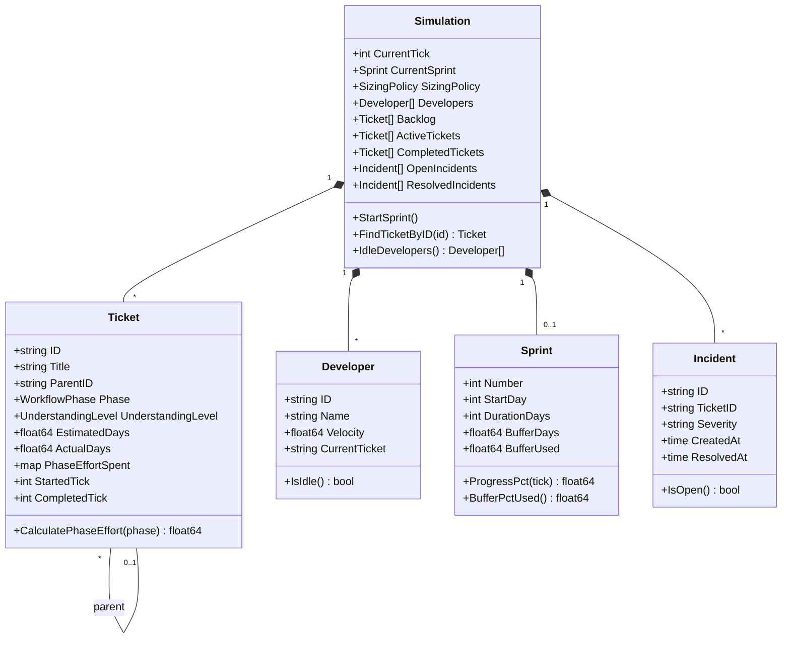
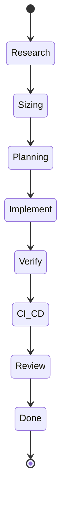
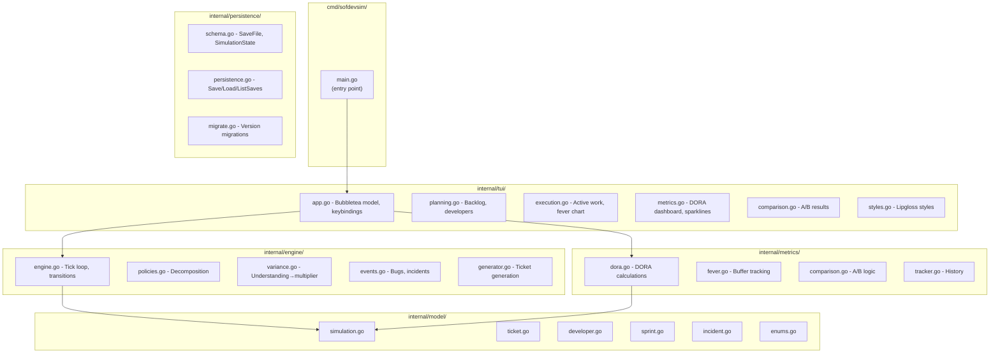
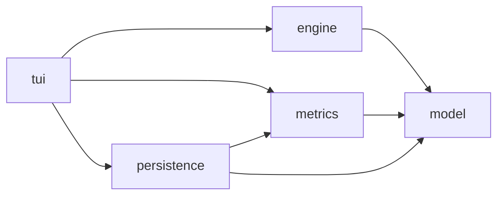
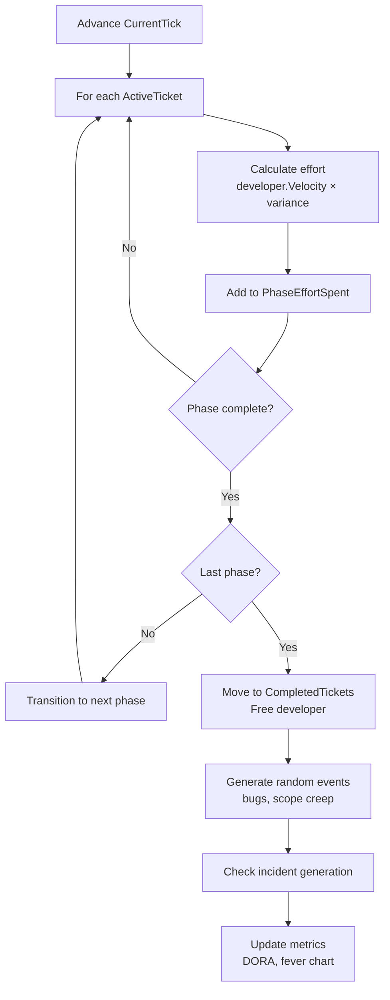
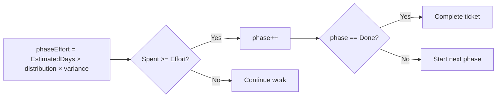
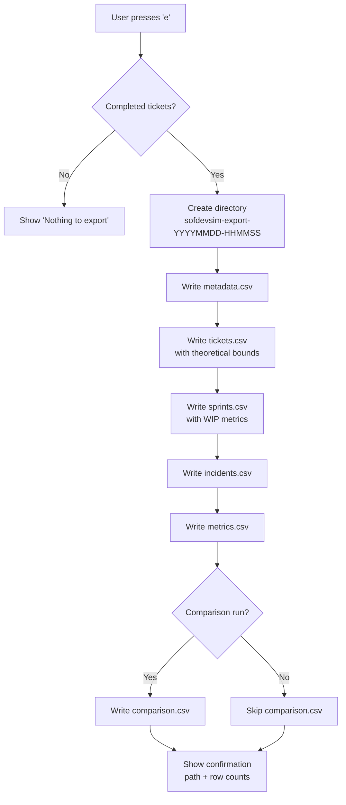
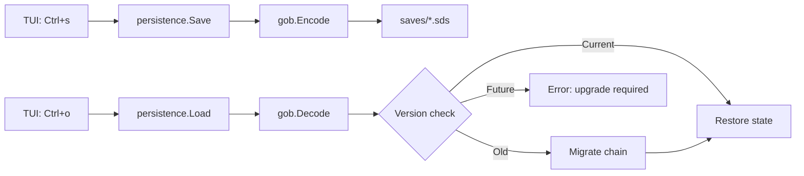

# Design Document

## Overview

### What This Simulation Does

The Software Development Simulation models an 8-phase ticket workflow to test competing theories about optimal ticket sizing:

- **DORA Research** suggests that batch size matters: tickets taking longer than one week correlate with worse delivery outcomes
- **TameFlow** argues that cognitive load (understanding level) is the real discriminant: uncertain work causes variance regardless of size

This simulation lets you run controlled experiments to see which approach produces better DORA metrics.

### The Hypothesis

| Policy | Rule | Theory |
|--------|------|--------|
| DORA-Strict | Decompose tickets > 5 days | Time-based ceiling reduces batch size |
| TameFlow-Cognitive | Decompose tickets with Low understanding | Reducing uncertainty improves predictability |
| Hybrid | Both conditions | Belt and suspenders |
| None | No decomposition | Baseline for comparison |

### Why This Matters

Sizing policy affects:
- **Lead Time** - How long from start to deploy?
- **Quality** - How many incidents per deploy?
- **Predictability** - Can we trust our estimates?

---

## Domain Model



### Workflow Phases



### Enumerations

**Understanding Levels:** Low | Medium | High

**Sizing Policies:** None | DORA-Strict | TameFlow-Cognitive | Hybrid

---

## Key Algorithms

### Variance Model (Core Hypothesis)

The variance model is the heart of the simulation. It maps understanding level to outcome predictability:

| Understanding | Multiplier Range | Meaning |
|---------------|------------------|---------|
| High | 0.95 - 1.05x | Predictable, minimal surprise |
| Medium | 0.80 - 1.20x | Some unknowns, moderate variance |
| Low | 0.50 - 1.50x | High uncertainty, frequent surprise |

**Implementation:** Each tick, actual effort = estimated effort × random multiplier from the range above.

### Phase Effort Distribution

Total ticket effort is distributed across phases:

| Phase | % of Total Effort |
|-------|-------------------|
| Research | 5% |
| Sizing | 2% |
| Planning | 3% |
| Implement | 55% |
| Verify | 20% |
| CI/CD | 5% |
| Review | 10% |
| Done | 0% |

### Decomposition Algorithm

When a ticket is decomposed:

1. **Children count:** 2-4 (weighted 40%/40%/20%)
2. **Children sum:** 90-110% of parent estimate (decomposition reveals scope)
3. **Each child:** Varies ±30% from base estimate
4. **Understanding improves:** 60% chance each child has better understanding than parent

### Incident Generation

Incidents are generated when tickets complete, based on understanding:

| Understanding | Base Fail Rate |
|---------------|----------------|
| High | 5% |
| Medium | 12% |
| Low | 25% |

**Large ticket multiplier:** Tickets > 5 days have 1.5x incident rate.

### DORA Metrics Calculation

| Metric | Formula | Better |
|--------|---------|--------|
| Lead Time | Average of (CompletedTick - StartedTick) | Lower |
| Deploy Frequency | Deploys in last 7 ticks ÷ 7 | Higher |
| MTTR | Average of (ResolvedAt - CreatedAt) for incidents | Lower |
| Change Fail Rate | Total incidents ÷ Total deploys | Lower |

---

## Architecture



### Package Dependencies



**Dependency Rule:** Packages only depend downward. Model has no dependencies.

### TUI Header Bar

```
[Planning] [Execution] [Metrics] [Comparison]  Policy: DORA-Strict | RUNNING | Day 42 | Backlog: 5 | Done: 12 | Seed 1234567890
```

| Element | Description |
|---------|-------------|
| View tabs | Current view highlighted |
| Policy | Active sizing policy |
| Status | RUNNING or PAUSED |
| Day | Current simulation tick |
| Backlog | Count of tickets awaiting assignment |
| Done | Count of completed tickets |
| Seed | RNG seed for reproducibility |

---

## Data Flow

### Tick Loop



### Phase Transition Logic



### Comparison Mode

1. Generate backlog with seed N
2. Clone simulation state
3. Run Simulation A with DORA-Strict for 3 sprints
4. Run Simulation B with TameFlow-Cognitive for 3 sprints (same seed)
5. Compare final DORA metrics
6. Declare winner based on metric wins (4 metrics, majority wins)

---

## Key Design Decisions

| Decision | Rationale |
|----------|-----------|
| Tick = 1 day | Simplifies mental model; matches sprint planning |
| 8 phases | Based on Unified Workflow Rubric from industry research |
| Variance by understanding | Core hypothesis: uncertainty causes unpredictability |
| Seed-based RNG | Enables reproducible experiments |
| Gob-based persistence | Versioned binary saves for research workflows (see CLAUDE.md) |
| Bubbletea TUI | Elm architecture, well-maintained, ntcharts compatible |

---

## Data Export

### Purpose

Enable external validation of simulation hypotheses and teaching of TOC/DORA principles. The export provides raw data for:

| Goal | How Export Supports It |
|------|------------------------|
| **Teaching TOC** | sprints.csv: buffer_pct, fever_status, max_wip, avg_wip |
| **DORA integration** | metrics.csv: all 4 metrics; incidents.csv: MTTR detail |
| **Unified Ticket Workflow Rubric validation** | tickets.csv: 8 phase timing columns enable testing effort distribution |
| **Sizing hypothesis** | comparison.csv + tickets.csv: variance by understanding, policy comparison |

### Output Structure

```
sofdevsim-export-20260103-143052/
├── metadata.csv      # Seed, policy, export timestamp, phase distribution
├── tickets.csv       # Per-ticket data with theoretical validation + phase timing
├── sprints.csv       # Per-sprint buffer/flow/WIP data (TOC concepts)
├── incidents.csv     # Per-incident MTTR detail
├── metrics.csv       # DORA metrics summary
└── comparison.csv    # Policy A vs B results (if comparison run)
```

### CSV Schemas

```csv
# metadata.csv - Reproducibility and context
seed,policy,sprints_run,export_timestamp,simulation_version,phase_effort_distribution

# tickets.csv - Core hypothesis validation + 8-phase effort distribution
ticket_id,title,understanding,estimated_days,actual_days,variance_ratio,expected_var_min,expected_var_max,within_expected,policy,sprint_number,started_tick,completed_tick,lead_time_days,phase_research_days,phase_sizing_days,phase_planning_days,phase_implement_days,phase_verify_days,phase_cicd_days,phase_review_days,phase_done_days

# sprints.csv - TOC concepts (buffer, flow, WIP)
sprint_number,duration_days,buffer_days,buffer_used,buffer_pct,fever_status,tickets_started,tickets_completed,incidents_generated,max_wip,avg_wip

# incidents.csv - MTTR detail
incident_id,ticket_id,severity,created_tick,resolved_tick,mttr_days,sprint_number

# metrics.csv - DORA integration
policy,lead_time_avg,lead_time_stddev,deploy_frequency,mttr_avg,change_fail_rate,total_tickets,total_incidents

# comparison.csv - Sizing hypothesis test
seed,sprints_run,metric,dora_strict_value,tameflow_value,winner,difference,difference_pct
```

### Theoretical Bounds

For hypothesis validation, tickets.csv includes expected variance bounds:

| Understanding | expected_var_min | expected_var_max |
|---------------|------------------|------------------|
| High | 0.95 | 1.05 |
| Medium | 0.80 | 1.20 |
| Low | 0.50 | 1.50 |

The `within_expected` column is `true` if `expected_var_min <= variance_ratio <= expected_var_max`.

### Phase Effort Distribution

Stored in metadata.csv as JSON for Unified Ticket Workflow Rubric validation:

```json
{"research":0.10,"sizing":0.05,"planning":0.10,"implement":0.40,"verify":0.15,"cicd":0.05,"review":0.10,"done":0.05}
```

Compare actual `phase_*_days` columns against `estimated_days × distribution` to validate the 8-phase model.

### Export Algorithm



---

## Persistence

Enables pause/resume for long-running experiments. Full state is captured including metrics history.

### Architecture



### Design Decisions

| Decision | Rationale |
|----------|-----------|
| Gob format | Go-native, efficient binary, handles all model types |
| Schema versioning | Forward compatibility for research data |
| Auto-migration | Seamless upgrades without user intervention |
| Most-recent load | Simple UX for common case (Ctrl+o loads latest) |

For API details and keybindings, see CLAUDE.md § Persistence.
