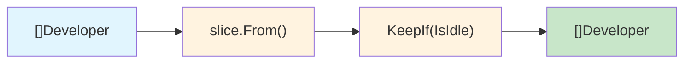
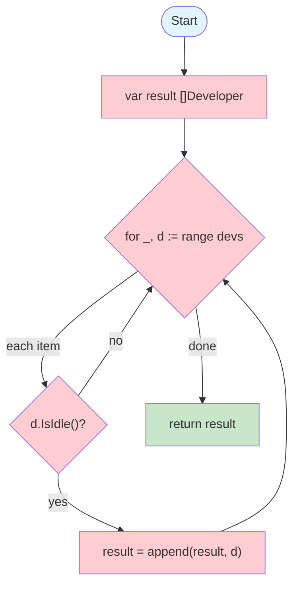
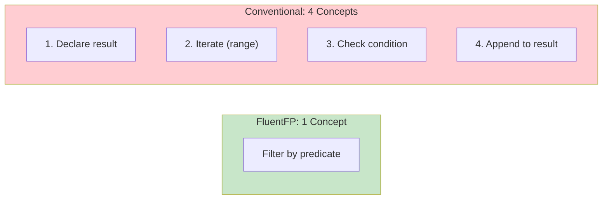
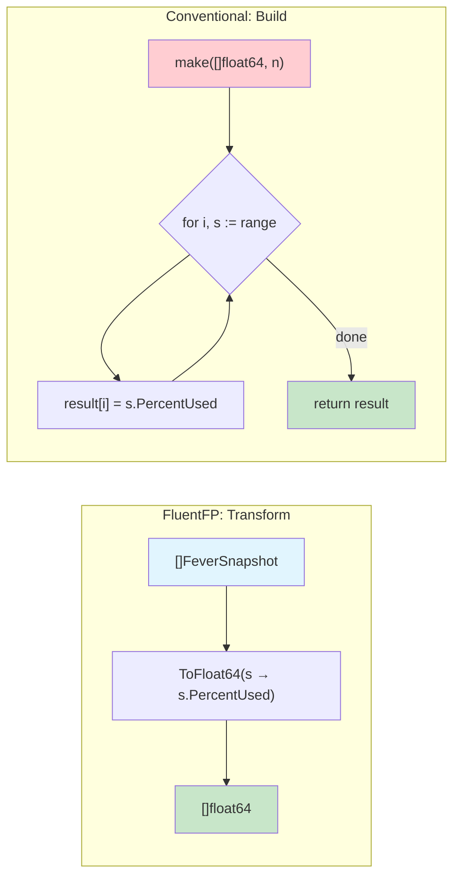
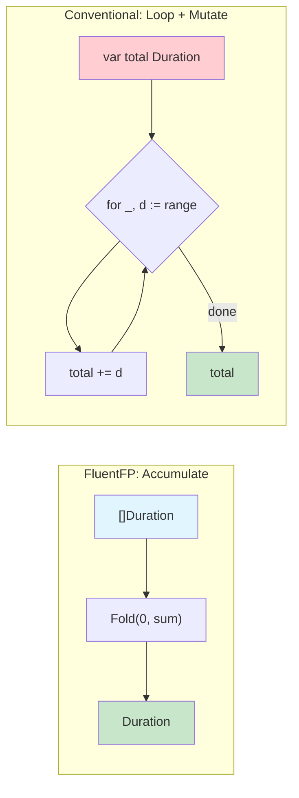
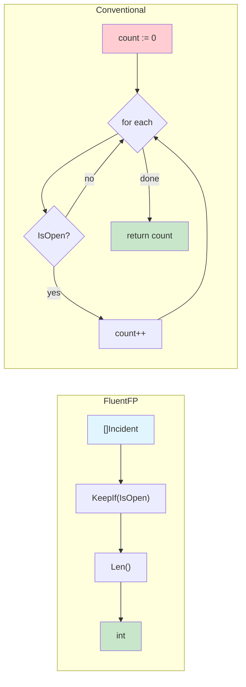
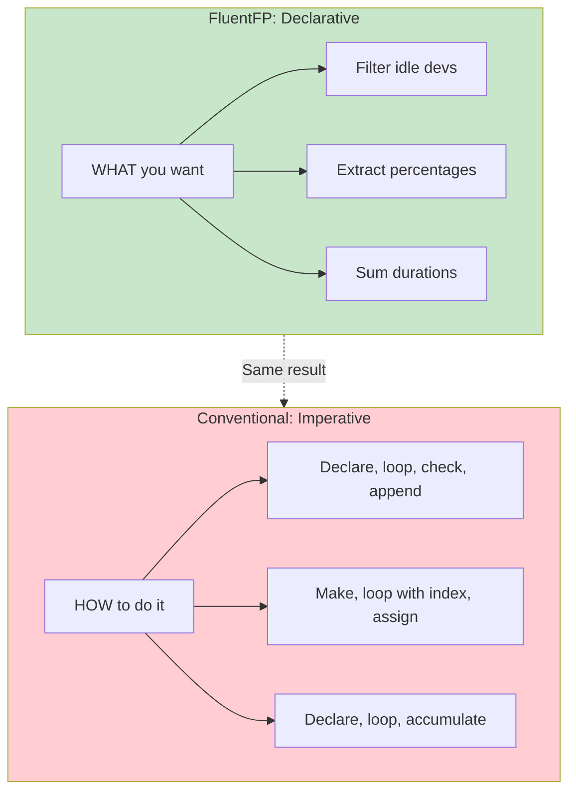

# FluentFP vs Conventional Go: Real Examples

Side-by-side comparison using actual code from this project.

## Key Insights

**The invisible familiarity discount.** A `for` loop you've seen 10,000 times feels instant to parse—but that's learned pattern recognition, not inherent simplicity. This doesn't mean FluentFP is always clearer (there are plenty of cases where conventional loops win), but be aware of the discount when comparing. Show that loop to a non-programmer alongside `KeepIf(Developer.IsIdle)`. Which one can they understand? Come back to your own code after 6 months—the loop requires re-simulation ("what is this counting?"), the chain states intent directly.

**Loop syntax variations add ambiguity.** Go's range-based `for` loop has multiple forms (`for i, x := range`, `for _, x := range`, `for i := range`, `for x := range ch`)—each means something different. You must identify which form before understanding what it does. (We haven't even mentioned C-style `for` loops.) FluentFP methods have one form each: `KeepIf` always filters, `ToFloat64` always extracts.

**Concerns factored, not eliminated.** FluentFP doesn't make iteration disappear—it moves it to one place. The library still does `make`, `range`, and `append`. The difference: written once in the library, not at every call site. You specify only what varies: the predicate, the extractor, the reducer.

---

## Conceptual Model

### FluentFP: Data Pipeline



Each step transforms data. You describe *what* happens, not *how*.

### Conventional: Iteration Mechanics



You manage iteration, conditionals, and accumulation yourself.

### Mental Load Comparison



---

## 1. Method Expression Filter + Count

**FluentFP (simulation.go:97-99):**
```go
func (s Simulation) IdleDevelopers() []Developer {
    return slice.From(s.Developers).KeepIf(Developer.IsIdle)
}
```

**Conventional Go:**
```go
func (s Simulation) IdleDevelopers() []Developer {
    var result []Developer
    for _, d := range s.Developers {
        if d.IsIdle() {
            result = append(result, d)
        }
    }
    return result
}
```

| Metric | FluentFP | Conventional |
|--------|----------|--------------|
| Lines | 1 | 7 |
| Concepts | 1 (filter) | 4 (var, range, if, append) |
| Reads as | "keep if idle" | iteration mechanics |

---

## 2. Filter + Count with Named Predicate

**FluentFP (engine.go:144-148):**
```go
// completedInCurrentSprint returns true if ticket was completed after sprint started.
completedInCurrentSprint := func(t model.Ticket) bool { return t.CompletedTick >= sprint.StartDay }
completedInSprint := slice.From(e.sim.CompletedTickets).
    KeepIf(completedInCurrentSprint).
    Len()
```

**Conventional Go:**
```go
// Count tickets completed in current sprint
completedInSprint := 0
for _, t := range e.sim.CompletedTickets {
    if t.CompletedTick >= sprint.StartDay {
        completedInSprint++
    }
}
```

| Metric | FluentFP | Conventional |
|--------|----------|--------------|
| Lines | 4 (incl predicate) | 5 |
| Named intent | Yes (`completedInCurrentSprint`) | No (inline condition) |
| Reusable predicate | Yes | No |

**Note:** Similar line count, but FluentFP separates *what* (the predicate) from *how* (filter + count).

---

## 3. Field Extraction (Map)



**FluentFP (fever.go:84-86):**
```go
func (f *FeverChart) HistoryValues() []float64 {
    return slice.From(f.History).ToFloat64(FeverSnapshot.GetPercentUsed)
}
```

**Conventional Go:**
```go
func (f *FeverChart) HistoryValues() []float64 {
    result := make([]float64, len(f.History))
    for i, s := range f.History {
        result[i] = s.PercentUsed
    }
    return result
}
```

| Metric | FluentFP | Conventional |
|--------|----------|--------------|
| Lines | 1 | 5 |
| Allocation | Implicit | Explicit (make) |
| Index tracking | None | Manual (`i`) |

---

## 4. Fold (Reduce)



**FluentFP (dora.go:89-91):**
```go
total := slice.Fold(m.LeadTimes, time.Duration(0), sumDuration)
m.LeadTimeAvg = total / time.Duration(len(m.LeadTimes))
```

**Conventional Go:**
```go
var total time.Duration
for _, d := range m.LeadTimes {
    total += d
}
m.LeadTimeAvg = total / time.Duration(len(m.LeadTimes))
```

| Metric | FluentFP | Conventional |
|--------|----------|--------------|
| Lines | 2 | 4 |
| Reducer | Named (`sumDuration`) | Inline |
| Zero value | Explicit parameter | Implicit (var declaration) |

**Note:** The named reducer `sumDuration` is reused elsewhere in the file.

---

## 5. Chained Filter + Count



**FluentFP (simulation.go:102-107):**
```go
func (s Simulation) TotalOpenIncidents() int {
    return slice.From(s.OpenIncidents).
        KeepIf(Incident.IsOpen).
        Len()
}
```

**Conventional Go:**
```go
func (s Simulation) TotalOpenIncidents() int {
    count := 0
    for _, inc := range s.OpenIncidents {
        if inc.IsOpen() {
            count++
        }
    }
    return count
}
```

| Metric | FluentFP | Conventional |
|--------|----------|--------------|
| Lines | 3 | 7 |
| Method expression | `Incident.IsOpen` | `inc.IsOpen()` |
| Mutation | None | Counter variable |

---

## 6. Filter with Captured Variable

**FluentFP (dora.go:101-105):**
```go
cutoff := sim.CurrentTick - 7
// completedAfterCutoff returns true if ticket was completed after the cutoff tick.
completedAfterCutoff := func(t model.Ticket) bool { return t.CompletedTick >= cutoff }
m.DeploysLast7Days = slice.From(sim.CompletedTickets).
    KeepIf(completedAfterCutoff).
    Len()
```

**Conventional Go:**
```go
cutoff := sim.CurrentTick - 7
// Count tickets completed after the cutoff
count := 0
for _, t := range sim.CompletedTickets {
    if t.CompletedTick >= cutoff {
        count++
    }
}
m.DeploysLast7Days = count
```

| Metric | FluentFP | Conventional |
|--------|----------|--------------|
| Lines | 5 | 7 |
| Named predicate | Yes | No |
| Variable capture | Explicit in closure | Implicit in scope |

---

## 7. Fold for Aggregation

**FluentFP (tracker.go:35-38):**
```go
// sumFeverStatus accumulates fever status values as float64.
sumFeverStatus := func(acc float64, s FeverSnapshot) float64 { return acc + float64(s.Status) }
sum := slice.Fold(t.Fever.History, 0.0, sumFeverStatus)
avgFever = sum / float64(len(t.Fever.History))
```

**Conventional Go:**
```go
// Sum fever status values for averaging
var sum float64
for _, s := range t.Fever.History {
    sum += float64(s.Status)
}
avgFever = sum / float64(len(t.Fever.History))
```

| Metric | FluentFP | Conventional |
|--------|----------|--------------|
| Lines | 3 | 4 |
| Named reducer | Yes | No |

---

## Summary

| Pattern | FluentFP | Conventional | Savings |
|---------|----------|--------------|---------|
| Filter + return | 1 line | 7 lines | 86% |
| Filter + count | 3-4 lines | 5-7 lines | 40-57% |
| Map (extract field) | 1 line | 5 lines | 80% |
| Fold (sum) | 2 lines | 4 lines | 50% |

### Qualitative Differences

**FluentFP advantages:**
- Method expressions (`Developer.IsIdle`) read as English
- Named predicates document intent and enable reuse
- No index variables, no append mechanics, no counter mutation
- Chainable: filter → count is one expression

**Conventional advantages:**
- Familiar to all Go developers
- No library dependency
- Slightly more control (break/continue/early return)
- Debugger can step through iterations

### When FluentFP Wins Clearly

1. **Method expressions available** - `KeepIf(Developer.IsIdle)` vs 7-line loop
2. **Field extraction** - `ToFloat64(...)` vs make + index loop
3. **Chained operations** - filter → map → count as one expression

### When It's Close

1. **Single filter + count** with inline predicate - similar lines, different style
2. **Fold** with simple reducer - 2 vs 4 lines

### When Conventional Wins

1. **Complex control flow** - break, continue, early return, multiple conditions
2. **Channel consumption** - `for x := range ch` has no FP equivalent
3. **Index-dependent logic** - when you need `i` for more than just indexing

---

## The Core Difference



**FluentFP** expresses intent. **Conventional Go** expresses mechanics.

Both produce the same output. The difference is what you have to hold in your head while reading.
