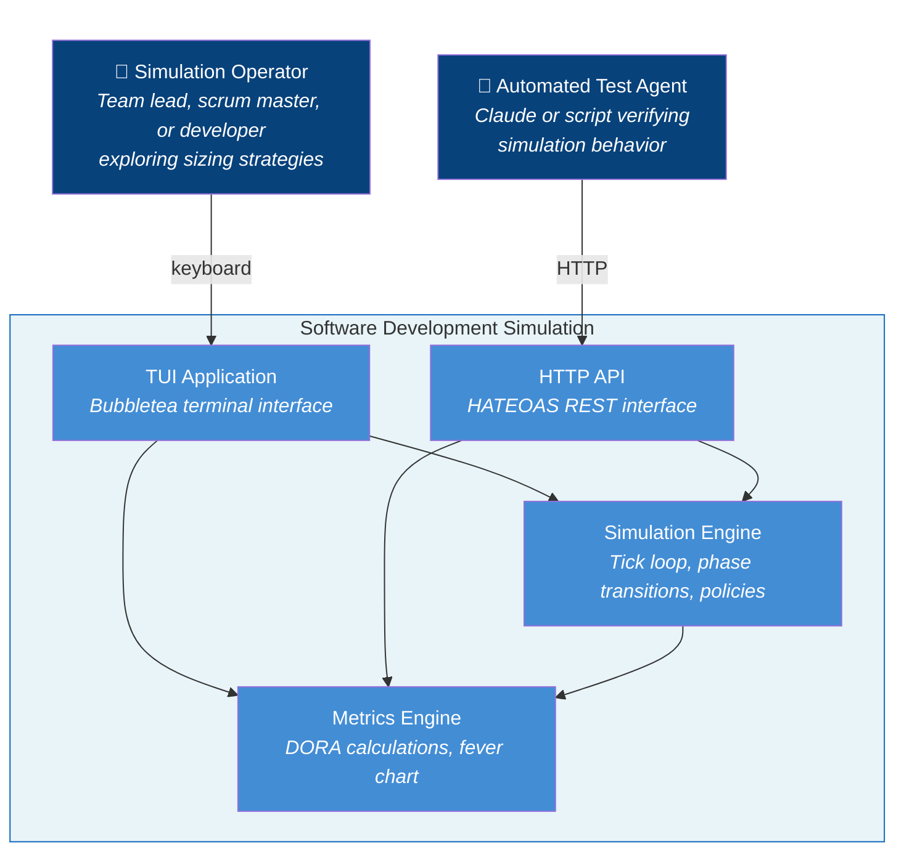

# Use Cases

## System Scope

**System Name:** Software Development Simulation (sofdevsim)

### In Scope (the system)

- TUI application
- HTTP API (HATEOAS REST interface)
- Simulation engine (tick loop, phase transitions)
- Ticket/developer/sprint management
- DORA metrics calculation
- Fever chart calculation
- Policy comparison

### Out of Scope (external)

- Real code repositories
- Actual CI/CD systems
- Multi-user access
- API authentication/authorization
- API rate limiting
- Persistent API state (simulations are in-memory only)

---

## Actors

### Primary Actors

**Simulation Operator** - Person running the TUI to explore sizing strategies

**Automated Test Agent** - Claude or script verifying simulation behavior via HTTP API

**Manager** - Software development manager learning TOC/DBR concepts through simulation

**Developer (test writer)** - Developer writing automated tests for TUI behavior without terminal dependencies

### Secondary Actors

None (self-contained simulation, no external services)

### Stakeholders & Interests

| Stakeholder | Interest |
|-------------|----------|
| Team Lead | Wants data to justify sizing policy to management |
| Scrum Master | Wants to understand buffer consumption patterns |
| Developer | Wants to see how understanding level affects outcomes |
| Researcher | Wants reproducible experiments (same seed = same results); wants exportable data to validate hypotheses statistically |
| Educator | Wants concrete data to teach TOC principles and demonstrate DORA metrics in action |
| Developer (Claude) | Wants to verify simulation fixes without manual TUI interaction |
| Human Developer | Wants to debug and explore simulation state via HTTP |

---

## System-in-Use Stories

### Story 1: The Skeptical Team Lead

> Jordan, a software team lead skeptical of "story points," launches the simulation during lunch. They generate a backlog of 12 tickets with mixed understanding levels, assign the top three to their virtual team, and start a sprint. As the simulation runs, Jordan notices a "Low Understanding" ticket causing the fever chart to turn yellow—buffer consumption is spiking. They pause, decompose the risky ticket into smaller pieces, and resume. At sprint end, Jordan switches to the Metrics view to check lead time trends. Wanting to test their hypothesis that understanding matters more than size, Jordan presses 'c' to run a comparison: same backlog, same team, DORA-Strict vs TameFlow-Cognitive. The results show TameFlow won on 3 of 4 metrics. Jordan screenshots this for tomorrow's retro. They realize decomposing by *uncertainty* rather than *size* would have prevented the buffer blowout.

### Story 2: The Process Experimenter

> Sam, a new engineering manager, inherits a team that estimates in t-shirt sizes. They run the simulation with PolicyNone to see what unmanaged flow looks like—lead times are all over the place. Then they try DORA-Strict (decompose anything >5 days) and see improvement. Finally, TameFlow-Cognitive (decompose low-understanding tickets) produces the best MTTR. Sam runs 10 comparisons with different seeds to confirm the pattern holds. They now have data to propose a "spike first, then estimate" policy.

### Story 3: The Data-Driven Researcher

> Pat, a process researcher at a consultancy, hypothesizes that TameFlow-Cognitive outperforms DORA-Strict. Pat runs 20 policy comparisons with different seeds, pressing 'e' after each to export. In R, Pat merges the CSVs, groups tickets by understanding level, and plots actual variance against the theoretical bounds (High ±5%, Medium ±20%, Low ±50%). The data shows 94% of tickets fell within expected ranges—validating the variance model. A t-test on lead times confirms TameFlow wins with p<0.01. Pat now has evidence, not just theory.

### Story 4: The TOC Educator

> Morgan, a Lean/TOC coach, uses the simulation to teach a workshop. After a simulated sprint, Morgan exports the data and projects the CSV. "Look at the buffer consumption column—see how Low-understanding tickets consumed 3x more buffer than High? That's the Theory of Constraints in action. The constraint isn't developer speed; it's uncertainty. Now look at the variance_ratio versus expected bounds—the model predicted this." The export transforms abstract theory into concrete, discussable data.

### Story 5: The Long-Running Experiment

> Pat, a process researcher, has been running a 50-sprint simulation comparing DORA-Strict vs TameFlow. After 3 hours, Pat needs to leave for a meeting. Pat presses 's' to save the simulation state, names it "tameflow-comparison-jan15", and closes the laptop. The next morning, Pat loads the state and continues from exactly where they left off—all 50 sprints of history intact, metrics preserved. Pat likes save/load because multi-hour experiments no longer require uninterrupted sessions.

### Story 6: The Automated Verifier

> Claude, verifying a fix to sprint-end behavior, sends a POST to `/simulations` to create a new simulation with seed 42. Claude then POSTs to `/simulations/{id}/sprints` to start a sprint, followed by repeated POSTs to `/simulations/{id}/tick` until the sprint ends. After each tick, Claude GETs `/simulations/{id}` to inspect state. When the sprint ends, Claude verifies that the tick link disappears from the response—the HATEOAS contract proves the sprint ended correctly. Claude likes this API because each response includes links to available actions, so there's no need to hardcode URL patterns—just follow the hypermedia.

### Story 7: The Collaborative Session

> Ted starts the TUI to explore a new sizing policy. Meanwhile, Claude (in a terminal session) wants to help operate the simulation while Ted watches. Claude GETs `/simulations` to discover what simulations exist—the response lists Ted's active simulation with its ID. Claude then GETs that simulation's state to see current tick, backlog, and available actions. Before starting the sprint, Claude assigns tickets to developers—POSTing to `/simulations/{id}/assignments` three times for the high-priority items. Each response includes the `assign` link since backlog still has tickets. Ted watches assignments appear in his TUI. Only after planning is complete does Claude POST to start the sprint. Ted sees the sprint begin and work commence. Ted likes this because Claude can drive the simulation while Ted observes patterns and asks questions. Claude likes sprint planning via API because it mirrors real planning—assign work *before* committing to the sprint.

### Story 8: The TUI Test Writer

> Alex, a developer adding a new lesson trigger, needs to verify the lesson panel displays correctly when the trigger fires. Rather than launching the TUI and manually clicking through states, Alex writes a test that constructs an `ExecutionViewModel` with the trigger conditions met, passes it to a `PlainTextRenderer`, and asserts the output contains "Understanding IS the Constraint". The test runs in milliseconds without terminal dependencies. Alex likes the ViewModel layer because it separates *what to display* from *how to display it*—the same ViewModel feeds both Bubble Tea (production) and plain text (testing). When the test passes, Alex runs the HTML renderer with the same ViewModel to verify the export looks right too. Alex realizes this architecture means new renderers (JSON API, accessibility mode) are just new implementations of the Renderer interface.

### Story 9: The Workshop Presenter

> Priya, a software engineering manager, projects the simulation onto a conference room screen for a workshop on flow-based development. During the planning phase, she points to the ASCII office layout: "See those colored circles gathered in the conference room? That's our virtual team in a planning meeting." She assigns a ticket to the purple developer—the class watches the circle animate smoothly from the conference room back to its cubicle. "Now watch," Priya says, starting the sprint. The developer icons pulse through different shapes (○◔◑◕●), showing work in progress. On day 8, a ticket estimated at 5 days still isn't done. A thought bubble appears next to the developer: "!@#$%". The class laughs. "That's frustration—the estimate was wrong." Priya presses '1' to slow the simulation to 10 seconds per tick so the class can follow along. She likes the office animation because it makes the abstract simulation tangible—you can *see* context switches, overruns, and idle time without reading numbers.

### Story 10: The Distributed Workshop (Future)

> *[Placeholder for future capability]* Morgan, running an online TOC workshop with 30 participants, starts a controller session that streams events to all connected clients. Half the participants watch the same simulation on their laptops—a "broadcast mode" where Morgan's TUI actions appear on everyone's screen simultaneously. The other half each run their own simulation with the same seed, acting as "Scrum Master" while Morgan observes as "Manager." When Morgan assigns a ticket on the broadcast simulation, all observers see it; when a participant assigns a ticket on their own simulation, only they see it, but Morgan can peek at any session. Different clients use different UIs—some prefer TUI, others use a web dashboard, one accessibility-focused participant uses a screen-reader-friendly text stream. Morgan likes this because distributed workshops finally feel as interactive as in-person ones.

---

## Actor-Goal List

**Primary Actor:** Simulation Operator

| # | Goal | Level | "Lunch Test" | Stakeholder Interest |
|---|------|-------|--------------|---------------------|
| 1 | Run a simulation sprint | Blue | Yes - complete sprint, see results | All - core capability |
| 2 | Compare sizing policies (A/B test) | Blue | Yes - get comparison results | Team Lead - justify decisions |
| 3 | View DORA metrics trends | Blue | Yes - understand performance | Scrum Master - track improvement |
| 4 | Monitor buffer consumption | Blue | Yes - know if sprint is at risk | Scrum Master - early warning |
| 5 | Decompose risky tickets | Blue | Yes - reduce uncertainty | Developer - manageable chunks |
| 6 | Assign tickets to developers | Blue | Yes - sprint is planned | All - start work |
| 7 | Adjust simulation speed | Indigo | No - part of running | - |
| 8 | Switch between views | Indigo | No - navigation | - |
| 9 | Change sizing policy | Indigo | No - configuration | - |
| 10 | Pause/resume simulation | Indigo | No - control | - |
| 11 | Export simulation data to CSV | Blue | Yes - have file for analysis | Researcher - validate hypotheses; Educator - teach with data |
| 12 | Save/load simulation state | Blue | Yes - can resume later | Researcher - long experiments; All - pause/resume workflow |
| 27 | Watch planning session (office animation) | Blue | Yes - see team gathered | Educator - visual teaching aid |
| 28 | Watch ticket assignment animation | Blue | Yes - see developer move | Educator - visualize assignment |
| 29 | Watch developer working animation | Blue | Yes - see work in progress | All - visual feedback |
| 30 | Notice developer overrun frustration | Blue | Yes - see warning indicator | Scrum Master - early warning |
| 31 | Watch ticket completion | Blue | Yes - see work finish | All - completion feedback |
| 32 | Control simulation speed | Blue | Yes - pace set for audience | Educator - adjust for comprehension |
| 33 | Pause/resume with animation state | Blue | Yes - can discuss frozen state | Educator - teachable moments |
| 34 | Resize terminal gracefully | Blue | Yes - layout adapts | All - usability |

**Primary Actor:** Automated Test Agent (Claude or script)

| # | Goal | Level | "Lunch Test" | Stakeholder Interest |
|---|------|-------|--------------|---------------------|
| 13 | Discover active simulations | Blue | Yes - know what exists | Developer - connect to TUI simulation |
| 14 | Test simulation behavior programmatically | Blue | Yes - verification complete | Developer - verify fixes without TUI |
| 15 | Access shared simulation (TUI + API) | Blue | Yes - see same state from both | Developer - debug via API while TUI runs |
| 16 | Plan sprint via API | Blue | Yes - sprint is ready to begin | Scrum Master - proper planning workflow |
| 17 | Compare policies via API | Blue | Yes - know which policy wins | Developer - automated A/B testing |
| 37 | See same office rendering as TUI user | Blue | Yes - can debug what operator sees | Developer - collaborative debugging |

**Primary Actor:** Learner (new user)

| # | Goal | Level | "Lunch Test" | Stakeholder Interest |
|---|------|-------|--------------|---------------------|
| 18 | Learn simulation concepts through guided interaction | Blue | Yes - understand variance/DORA/policies | Team Lead - informed decisions; Researcher - validate teaching |

**Primary Actor:** Manager (software development manager)

| # | Goal | Level | "Lunch Test" | Stakeholder Interest | Prereq |
|---|------|-------|--------------|---------------------|--------|
| 19 | Recognize that understanding IS the constraint | Blue | Yes (5 min) | Researcher: validate key insight | Buffer red on LOW ticket |
| 20 | Identify the constraint in a simulated team | Blue | Yes (5-10 min) | Team Lead: capacity decisions | UC19 + 2 sprints |
| 21 | Understand exploitation vs elevation tradeoff | Blue | Yes (5-10 min) | Team Lead: prioritize investments | UC19 + decomposition used |
| 22 | Apply Five Focusing Steps to simulation data | Blue | Yes (10-15 min) | Educator: teach TOC systematically | UC20 + UC21 + 3 sprints |
| 23 | Generate actionable questions for real team | Blue | Yes (5 min) | Manager: bridge to practice | UC22 + comparison run |
| 24 | Share simulation insights with team | Blue | Yes (3 min) | Team Lead: spread learning | Any simulation run |

*Pedagogical Order:* UC19 → UC20/UC21 (parallel) → UC22 → UC23; UC24 anytime

**Primary Actor:** Developer (test writer)

| # | Goal | Level | "Lunch Test" | Stakeholder Interest |
|---|------|-------|--------------|---------------------|
| 25 | Verify UI displays correct state without terminal | Blue | Yes - test passes | Developer - catch display bugs in CI |
| 26 | Verify input produces correct state change | Blue | Yes - interaction verified | Developer - catch handler bugs in CI |

**Use Cases Written:** Goals 1-12, 14-37 (Blue level)

---

## Use Cases

### UC1: Run a Simulation Sprint

**Primary Actor:** Simulation Operator

**Goal in Context:** Complete a sprint to observe how tickets flow through the 8-phase workflow and see resulting metrics.

**Scope:** Software Development Simulation

**Level:** User Goal (Blue)

**Main Success Scenario:**

1. Operator views backlog in Planning view
2. Operator assigns tickets to developers
3. Operator starts sprint
4. System simulates work (tick loop advances)
5. System displays progress in Execution view
6. Sprint ends when duration reached (system clears active sprint, auto-pauses)
7. Operator reviews results in Metrics view

**Extensions:**

- 2a. *No idle developers:* System shows all developers as busy; operator waits or adjusts
- 4a. *Ticket variance causes delay:* Fever chart turns yellow/red; operator may pause and decompose
- 4b. *Incident generated:* Event appears in log; MTTR tracking begins
- 6a. *Sprint ends with incomplete work:* Tickets remain in ActiveTickets; carry over to next sprint

---

### UC2: Compare Sizing Policies

**Primary Actor:** Simulation Operator

**Goal in Context:** Run the same scenario under DORA-Strict and TameFlow-Cognitive policies to determine which produces better DORA metrics.

**Scope:** Software Development Simulation

**Level:** User Goal (Blue)

**Main Success Scenario:**

1. Operator presses 'c' to initiate comparison
2. System generates fresh backlog with current seed
3. System runs 3 sprints with DORA-Strict policy
4. System runs 3 sprints with TameFlow-Cognitive policy (same seed)
5. System displays comparison results showing metrics for each policy
6. Operator identifies winning policy based on DORA metrics
7. System provides experiment insight explaining why winner performed better

**Extensions:**

- 5a. *Tie on metrics:* System shows "TIE" with suggestion to run more sprints
- 6a. *Operator wants different seed:* Press 'c' again for new comparison with fresh seed

**Technology & Data Variations:**

- TUI: Press 'c' key to initiate comparison
- API: See UC12 for automated comparison via API

---

### UC3: View DORA Metrics Trends

**Primary Actor:** Simulation Operator

**Goal in Context:** Understand team performance over time by viewing the four DORA metrics with historical trends.

**Scope:** Software Development Simulation

**Level:** User Goal (Blue)

**Main Success Scenario:**

1. Operator switches to Metrics view (Tab key)
2. System displays four DORA metrics with current values
3. System displays sparkline trends for each metric
4. Operator identifies improving or degrading trends
5. Operator correlates trends with policy changes or ticket mix

**Extensions:**

- 2a. *No completed tickets yet:* Metrics show zero values; sparklines show flat line

---

### UC4: Respond to Buffer Crisis

**Primary Actor:** Simulation Operator

**Goal in Context:** Recognize an at-risk sprint and take corrective action before the buffer is exhausted.

**Scope:** Software Development Simulation

**Level:** User Goal (Blue)

**Stakeholders and Interests:**

- *Scrum Master:* Wants early warning of at-risk sprints
- *Team Lead:* Wants data-driven decision on when to intervene
- *Developer:* Wants clear signal to stop starting, start finishing

**Preconditions:**

- Sprint is active
- System is displaying Execution view with fever chart

**Trigger:** Fever chart transitions to Yellow or Red zone

**Main Success Scenario:**

1. System signals zone change (Yellow or Red) during sprint
2. Operator reviews fever chart: progress %, buffer %, ratio
3. System shows WIP count and active ticket status to aid diagnosis
4. Operator takes corrective action (stop starting new work, swarm on blockers)
5. System shows ratio improving over subsequent ticks
6. Sprint completes with buffer remaining or work finished

**Extensions:**

- 2a. *Progress < 5%:* Ratio not meaningful yet; operator waits for more data
- 3a. *High WIP visible:* Operator stops assigning new tickets
- 3b. *Blocked ticket visible:* Operator focuses team on unblocking
- 4a. *Corrective action insufficient:* Zone remains Red; operator escalates or negotiates scope
- 6a. *Buffer exhausted before work complete:* Sprint fails; operator learns for next sprint
- 6b. *Buffer exhausted but work complete:* Success - buffer absorbed uncertainty as intended

**Postconditions (Success Guarantee):**

- Operator made informed decision based on fever chart data
- If Red zone: corrective action was attempted

**Minimal Guarantee:**

- Fever chart state was visible to operator
- Zone transitions were signaled

---

### UC5: Decompose Risky Tickets

**Primary Actor:** Simulation Operator

**Goal in Context:** Break down a large or uncertain ticket into smaller, more predictable pieces before committing to sprint work.

**Scope:** Software Development Simulation

**Level:** User Goal (Blue)

**Main Success Scenario:**

1. Operator selects ticket in backlog (j/k or arrow keys)
2. Operator requests decomposition (d key)
3. System splits ticket into 2-4 children
4. Children appear in backlog with potentially improved understanding
5. Original ticket is replaced by children
6. Operator assigns children to developers

**Extensions:**

- 2a. *Policy says don't decompose:* System performs decomposition anyway (manual override)
- 3a. *Ticket already small and understood:* Decomposition still works but benefit is minimal
- 4a. *Understanding improves:* 60% chance each child has better understanding than parent

---

### UC6: Assign Tickets to Developers

**Primary Actor:** Simulation Operator / Automated Agent

**Goal in Context:** Assign a ticket from the backlog to an available developer so work can begin.

**Scope:** Software Development Simulation

**Level:** User Goal (Blue)

**Stakeholders and Interests:**

- *Operator:* Wants efficient assignment without memorizing developer names
- *Automated Agent:* Wants explicit control over which developer gets which ticket

**Preconditions:**

- Simulation exists with at least one ticket in backlog
- At least one developer exists in the simulation
- Sprint may or may not be active (assignment allowed in both states for sprint planning)

**Postconditions (Guarantees):**

- *Success:* Ticket assigned to developer, TicketAssigned event emitted
- *Failure:* No state change, error reported to actor

**Main Success Scenario:**

1. Actor selects a ticket from the backlog
2. Actor specifies target developer
3. System validates developer is idle
4. System assigns ticket to developer
5. Ticket moves from Backlog to ActiveTickets
6. Developer status changes from idle to busy
7. System emits TicketAssigned event

**Extensions:**

- 2a. *No developer specified:* System auto-assigns to first idle developer (Alice, Bob, Carol order)
- 3a. *Developer is busy:* System rejects assignment with error
- 3b. *No idle developers:* Assignment fails; all developers are busy
- 3c. *Ticket not in backlog:* System rejects with "ticket not found"

**Technology & Data Variations:**

- TUI: Navigate backlog with j/k, press 'a' to auto-assign selected ticket
- API: POST /simulations/{id}/assignments with ticketId and developerId
- API: `assign` link available whenever backlog has tickets (not just during active sprint)

---

### UC7: Export Simulation Data

**Primary Actor:** Simulation Operator

**Goal in Context:** Export simulation data to CSV files for external analysis, hypothesis validation, or teaching demonstrations.

**Scope:** Software Development Simulation

**Level:** User Goal (Blue)

**Main Success Scenario:**

1. Operator runs simulation (completes sprints or comparison)
2. Operator presses 'e' to export
3. System creates timestamped export directory
4. System writes CSV files (metadata, tickets, sprints, incidents, metrics, comparison if applicable)
5. System confirms export with path and row counts
6. Operator analyzes data in external tool (spreadsheet, R, Python)

**Extensions:**

- 2a. *No completed tickets:* System shows "Nothing to export" message; no files created
- 3a. *Export directory exists:* System appends sequence number to directory name
- 4a. *No comparison run:* System omits comparison.csv; notes in confirmation message
- 5a. *Write error:* System shows error message with path attempted

---

### UC8: Save/Load Simulation State

**Primary Actor:** Simulation Operator

**Goal in Context:** Persist simulation state to disk so work can be paused and resumed across sessions.

**Scope:** Software Development Simulation

**Level:** User Goal (Blue)

**Main Success Scenario (Save):**

1. Operator requests save (Ctrl+s)
2. System generates save name from seed and timestamp
3. System serializes full state (simulation + metrics + history)
4. System writes versioned file to saves directory
5. System confirms save with path

**Main Success Scenario (Load):**

1. Operator requests load (Ctrl+o)
2. System finds most recent save file
3. System reads and deserializes state
4. System validates schema version, migrates if needed
5. System restores simulation to saved state
6. Operator continues from saved point

**Extensions:**

- 3a. *Serialization fails:* System shows error; no file written
- 4a. *Save directory doesn't exist:* System creates it
- 5a. *Schema version mismatch:* System runs migration chain
- 5b. *Unknown future version:* System shows "upgrade required" error
- 6a. *Corrupted file:* System shows validation error; no state change

---

### UC9: Test Simulation Behavior Programmatically

**Primary Actor:** Automated Test Agent (Claude or script)

**Goal in Context:** Execute simulation scenarios and verify outcomes programmatically, enabling automated verification of simulation behavior without manual TUI interaction.

**Scope:** Software Development Simulation

**Level:** User Goal (Blue)

**Main Success Scenario:**

1. Agent creates a new simulation via POST (specifying seed)
2. System returns simulation resource with links to available actions
3. Agent starts a sprint via the provided start-sprint link
4. System returns updated state with tick link available
5. Agent advances simulation via tick link
6. System returns events and updated state
7. Agent inspects state to verify expected outcomes
8. Agent verifies HATEOAS links match expected state (e.g., tick link absent after sprint ends)

**Extensions:**

- 1a. *Invalid configuration:* System returns 400 with problem details
- 5a. *Sprint ends:* System clears sprint, tick link disappears, start-sprint link appears
- 5b. *Ticket completes:* Event included in response
- 7a. *Verification fails:* Agent reports test failure (external to system)

---

### UC10: Shared Simulation via Events

**Primary Actor:** Simulation Operator / Automated Test Agent

**Goal in Context:** Access and interact with the same simulation from both TUI and API, with changes visible to both in real-time.

**Scope:** Software Development Simulation

**Level:** User Goal (Blue)

**Stakeholders and Interests:**

- *Operator:* Wants to watch simulation while collaborator operates it
- *Automated Agent:* Wants to discover and connect to existing simulation without asking for ID

**Preconditions:**

- API server running (started with TUI or standalone)

**Postconditions (Guarantees):**

- *Success:* Both TUI and API see consistent state; changes from either are visible to both
- *Failure:* No state corruption; API returns error, TUI continues operating

**Main Success Scenario:**

1. Operator starts simulation in TUI
2. API client lists active simulations to discover available IDs
3. API client selects simulation and gets current state
4. API client advances tick via POST
5. TUI receives event notification and updates display (switches to Execution view on sprint start)
6. Operator views updated state in TUI
7. Operator assigns ticket via TUI
8. API client sees assignment reflected in next GET

**Extensions:**

- 2a. *No simulations exist:* API returns empty list; client creates new simulation via POST
- 3a. *Simulation not found:* API returns 404; client refreshes list
- 5a. *TUI disconnected:* Events queued; TUI catches up on reconnect
- 7a. *Conflicting action:* Event ordering resolves conflict (last write wins within tick)

**Technology & Data Variations:**

- API: GET /simulations returns list of active simulation IDs
- API: GET /simulations/{id} returns full state with HATEOAS links

**Technical Notes:**

This use case requires event sourcing architecture:
- Single event stream per simulation
- TUI and API both subscribe to events
- Each maintains projection of current state
- Events are the source of truth

---

### UC11: Plan Sprint via API

**Primary Actor:** Automated Test Agent (Claude or script)

**Goal in Context:** Assign tickets to developers before starting a sprint, enabling proper sprint planning workflow via API.

**Scope:** Software Development Simulation

**Level:** User Goal (Blue)

**Preconditions:**

- Simulation exists with tickets in backlog (backlog size always exceeds developer count)
- At least one developer exists
- Sprint may or may not be active (assignment allowed in both states per UC6)

**Postconditions (Guarantees):**

- *Success:* All developers have tickets assigned, sprint started, work begins immediately
- *Failure:* No state change, error reported to agent

**Main Success Scenario:**

1. Agent gets simulation state via GET
2. System returns state with `assign` and `start-sprint` links (backlog has tickets)
3. Agent assigns ticket to developer via POST to `assign` link
4. System returns updated state; `assign` link remains while backlog has unassigned tickets
5. Agent repeats steps 3-4 for each planned ticket
6. Agent starts sprint via POST to `start-sprint` link
7. System returns state with `tick` link; sprint is now active
8. Assigned tickets begin processing

**Extensions:**

- 3a. *Developer busy:* System returns 400; agent selects different developer
- 3b. *No idle developers:* All developers assigned; agent proceeds to step 6
- 4a. *Backlog empty after assignments:* `assign` link disappears; agent proceeds to step 6
- 6a. *Idle developers remain:* Agent continues assigning (step 3) until all developers have work

**Technology & Data Variations:**

- POST /simulations/{id}/assignments with `{"ticketId": "TKT-001", "developerId": "dev-1"}`
- POST /simulations/{id}/sprints to start sprint

---

### UC12: Compare Policies via API

**Primary Actor:** Automated Test Agent (Claude or script)

**Goal in Context:** Run identical simulations under two policies to determine which produces better DORA metrics.

**Scope:** Software Development Simulation

**Level:** User Goal (Blue)

**Preconditions:**

- API server running

**Postconditions (Guarantees):**

- *Success:* Comparison complete, per-metric and overall winners identified
- *Failure:* Error returned, no state change

**Main Success Scenario:**

1. Agent POSTs to `/comparisons` with seed and sprint count
2. System creates two internal simulations (DORA-Strict, TameFlow-Cognitive)
3. System runs N sprints on each with auto-assignment
4. System computes DORA metrics for each
5. System returns `ComparisonResult` with winners

**Extensions:**

- 1a. *Invalid sprint count:* System returns 400
- 3a. *Simulation error:* System returns 500

**Technology & Data Variations:**

- Entry point `/` includes `comparisons` link for HATEOAS discovery
- `POST /comparisons` with `{"seed": 12345, "sprints": 3}` (blocking, synchronous)
- Response includes `ComparisonResult` per `metrics/comparison.go:8-26`

**Note:** This is a top-level resource (`/comparisons`), not a sub-resource of `/simulations/{id}`, because comparison creates two new internal simulations rather than modifying an existing one.

---

### UC13: Learn Simulation Concepts (Tutorial)

**Primary Actor:** Learner (new user)

**Goal in Context:** Understand variance model, DORA metrics, and policy tradeoffs through guided hands-on interaction.

**Scope:** Software Development Simulation

**Level:** User Goal (Blue)

**Stakeholders and Interests:**

- *Learner:* Wants to understand simulation concepts without reading documentation
- *Team Lead:* Wants team members to understand variance/DORA before making process decisions
- *Researcher:* Wants to validate that simulation teaches intended concepts

**Trigger:** Learner presses 'h' to enable lessons panel

**Preconditions:**

- Simulation launched (TUI or API-created)
- Learner can see TUI

**Postconditions (Guarantees):**

- *Success:* System has displayed contextual lessons for: understanding/variance relationship, all four DORA metrics, and policy comparison results
- *Failure:* No simulation state corruption; lessons panel can be re-enabled; partial progress preserved

**Minimal Guarantees (always hold):**

- Simulation state is never corrupted by lessons panel
- Lessons panel can always be toggled off
- API operation is never blocked by lessons panel state

**Main Success Scenario:**

1. Learner enables lessons panel; system shows orientation message
2. Learner views backlog; system explains understanding levels and variance ranges
3. Learner assigns ticket; system shows expected variance for that ticket
4. Learner starts sprint; system explains fever chart and buffer purpose
5. Learner observes ticket progress; system highlights phase transitions and delays
6. Sprint completes; system shows actual vs estimated with variance analysis
7. Learner views DORA metrics; system explains each metric's meaning and direction
8. Learner runs policy comparison; system explains why winner performed better

**Extensions:**

- 1a. *Lessons already enabled:* System shows current context-appropriate lesson
- 3a. *API assigns ticket:* Lesson still appears; learner observes external operation
- 5a. *Incident occurs:* System explains incident impact on variance and MTTR
- 5b. *No incidents in sprint:* System notes "clean sprint" and explains Change Fail Rate
- 6a. *Variance within bounds:* System confirms prediction accuracy for understanding level
- 6b. *Variance exceeds bounds:* System explains contributing factors (incidents, phase delays)
- 8a. *Tie on metrics:* System explains statistical noise and suggests more sprints

**Technology & Data Variations:**

- TUI: Dedicated "Lessons" panel toggled with 'h' key; shows contextual how/what content
- API: Teaching content available via GET endpoint (for external UI building their own lessons panel)

---

### UC19: Recognize Understanding as the Constraint (Aha Moment)

**Primary Actor:** Manager (software development manager)

**Goal in Context:** Experience the key insight that uncertainty, not capacity, determines delivery predictability.

**Scope:** Software Development Simulation

**Level:** User Goal (Blue)

**Stakeholders and Interests:**

- *Manager:* Wants to understand why estimates fail
- *Researcher:* Wants to validate that simulation transfers key TOC insight

**Trigger:** Buffer consumption reaches red zone (>66%) on a LOW understanding ticket

**Preconditions:**

- First sprint in progress or completed
- Lessons panel enabled ('h' key)

**Postconditions (Guarantees):**

- *Success:* Manager experiences "aha moment": "Uncertainty, not capacity, is my bottleneck"
- *Failure:* Simulation state unchanged; manager can retry

**Main Success Scenario:**

1. Manager watches a LOW understanding ticket blow past its estimate
2. Buffer consumption reaches red zone (>66%)
3. System triggers lesson immediately: "Buffer consumed! LOW understanding = ±50% variance"
4. Manager sees the math: 3-day estimate → actual 1.5-4.5 days possible
5. Lesson continues: "Your constraint isn't the phase—it's what you don't know yet"
6. Manager connects: "This is why my real team's estimates fail"

**Extensions:**

- 2a. *Buffer stays green:* Lesson defers until red zone reached
- 3a. *Manager has already seen this lesson:* Show incident correlation variant
- *a. *Lessons disabled:* No lesson shown; manager discovers pattern independently

---

### UC20: Identify the Constraint

**Primary Actor:** Manager

**Goal in Context:** Learn to distinguish symptoms (queue depth) from root cause (understanding variance).

**Scope:** Software Development Simulation

**Level:** User Goal (Blue)

**Stakeholders and Interests:**

- *Team Lead:* Wants to make informed capacity decisions

**Trigger:** Phase queue exceeds 2× average queue depth AND UC19 lesson seen

**Preconditions:**

- UC19 completed (aha moment experienced)
- At least 2 sprints completed
- Lessons panel enabled

**Postconditions (Guarantees):**

- *Success:* Manager can articulate: "Queue depth shows symptoms; variance shows root cause"
- *Failure:* Simulation state unchanged; manager can retry

**Main Success Scenario:**

1. Manager views Execution or Metrics after 2+ sprints
2. Manager notices some phases have longer queues
3. System detects queue imbalance (any phase > 2× average queue depth)
4. System displays "Constraint Hunt" lesson
5. Lesson shows queue depths alongside variance by understanding level
6. Manager sees: HIGH queue depth correlates with LOW understanding tickets
7. Manager recognizes: the constraint is uncertainty, not the phase itself

**Extensions:**

- 3a. *No queue imbalance yet:* Lesson defers
- *a. *Lessons disabled:* No lesson shown; manager discovers pattern independently

---

### UC21: Understand Exploitation vs Elevation

**Primary Actor:** Manager

**Goal in Context:** Learn when decomposition helps vs hurts based on exploitation-first principle.

**Scope:** Software Development Simulation

**Level:** User Goal (Blue)

**Stakeholders and Interests:**

- *Team Lead:* Wants to prioritize improvement investments correctly

**Trigger:** Decomposed ticket's children completed AND any child actual/estimate ratio > 1.3

**Preconditions:**

- UC19 completed (aha moment)
- Manager has decomposed at least one ticket
- Child tickets have completed

**Postconditions (Guarantees):**

- *Success:* Manager understands: "Exploitation = get more from constraint; Elevation = add capacity"
- *Failure:* Decomposition recorded; manager can observe outcomes in future sprints

**Main Success Scenario:**

1. Manager decomposes a LOW understanding ticket
2. System tracks outcome of child tickets
3. When children complete, system compares child variance to parent estimate
4. Children also had high variance (actual/estimate ratio > 1.3 for any child)
5. Lesson triggers: "Splitting didn't fix uncertainty"
6. Manager sees: decomposition without understanding improvement is elevation without exploitation
7. Lesson explains: "Exploit first (improve understanding), then consider elevation"

**Extensions:**

- 4a. *Children had LOW variance (all ratios < 1.2):* Lesson: "Decomposition worked! Understanding improved during split."
- 4b. *Mixed results:* Lesson shows which children succeeded and why
- *a. *Lessons disabled:* No lesson shown; manager discovers pattern independently

---

### UC22: Apply Five Focusing Steps

**Primary Actor:** Manager

**Goal in Context:** Learn and apply the TOC Five Focusing Steps framework to simulation data.

**Scope:** Software Development Simulation

**Level:** User Goal (Blue)

**Stakeholders and Interests:**

- *Educator:* Wants to teach TOC systematically with concrete examples

**Trigger:** 3+ sprints completed AND UC20 + UC21 lessons seen

**Preconditions:**

- UC20 and UC21 completed (constraint identified, exploit/elevate understood)
- Manager has completed 3+ sprints
- Metrics view has data to analyze

**Postconditions (Guarantees):**

- *Success:* Manager can recite the 5FS: Identify, Exploit, Subordinate, Elevate, Repeat
- *Failure:* Simulation data preserved; manager can return to Metrics view

**Main Success Scenario:**

1. Manager views Metrics after 3+ sprints
2. System detects sufficient data for pattern recognition
3. System displays 5FS lesson with IDENTIFY step: "Your data shows understanding is the constraint"
4. Manager reads EXPLOIT step: "TameFlow policy maxes understanding before committing"
5. Manager reads SUBORDINATE step: "Other phases wait for understanding to stabilize"
6. Manager reads ELEVATE step: "Decomposition adds capacity only after exploitation"
7. Manager reads REPEAT step: "Run another sprint—did the constraint move?"
8. Manager sees 5FS mapped to their actual simulation run

**Extensions:**

- 2a. *Data insufficient (< 3 sprints):* Lesson defers, suggests more sprints
- *a. *Lessons disabled:* No lesson shown; manager discovers pattern independently

---

### UC23: Generate Actionable Questions

**Primary Actor:** Manager

**Goal in Context:** Leave the simulation with concrete questions to ask their real team Monday morning.

**Scope:** Software Development Simulation

**Level:** User Goal (Blue)

**Stakeholders and Interests:**

- *Manager:* Wants to bridge simulation learning to real practice

**Trigger:** Comparison view opened AND UC22 lesson seen

**Preconditions:**

- Manager has completed comparison mode run
- Manager has seen multiple lessons

**Postconditions (Guarantees):**

- *Success:* Manager leaves with 3 specific questions to ask their real team Monday
- *Failure:* Comparison data preserved; manager can return to view

**Main Success Scenario:**

1. Manager views comparison results (DORA vs TameFlow)
2. System displays "Manager Scorecard" with Predictability, Throughput, Quality, Team Health
3. System shows first transfer question: "Which tickets surprised you last sprint? What did they have in common?"
4. System shows second transfer question: "Was it SIZE or UNCERTAINTY that caused the surprise?"
5. System shows third transfer question: "Where does your team invest time before committing to estimates?"
6. Manager mentally maps questions to their real team context

**Extensions:**

- 2a. *Only one policy run:* Scorecard shows single-policy results with comparison prompt
- *a. *Lessons disabled:* Scorecard shows metrics only, no transfer questions

---

### UC24: Share Simulation Insights with Team

**Primary Actor:** Manager

**Goal in Context:** Export simulation learnings as an HTML report to share with team.

**Scope:** Software Development Simulation

**Level:** User Goal (Blue)

**Stakeholders and Interests:**

- *Team Lead:* Wants to spread learning across team without everyone running simulation

**Trigger:** Manager invokes `--export-html` flag or presses 'e' in TUI

**Preconditions:**

- Manager has run at least one simulation

**Postconditions (Guarantees):**

- *Success:* Manager has an HTML file they can email/Slack to team
- *Failure:* Simulation state unchanged; export can be retried

**Main Success Scenario:**

1. Manager completes simulation session
2. Manager invokes export command (CLI flag or TUI key 'e')
3. System prompts for output path (default: `./simulation-report-{timestamp}.html`)
4. System generates HTML report with simulation parameters header (seed, developers, policy)
5. System adds DORA metrics summary section with sparklines for each metric
6. System adds buffer consumption history section with color-coded timeline
7. System adds lessons section listing each triggered lesson with key insight
8. System adds transfer questions section with the 3 Monday morning questions
9. System saves report to path from step 3
10. Manager shares file via email/Slack/wiki

**Extensions:**

- 3a. *Path not writable:* Error with suggestion, re-prompt
- 7a. *No lessons triggered:* Report shows metrics only with "Run with 'h' to enable lessons" prompt

**Note:** UC24 has no lesson—it's a sharing mechanism, not a teaching moment.

---

### UC25: Verify UI Displays Correct State

**Primary Actor:** Developer (test writer)

**Goal in Context:** Confirm that given a specific simulation state, the UI displays the expected information without requiring a terminal. (See Story 8: The TUI Test Writer)

**Scope:** Software Development Simulation

**Level:** User Goal (Blue)

**Stakeholders and Interests:**

- *Developer:* Wants to catch display bugs before production
- *CI System:* Needs headless test execution

**Trigger:** Developer modifies display logic or adds new UI element

**Preconditions:**

- Simulation can be initialized to a known state
- UI output can be captured as text (not just ANSI terminal codes)

**Minimal Guarantees (always hold):**

- Test execution never requires terminal or user interaction
- Test produces deterministic output (same state → same result)

**Postconditions (Guarantees):**

- *Success:* Test confirms UI shows correct values for given state
- *Failure:* Test shows expected vs actual output

**Main Success Scenario:**

1. Developer specifies simulation state (sprint day, buffer level, active tickets, etc.)
2. Developer requests text representation of current view
3. Developer receives deterministic text output
4. Developer asserts output contains expected content
5. Test passes

**Extensions:**

- 1a. *Complex state needed:* Developer runs simulation actions to reach desired state
- 3a. *Multiple views to verify:* Developer requests each view's output separately
- 4a. *Assertion fails:* Developer sees diff, fixes display logic or updates expectation
- 4b. *Golden file comparison:* Developer compares against stored expected output

**Technology & Data Variations:**

- Text output: Plain text for assertions, HTML for export, ANSI for terminal
- State setup: Direct construction, action sequence, or fixture loading
- Assertion style: Substring match, exact match, or golden file

---

### UC26: Verify Input Produces Correct State Change

**Primary Actor:** Developer (test writer)

**Goal in Context:** Confirm that user input (key press, command) in a given state produces the expected state transition without requiring a terminal. (See Story 8: The TUI Test Writer)

**Scope:** Software Development Simulation

**Level:** User Goal (Blue)

**Stakeholders and Interests:**

- *Developer:* Wants to catch interaction bugs before production
- *QA:* Needs automated regression tests for keyboard handlers

**Trigger:** Developer adds or modifies keyboard handler

**Preconditions:**

- Simulation can be initialized to a known state
- Input events can be sent programmatically

**Minimal Guarantees (always hold):**

- Test execution never requires terminal or user interaction
- Invalid input never corrupts simulation state

**Postconditions (Guarantees):**

- *Success:* Test confirms input produced expected state change
- *Failure:* Test shows state before, input sent, and actual vs expected state after

**Main Success Scenario:**

1. Developer specifies initial simulation state
2. Developer sends input event (key press, mouse click, etc.)
3. Developer inspects resulting state
4. Developer asserts resulting state matches expected
5. Test passes

**Extensions:**

- 2a. *Input sequence:* Developer sends multiple inputs in order
- 3a. *Input triggers async operation:* Developer waits for or simulates completion
- 4a. *State unchanged (expected):* Developer verifies no-op for invalid input
- 4b. *State unchanged (unexpected):* Developer debugs handler logic
- 4c. *Verify display also changed:* Developer combines with UC25 to check output

**Example Scenarios:**

| Initial State | Input | Expected Result |
|---------------|-------|-----------------|
| Planning view, tickets in backlog | 's' key | Sprint starts, view switches to Execution |
| Execution view, sprint active | Space | Tick advances, day increments |
| Any view | Tab | View cycles to next |
| Metrics view, no comparison | 'c' key | Comparison runs, results displayed |
| Planning view, ticket selected | 'a' key | Ticket assigned to idle developer |

**Technology & Data Variations:**

- Input types: Key press, special key (Tab, Enter), mouse event
- Sequence testing: Chain of inputs with intermediate state checks
- Combined verification: State assertion + output assertion in same test

**Example Scenarios:**

| Initial State | Input | Expected Result |
|---------------|-------|-----------------|
| Planning view, tickets in backlog | 's' key | Sprint starts, view switches to Execution |
| Execution view, sprint active | Space | Tick advances, day increments |
| Any view | Tab | View cycles to next |
| Metrics view, no comparison | 'c' key | Comparison runs, results displayed |

---

### UC27: Watch Planning Session (Office Animation)

**Primary Actor:** Simulation Operator

**Goal in Context:** See developers walk from cubicles to conference room for planning, then wait with idle animations while assignments are made.

**Scope:** Software Development Simulation

**Level:** User Goal (Blue)

**Preconditions:**

- TUI is running
- Sprint planning begins (or simulation starts)

**Postconditions (Guarantees):**

- *Success:* All developers displayed in conference room with neutral faces, accessories visible

**Trigger:** Sprint planning phase begins

**Main Success Scenario:**

1. Sprint planning begins
2. Developers walk from cubicles to conference room
3. Developers gather around table with neutral expressions
4. Developers with drinks occasionally take sips while waiting
5. Each developer displays with unique color and name

**Extensions:**

- 2a. *Some developers already in conference:* Only remaining developers walk
- 4a. *Sip animation:* Developer briefly drinks, then returns to neutral expression
- 5a. *Ticket assigned:* Developer leaves for cubicle (UC28)

---

### UC28: Watch Ticket Assignment Animation

**Primary Actor:** Simulation Operator

**Goal in Context:** See developer animate from conference room back to their cubicle when assigned a ticket.

**Scope:** Software Development Simulation

**Level:** User Goal (Blue)

**Preconditions:**

- TUI is running in engine mode
- Developer is in conference room

**Postconditions (Guarantees):**

- *Success:* Developer icon smoothly moves through hallway to cubicle, working animation begins

**Trigger:** Operator assigns ticket to developer

**Main Success Scenario:**

1. Operator assigns ticket to developer
2. Developer leaves conference room
3. Developer walks through hallway to their cubicle
4. Developer arrives at cubicle and begins working (UC29)

**Extensions:**

- 1a. *HTTP client mode:* Developer appears in cubicle immediately
- 2a. *Developer was drinking:* Developer finishes sip before leaving

---

### UC29: Watch Developer Working Animation

**Primary Actor:** Simulation Operator

**Goal in Context:** See visual indication that developer is actively working via animated expressions.

**Scope:** Software Development Simulation

**Level:** User Goal (Blue)

**Preconditions:**

- Developer has assigned ticket
- Sprint is active
- Developer is in cubicle

**Postconditions (Guarantees):**

- *Success:* Developer face cycles through happy emoji frames in staggered fashion

**Trigger:** Developer is in cubicle with assigned ticket

**Main Success Scenario:**

1. Developer is at cubicle with assigned ticket
2. Developer's face animates through happy expressions
3. Animation continues until work state changes

**Extensions:**

- 2a. *Ticket overruns estimate:* Developer becomes frustrated (UC30)
- 2b. *Developer has drink:* Occasionally takes a sip

---

### UC30: Notice Developer Overrun Frustration

**Primary Actor:** Simulation Operator

**Goal in Context:** See visual indicator when developer has been working longer than estimated, including a brief "Late!" bubble at transition.

**Scope:** Software Development Simulation

**Level:** User Goal (Blue)

**Preconditions:**

- Developer has assigned ticket
- ticket.ActualDays > ticket.EstimatedDays

**Postconditions (Guarantees):**

- *Success:* Developer's face changes to frustrated emoji animation; "Late!" bubble appears briefly

**Trigger:** Simulation tick causes ActualDays to exceed EstimatedDays

**Main Success Scenario:**

1. Developer exceeds ticket estimate
2. "Late!" speech bubble appears briefly above developer
3. Developer's expression changes to frustrated
4. Frustrated animation continues until ticket completes

**Extensions:**

- 4a. *Ticket completes:* Developer returns to idle state (UC31)

---

### UC31: Watch Ticket Completion

**Primary Actor:** Simulation Operator

**Goal in Context:** See developer finish work and return to idle state.

**Scope:** Software Development Simulation

**Level:** User Goal (Blue)

**Preconditions:**

- Developer had assigned ticket
- Ticket reached Done phase

**Postconditions (Guarantees):**

- *Success:* Working animation stops, frustration clears, developer shows idle

**Trigger:** TicketCompleted event

**Main Success Scenario:**

1. System emits TicketCompleted event
2. System clears developer's current ticket
3. System stops working animation
4. System clears frustration indicator if present
5. System shows developer icon in idle state (static circle)

**Extensions:**

- 5a. *No sprint active:* Developer moves back to conference room (UC27)

---

### UC32: Control Simulation Speed

**Primary Actor:** Simulation Operator

**Goal in Context:** Adjust simulation pace to watch animations comfortably or skip ahead quickly.

**Scope:** Software Development Simulation

**Level:** User Goal (Blue)

**Related:** Extends goal #7 (Adjust simulation speed, Indigo) with named presets and animation-aware timing.

**Preconditions:**

- TUI is running

**Postconditions (Guarantees):**

- *Success:* Simulation tick rate changes, animation frame rate unchanged (smooth visuals at any speed)

**Trigger:** Operator presses speed key (1-5)

**Main Success Scenario:**

1. Operator presses number key 1-5
2. System maps key to speed preset:
   - 1: Turtle (10s/tick) - detailed observation
   - 2: Slow (5s/tick) - default, comfortable watching
   - 3: Normal (1s/tick) - original behavior
   - 4: Fast (200ms/tick) - quick runs
   - 5: Turbo (50ms/tick) - batch processing
3. System updates tick interval
4. System displays status message confirming speed name

**Extensions:**

- 2a. *+/- keys still work:* Fine-grained adjustment within current preset range

---

### UC33: Pause and Resume with Animation State

**Primary Actor:** Simulation Operator

**Goal in Context:** Freeze simulation to examine or discuss state, then resume without losing animation context.

**Scope:** Software Development Simulation

**Level:** User Goal (Blue)

**Preconditions:**

- TUI is running

**Postconditions (Guarantees):**

- *Success:* Animation state preserved during pause, resumes smoothly

**Trigger:** Operator presses pause key (space or 'p')

**Main Success Scenario (Pause):**

1. Operator presses pause key while running
2. System stops simulation tick timer
3. System preserves animation frame counters
4. System displays "Paused" indicator
5. Developer icons freeze in current position/frame

**Main Success Scenario (Resume):**

1. Operator presses pause key while paused
2. System resumes simulation tick timer
3. System resumes animation from preserved frame
4. System clears "Paused" indicator

---

### UC34: Resize Terminal Gracefully

**Primary Actor:** Simulation Operator

**Goal in Context:** Resize terminal window without breaking layout or losing animation state.

**Scope:** Software Development Simulation

**Level:** User Goal (Blue)

**Preconditions:**

- TUI is running

**Postconditions (Guarantees):**

- *Success:* Layout re-renders, positions recalculated, no crashes

**Trigger:** Terminal window size changes

**Main Success Scenario:**

1. Operator resizes terminal
2. System receives WindowSizeMsg
3. System recalculates office layout dimensions
4. System recalculates cubicle and conference room positions
5. System updates developer positions proportionally
6. System re-renders at new size

**Extensions:**

- 2a. *Terminal too narrow:* System displays "Terminal too narrow" fallback

---

### UC35: Query Office Animation State via API

**Primary Actor:** Automated Test Agent (Claude or script)

**Goal in Context:** Retrieve current office visualization state to verify developer positions and animation states match expected simulation behavior.

**Scope:** Software Development Simulation

**Level:** User Goal (Blue)

**Preconditions:**

- Simulation exists in registry
- Agent has simulation ID

**Postconditions (Guarantees):**

- *Success:* Agent receives office state including rendered ASCII art and structured animation data
- *Failure:* 404 if simulation not found

**Trigger:** Agent sends GET request to /simulations/{id}/office

**Main Success Scenario:**

1. Agent sends GET to /simulations/{id}/office
2. System retrieves OfficeProjection from SimInstance
3. System calls RenderOffice() to generate ASCII visualization
4. System builds response with:
   - renderedOutput: ANSI-styled ASCII art
   - renderedPlain: Plain text (ANSI stripped via StripANSI)
   - developers[]: Animation state per developer (devId, devName, state, colorName, ticketId)
   - transitions[]: Recent state changes (last 10) with tick, timestamp, reason
   - currentTick: Simulation tick when state was captured
5. System returns HAL+JSON response with _links
6. Agent inspects developer states (Idle, Working, Frustrated, Conference)

**Extensions:**

- 2a. *No office events recorded:* System returns initial state (empty developers, no transitions)
- 3a. *TUI connected to same registry:* System uses TUI terminal dimensions instead of defaults (UC37)
- 6a. *State mismatch detected:* Agent reports bug with specific discrepancy

---

### UC36: Debug Animation Timing via Transition History

**Primary Actor:** Automated Test Agent (Claude or script)

**Goal in Context:** Inspect state transition history to identify animation timing bugs (e.g., "developer showed frustrated before estimate was exceeded").

**Scope:** Software Development Simulation

**Level:** User Goal (Blue)

**Preconditions:**

- Simulation exists with recorded office events
- Agent suspects timing issue in animation state

**Postconditions (Guarantees):**

- *Success:* Agent identifies timing discrepancy with tick/timestamp evidence
- *Failure:* No timing issues found (transitions match expectations)

**Trigger:** Agent observes unexpected animation state

**Main Success Scenario:**

1. Agent performs simulation operations (assign ticket, tick, etc.)
2. Agent queries GET /simulations/{id}/office
3. Agent inspects transitions[] array
4. For each transition, agent examines:
   - tick: Simulation tick when state changed
   - timestamp: Wall-clock time of change
   - reason: Why change occurred (e.g., "assigned to TKT-001", "ticket TKT-001 exceeded estimate")
5. Agent correlates transition ticks with simulation events
6. Agent identifies if state changed at wrong tick

**Extensions:**

- 4a. *Transition missing reason:* Agent notes which event types lack reasons
- 6a. *Timing bug found:* Agent reports: "Developer dev-1 became frustrated at tick 5 but estimate wasn't exceeded until tick 7"

---

### UC37: See Same Office Rendering as TUI User

**Primary Actor:** Automated Test Agent (Claude or script)

**Goal in Context:** Retrieve office visualization rendered at the TUI user's actual terminal dimensions, so agent sees exactly what the operator sees.

**Scope:** Software Development Simulation

**Level:** User Goal (Blue)

**Stakeholders and Interests:**

- *Automated Agent:* Wants to discuss what the operator sees, not a different rendering
- *Operator:* Wants Claude to debug what's actually on their screen

**Preconditions:**

- Simulation exists in registry
- TUI is running and connected to the same registry
- TUI has received at least one WindowSizeMsg

**Postconditions (Guarantees):**

- *Success:* renderedOutput and renderedPlain use TUI terminal dimensions; layout matches what operator sees
- *Failure (no TUI):* Falls back to default 80×24; response indicates dimensions are defaults

**Trigger:** Agent sends GET request to /simulations/{id}/office

**Main Success Scenario:**

1. TUI receives terminal dimensions via WindowSizeMsg
2. TUI stores dimensions in shared registry
3. Agent sends GET to /simulations/{id}/office
4. System retrieves stored terminal dimensions from registry
5. System calls RenderOffice() with TUI dimensions
6. Agent receives rendering that matches TUI layout

**Extensions:**

- 1a. *No TUI running (standalone server):* System uses default 80×24
- 1b. *TUI resized:* Next GET reflects new dimensions
- 4a. *Dimensions not set:* System uses default 80×24

---

## Goal Level Reference

| Level | Name | Duration | Test |
|-------|------|----------|------|
| White | Strategic | Hours-months | Multiple user sessions to complete |
| Blue | User Goal | 2-20 min | "Can I go to lunch after?" |
| Indigo | Subfunction | Seconds | Part of another task, not standalone value |

*Based on Cockburn, Alistair. "Writing Effective Use Cases." Addison-Wesley, 2001.*
