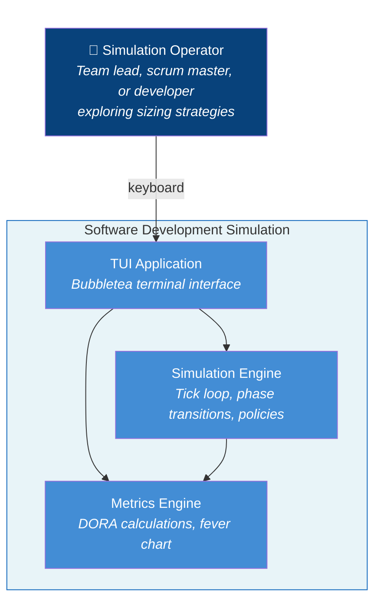

# Use Cases

## System Scope

**System Name:** Software Development Simulation (sofdevsim)

### In Scope (the system)

- TUI application
- Simulation engine (tick loop, phase transitions)
- Ticket/developer/sprint management
- DORA metrics calculation
- Fever chart calculation
- Policy comparison

### Out of Scope (external)

- Real code repositories
- Actual CI/CD systems
- Persistent storage
- Multi-user access

---

## Actors

### Primary Actor

**Simulation Operator** - Person running the TUI to explore sizing strategies

### Secondary Actors

None (self-contained simulation, no external services)

### Stakeholders & Interests

| Stakeholder | Interest |
|-------------|----------|
| Team Lead | Wants data to justify sizing policy to management |
| Scrum Master | Wants to understand buffer consumption patterns |
| Developer | Wants to see how understanding level affects outcomes |
| Researcher | Wants reproducible experiments (same seed = same results) |

---

## System-in-Use Stories

### Story 1: The Skeptical Team Lead

> Jordan, a software team lead skeptical of "story points," launches the simulation during lunch. They generate a backlog of 12 tickets with mixed understanding levels, assign the top three to their virtual team, and start a sprint. As the simulation runs, Jordan notices a "Low Understanding" ticket causing the fever chart to turn yellow—buffer consumption is spiking. They pause, decompose the risky ticket into smaller pieces, and resume. At sprint end, Jordan switches to the Metrics view to check lead time trends. Wanting to test their hypothesis that understanding matters more than size, Jordan presses 'c' to run a comparison: same backlog, same team, DORA-Strict vs TameFlow-Cognitive. The results show TameFlow won on 3 of 4 metrics. Jordan screenshots this for tomorrow's retro. They realize decomposing by *uncertainty* rather than *size* would have prevented the buffer blowout.

### Story 2: The Process Experimenter

> Sam, a new engineering manager, inherits a team that estimates in t-shirt sizes. They run the simulation with PolicyNone to see what unmanaged flow looks like—lead times are all over the place. Then they try DORA-Strict (decompose anything >5 days) and see improvement. Finally, TameFlow-Cognitive (decompose low-understanding tickets) produces the best MTTR. Sam runs 10 comparisons with different seeds to confirm the pattern holds. They now have data to propose a "spike first, then estimate" policy.

---

## Actor-Goal List

**Primary Actor:** Simulation Operator

| # | Goal | Level | "Lunch Test" | Stakeholder Interest |
|---|------|-------|--------------|---------------------|
| 1 | Run a simulation sprint | Blue | Yes - complete sprint, see results | All - core capability |
| 2 | Compare sizing policies (A/B test) | Blue | Yes - get comparison results | Team Lead - justify decisions |
| 3 | View DORA metrics trends | Blue | Yes - understand performance | Scrum Master - track improvement |
| 4 | Monitor buffer consumption | Blue | Yes - know if sprint is at risk | Scrum Master - early warning |
| 5 | Decompose risky tickets | Blue | Yes - reduce uncertainty | Developer - manageable chunks |
| 6 | Assign tickets to developers | Blue | Yes - sprint is planned | All - start work |
| 7 | Adjust simulation speed | Indigo | No - part of running | - |
| 8 | Switch between views | Indigo | No - navigation | - |
| 9 | Change sizing policy | Indigo | No - configuration | - |
| 10 | Pause/resume simulation | Indigo | No - control | - |

**Use Cases Written:** Goals 1-6 (Blue level)

---

## Use Cases

### UC1: Run a Simulation Sprint

**Primary Actor:** Simulation Operator

**Goal in Context:** Complete a sprint to observe how tickets flow through the 8-phase workflow and see resulting metrics.

**Scope:** Software Development Simulation

**Level:** User Goal (Blue)

**Main Success Scenario:**

1. Operator views backlog in Planning view
2. Operator assigns tickets to developers
3. Operator starts sprint
4. System simulates work (tick loop advances)
5. System displays progress in Execution view
6. Sprint completes when duration reached
7. Operator reviews results in Metrics view

**Extensions:**

- 2a. *No idle developers:* System shows all developers as busy; operator waits or adjusts
- 4a. *Ticket variance causes delay:* Fever chart turns yellow/red; operator may pause and decompose
- 4b. *Incident generated:* Event appears in log; MTTR tracking begins
- 6a. *Sprint ends with incomplete work:* Tickets remain in ActiveTickets; carry over to next sprint

---

### UC2: Compare Sizing Policies

**Primary Actor:** Simulation Operator

**Goal in Context:** Run the same scenario under DORA-Strict and TameFlow-Cognitive policies to determine which produces better DORA metrics.

**Scope:** Software Development Simulation

**Level:** User Goal (Blue)

**Main Success Scenario:**

1. Operator presses 'c' to initiate comparison
2. System generates fresh backlog with current seed
3. System runs 3 sprints with DORA-Strict policy
4. System runs 3 sprints with TameFlow-Cognitive policy (same seed)
5. System displays comparison results showing metrics for each policy
6. Operator identifies winning policy based on DORA metrics
7. System provides experiment insight explaining why winner performed better

**Extensions:**

- 5a. *Tie on metrics:* System shows "TIE" with suggestion to run more sprints
- 6a. *Operator wants different seed:* Press 'c' again for new comparison with fresh seed

---

### UC3: View DORA Metrics Trends

**Primary Actor:** Simulation Operator

**Goal in Context:** Understand team performance over time by viewing the four DORA metrics with historical trends.

**Scope:** Software Development Simulation

**Level:** User Goal (Blue)

**Main Success Scenario:**

1. Operator switches to Metrics view (Tab key)
2. System displays four DORA metrics with current values
3. System displays sparkline trends for each metric
4. Operator identifies improving or degrading trends
5. Operator correlates trends with policy changes or ticket mix

**Extensions:**

- 2a. *No completed tickets yet:* Metrics show zero values; sparklines show flat line

---

### UC4: Monitor Buffer Consumption

**Primary Actor:** Simulation Operator

**Goal in Context:** Track sprint buffer consumption to identify at-risk sprints early and take corrective action.

**Scope:** Software Development Simulation

**Level:** User Goal (Blue)

**Main Success Scenario:**

1. Operator observes fever chart in Execution view during active sprint
2. System shows buffer percentage used with color indicator
3. System displays remaining buffer days
4. Operator identifies sprint health (Green = on track, Yellow = at risk, Red = over budget)
5. If at risk, operator takes corrective action (decompose, reassign)

**Extensions:**

- 2a. *Buffer exceeds 100%:* Red status indicates sprint will likely miss commitment
- 4a. *No risk identified:* Operator continues observing; no action needed

---

### UC5: Decompose Risky Tickets

**Primary Actor:** Simulation Operator

**Goal in Context:** Break down a large or uncertain ticket into smaller, more predictable pieces before committing to sprint work.

**Scope:** Software Development Simulation

**Level:** User Goal (Blue)

**Main Success Scenario:**

1. Operator selects ticket in backlog (j/k or arrow keys)
2. Operator requests decomposition (d key)
3. System splits ticket into 2-4 children
4. Children appear in backlog with potentially improved understanding
5. Original ticket is replaced by children
6. Operator assigns children to developers

**Extensions:**

- 2a. *Policy says don't decompose:* System performs decomposition anyway (manual override)
- 3a. *Ticket already small and understood:* Decomposition still works but benefit is minimal
- 4a. *Understanding improves:* 60% chance each child has better understanding than parent

---

### UC6: Assign Tickets to Developers

**Primary Actor:** Simulation Operator

**Goal in Context:** Assign a ticket from the backlog to an available developer so work can begin.

**Scope:** Software Development Simulation

**Level:** User Goal (Blue)

**Main Success Scenario:**

1. Operator selects ticket in backlog (j/k or arrow keys)
2. Operator requests assignment (a key)
3. System finds first idle developer
4. System assigns ticket to developer
5. Ticket moves from Backlog to ActiveTickets
6. Developer status changes from idle to busy

**Extensions:**

- 3a. *No idle developers:* Assignment fails silently; all developers are busy
- 3b. *Multiple idle developers:* System assigns to first available (Alice, Bob, Carol order)

---

## Goal Level Reference

| Level | Name | Duration | Test |
|-------|------|----------|------|
| White | Strategic | Hours-months | Multiple user sessions to complete |
| Blue | User Goal | 2-20 min | "Can I go to lunch after?" |
| Indigo | Subfunction | Seconds | Part of another task, not standalone value |

*Based on Cockburn, Alistair. "Writing Effective Use Cases." Addison-Wesley, 2001.*
