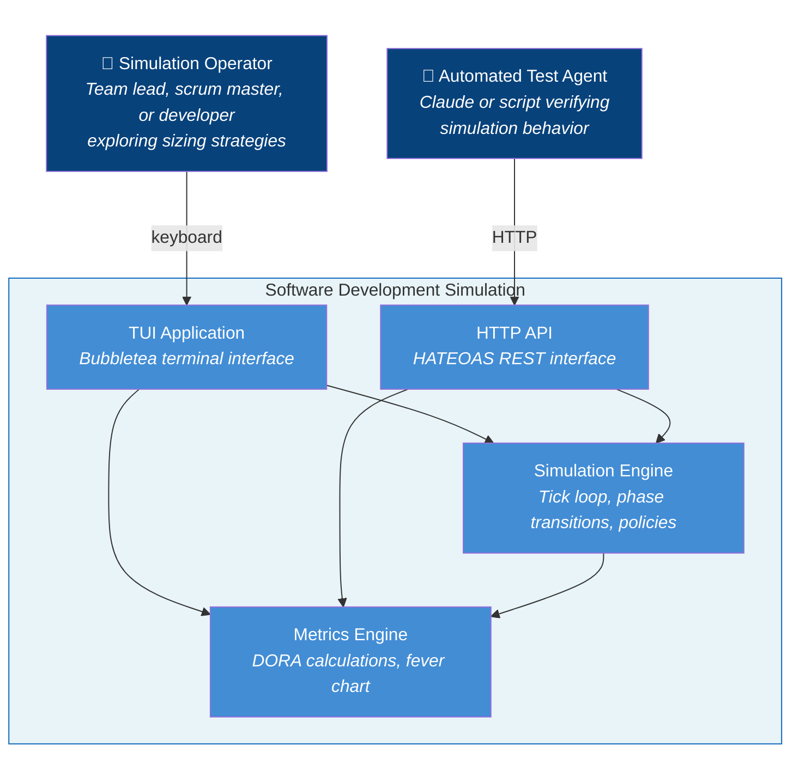

# Use Cases

## System Scope

**System Name:** Software Development Simulation (sofdevsim)

### In Scope (the system)

- TUI application
- HTTP API (HATEOAS REST interface)
- Simulation engine (tick loop, phase transitions)
- Ticket/developer/sprint management
- DORA metrics calculation
- Fever chart calculation
- Policy comparison

### Out of Scope (external)

- Real code repositories
- Actual CI/CD systems
- Multi-user access
- API authentication/authorization
- API rate limiting
- Persistent API state (simulations are in-memory only)

---

## Actors

### Primary Actors

**Simulation Operator** - Person running the TUI to explore sizing strategies

**Automated Test Agent** - Claude or script verifying simulation behavior via HTTP API

### Secondary Actors

None (self-contained simulation, no external services)

### Stakeholders & Interests

| Stakeholder | Interest |
|-------------|----------|
| Team Lead | Wants data to justify sizing policy to management |
| Scrum Master | Wants to understand buffer consumption patterns |
| Developer | Wants to see how understanding level affects outcomes |
| Researcher | Wants reproducible experiments (same seed = same results); wants exportable data to validate hypotheses statistically |
| Educator | Wants concrete data to teach TOC principles and demonstrate DORA metrics in action |
| Developer (Claude) | Wants to verify simulation fixes without manual TUI interaction |
| Human Developer | Wants to debug and explore simulation state via HTTP |

---

## System-in-Use Stories

### Story 1: The Skeptical Team Lead

> Jordan, a software team lead skeptical of "story points," launches the simulation during lunch. They generate a backlog of 12 tickets with mixed understanding levels, assign the top three to their virtual team, and start a sprint. As the simulation runs, Jordan notices a "Low Understanding" ticket causing the fever chart to turn yellow—buffer consumption is spiking. They pause, decompose the risky ticket into smaller pieces, and resume. At sprint end, Jordan switches to the Metrics view to check lead time trends. Wanting to test their hypothesis that understanding matters more than size, Jordan presses 'c' to run a comparison: same backlog, same team, DORA-Strict vs TameFlow-Cognitive. The results show TameFlow won on 3 of 4 metrics. Jordan screenshots this for tomorrow's retro. They realize decomposing by *uncertainty* rather than *size* would have prevented the buffer blowout.

### Story 2: The Process Experimenter

> Sam, a new engineering manager, inherits a team that estimates in t-shirt sizes. They run the simulation with PolicyNone to see what unmanaged flow looks like—lead times are all over the place. Then they try DORA-Strict (decompose anything >5 days) and see improvement. Finally, TameFlow-Cognitive (decompose low-understanding tickets) produces the best MTTR. Sam runs 10 comparisons with different seeds to confirm the pattern holds. They now have data to propose a "spike first, then estimate" policy.

### Story 3: The Data-Driven Researcher

> Pat, a process researcher at a consultancy, hypothesizes that TameFlow-Cognitive outperforms DORA-Strict. Pat runs 20 policy comparisons with different seeds, pressing 'e' after each to export. In R, Pat merges the CSVs, groups tickets by understanding level, and plots actual variance against the theoretical bounds (High ±5%, Medium ±20%, Low ±50%). The data shows 94% of tickets fell within expected ranges—validating the variance model. A t-test on lead times confirms TameFlow wins with p<0.01. Pat now has evidence, not just theory.

### Story 4: The TOC Educator

> Morgan, a Lean/TOC coach, uses the simulation to teach a workshop. After a simulated sprint, Morgan exports the data and projects the CSV. "Look at the buffer consumption column—see how Low-understanding tickets consumed 3x more buffer than High? That's the Theory of Constraints in action. The constraint isn't developer speed; it's uncertainty. Now look at the variance_ratio versus expected bounds—the model predicted this." The export transforms abstract theory into concrete, discussable data.

### Story 5: The Long-Running Experiment

> Pat, a process researcher, has been running a 50-sprint simulation comparing DORA-Strict vs TameFlow. After 3 hours, Pat needs to leave for a meeting. Pat presses 's' to save the simulation state, names it "tameflow-comparison-jan15", and closes the laptop. The next morning, Pat loads the state and continues from exactly where they left off—all 50 sprints of history intact, metrics preserved. Pat likes save/load because multi-hour experiments no longer require uninterrupted sessions.

### Story 6: The Automated Verifier

> Claude, verifying a fix to sprint-end behavior, sends a POST to `/simulations` to create a new simulation with seed 42. Claude then POSTs to `/simulations/{id}/sprints` to start a sprint, followed by repeated POSTs to `/simulations/{id}/tick` until the sprint ends. After each tick, Claude GETs `/simulations/{id}` to inspect state. When the sprint ends, Claude verifies that the tick link disappears from the response—the HATEOAS contract proves the sprint ended correctly. Claude likes this API because each response includes links to available actions, so there's no need to hardcode URL patterns—just follow the hypermedia.

### Story 7: The Collaborative Session

> Ted starts the TUI to explore a new sizing policy. Meanwhile, Claude (in a terminal session) wants to help operate the simulation while Ted watches. Claude GETs `/simulations` to discover what simulations exist—the response lists Ted's active simulation with its ID. Claude then GETs that simulation's state to see current tick, backlog, and available actions. Before starting the sprint, Claude assigns tickets to developers—POSTing to `/simulations/{id}/assignments` three times for the high-priority items. Each response includes the `assign` link since backlog still has tickets. Ted watches assignments appear in his TUI. Only after planning is complete does Claude POST to start the sprint. Ted sees the sprint begin and work commence. Ted likes this because Claude can drive the simulation while Ted observes patterns and asks questions. Claude likes sprint planning via API because it mirrors real planning—assign work *before* committing to the sprint.

---

## Actor-Goal List

**Primary Actor:** Simulation Operator

| # | Goal | Level | "Lunch Test" | Stakeholder Interest |
|---|------|-------|--------------|---------------------|
| 1 | Run a simulation sprint | Blue | Yes - complete sprint, see results | All - core capability |
| 2 | Compare sizing policies (A/B test) | Blue | Yes - get comparison results | Team Lead - justify decisions |
| 3 | View DORA metrics trends | Blue | Yes - understand performance | Scrum Master - track improvement |
| 4 | Monitor buffer consumption | Blue | Yes - know if sprint is at risk | Scrum Master - early warning |
| 5 | Decompose risky tickets | Blue | Yes - reduce uncertainty | Developer - manageable chunks |
| 6 | Assign tickets to developers | Blue | Yes - sprint is planned | All - start work |
| 7 | Adjust simulation speed | Indigo | No - part of running | - |
| 8 | Switch between views | Indigo | No - navigation | - |
| 9 | Change sizing policy | Indigo | No - configuration | - |
| 10 | Pause/resume simulation | Indigo | No - control | - |
| 11 | Export simulation data to CSV | Blue | Yes - have file for analysis | Researcher - validate hypotheses; Educator - teach with data |
| 12 | Save/load simulation state | Blue | Yes - can resume later | Researcher - long experiments; All - pause/resume workflow |

**Primary Actor:** Automated Test Agent (Claude or script)

| # | Goal | Level | "Lunch Test" | Stakeholder Interest |
|---|------|-------|--------------|---------------------|
| 13 | Discover active simulations | Blue | Yes - know what exists | Developer - connect to TUI simulation |
| 14 | Test simulation behavior programmatically | Blue | Yes - verification complete | Developer - verify fixes without TUI |
| 15 | Access shared simulation (TUI + API) | Blue | Yes - see same state from both | Developer - debug via API while TUI runs |
| 16 | Plan sprint via API | Blue | Yes - sprint is ready to begin | Scrum Master - proper planning workflow |
| 17 | Compare policies via API | Blue | Yes - know which policy wins | Developer - automated A/B testing |

**Use Cases Written:** Goals 1-12, 14-17 (Blue level)

---

## Use Cases

### UC1: Run a Simulation Sprint

**Primary Actor:** Simulation Operator

**Goal in Context:** Complete a sprint to observe how tickets flow through the 8-phase workflow and see resulting metrics.

**Scope:** Software Development Simulation

**Level:** User Goal (Blue)

**Main Success Scenario:**

1. Operator views backlog in Planning view
2. Operator assigns tickets to developers
3. Operator starts sprint
4. System simulates work (tick loop advances)
5. System displays progress in Execution view
6. Sprint ends when duration reached (system clears active sprint, auto-pauses)
7. Operator reviews results in Metrics view

**Extensions:**

- 2a. *No idle developers:* System shows all developers as busy; operator waits or adjusts
- 4a. *Ticket variance causes delay:* Fever chart turns yellow/red; operator may pause and decompose
- 4b. *Incident generated:* Event appears in log; MTTR tracking begins
- 6a. *Sprint ends with incomplete work:* Tickets remain in ActiveTickets; carry over to next sprint

---

### UC2: Compare Sizing Policies

**Primary Actor:** Simulation Operator

**Goal in Context:** Run the same scenario under DORA-Strict and TameFlow-Cognitive policies to determine which produces better DORA metrics.

**Scope:** Software Development Simulation

**Level:** User Goal (Blue)

**Main Success Scenario:**

1. Operator presses 'c' to initiate comparison
2. System generates fresh backlog with current seed
3. System runs 3 sprints with DORA-Strict policy
4. System runs 3 sprints with TameFlow-Cognitive policy (same seed)
5. System displays comparison results showing metrics for each policy
6. Operator identifies winning policy based on DORA metrics
7. System provides experiment insight explaining why winner performed better

**Extensions:**

- 5a. *Tie on metrics:* System shows "TIE" with suggestion to run more sprints
- 6a. *Operator wants different seed:* Press 'c' again for new comparison with fresh seed

**Technology & Data Variations:**

- TUI: Press 'c' key to initiate comparison
- API: See UC12 for automated comparison via API

---

### UC3: View DORA Metrics Trends

**Primary Actor:** Simulation Operator

**Goal in Context:** Understand team performance over time by viewing the four DORA metrics with historical trends.

**Scope:** Software Development Simulation

**Level:** User Goal (Blue)

**Main Success Scenario:**

1. Operator switches to Metrics view (Tab key)
2. System displays four DORA metrics with current values
3. System displays sparkline trends for each metric
4. Operator identifies improving or degrading trends
5. Operator correlates trends with policy changes or ticket mix

**Extensions:**

- 2a. *No completed tickets yet:* Metrics show zero values; sparklines show flat line

---

### UC4: Monitor Buffer Consumption

**Primary Actor:** Simulation Operator

**Goal in Context:** Track sprint buffer consumption to identify at-risk sprints early and take corrective action.

**Scope:** Software Development Simulation

**Level:** User Goal (Blue)

**Main Success Scenario:**

1. Operator observes fever chart in Execution view during active sprint
2. System shows buffer percentage used with color indicator
3. System displays remaining buffer days
4. Operator identifies sprint health (Green = on track, Yellow = at risk, Red = over budget)
5. If at risk, operator takes corrective action (decompose, reassign)

**Extensions:**

- 2a. *Buffer exceeds 100%:* Red status indicates sprint will likely miss commitment
- 4a. *No risk identified:* Operator continues observing; no action needed

---

### UC5: Decompose Risky Tickets

**Primary Actor:** Simulation Operator

**Goal in Context:** Break down a large or uncertain ticket into smaller, more predictable pieces before committing to sprint work.

**Scope:** Software Development Simulation

**Level:** User Goal (Blue)

**Main Success Scenario:**

1. Operator selects ticket in backlog (j/k or arrow keys)
2. Operator requests decomposition (d key)
3. System splits ticket into 2-4 children
4. Children appear in backlog with potentially improved understanding
5. Original ticket is replaced by children
6. Operator assigns children to developers

**Extensions:**

- 2a. *Policy says don't decompose:* System performs decomposition anyway (manual override)
- 3a. *Ticket already small and understood:* Decomposition still works but benefit is minimal
- 4a. *Understanding improves:* 60% chance each child has better understanding than parent

---

### UC6: Assign Tickets to Developers

**Primary Actor:** Simulation Operator / Automated Agent

**Goal in Context:** Assign a ticket from the backlog to an available developer so work can begin.

**Scope:** Software Development Simulation

**Level:** User Goal (Blue)

**Stakeholders and Interests:**

- *Operator:* Wants efficient assignment without memorizing developer names
- *Automated Agent:* Wants explicit control over which developer gets which ticket

**Preconditions:**

- Simulation exists with at least one ticket in backlog
- At least one developer exists in the simulation
- Sprint may or may not be active (assignment allowed in both states for sprint planning)

**Postconditions (Guarantees):**

- *Success:* Ticket assigned to developer, TicketAssigned event emitted
- *Failure:* No state change, error reported to actor

**Main Success Scenario:**

1. Actor selects a ticket from the backlog
2. Actor specifies target developer
3. System validates developer is idle
4. System assigns ticket to developer
5. Ticket moves from Backlog to ActiveTickets
6. Developer status changes from idle to busy
7. System emits TicketAssigned event

**Extensions:**

- 2a. *No developer specified:* System auto-assigns to first idle developer (Alice, Bob, Carol order)
- 3a. *Developer is busy:* System rejects assignment with error
- 3b. *No idle developers:* Assignment fails; all developers are busy
- 3c. *Ticket not in backlog:* System rejects with "ticket not found"

**Technology & Data Variations:**

- TUI: Navigate backlog with j/k, press 'a' to auto-assign selected ticket
- API: POST /simulations/{id}/assignments with ticketId and developerId
- API: `assign` link available whenever backlog has tickets (not just during active sprint)

---

### UC7: Export Simulation Data

**Primary Actor:** Simulation Operator

**Goal in Context:** Export simulation data to CSV files for external analysis, hypothesis validation, or teaching demonstrations.

**Scope:** Software Development Simulation

**Level:** User Goal (Blue)

**Main Success Scenario:**

1. Operator runs simulation (completes sprints or comparison)
2. Operator presses 'e' to export
3. System creates timestamped export directory
4. System writes CSV files (metadata, tickets, sprints, incidents, metrics, comparison if applicable)
5. System confirms export with path and row counts
6. Operator analyzes data in external tool (spreadsheet, R, Python)

**Extensions:**

- 2a. *No completed tickets:* System shows "Nothing to export" message; no files created
- 3a. *Export directory exists:* System appends sequence number to directory name
- 4a. *No comparison run:* System omits comparison.csv; notes in confirmation message
- 5a. *Write error:* System shows error message with path attempted

---

### UC8: Save/Load Simulation State

**Primary Actor:** Simulation Operator

**Goal in Context:** Persist simulation state to disk so work can be paused and resumed across sessions.

**Scope:** Software Development Simulation

**Level:** User Goal (Blue)

**Main Success Scenario (Save):**

1. Operator requests save (Ctrl+s)
2. System generates save name from seed and timestamp
3. System serializes full state (simulation + metrics + history)
4. System writes versioned file to saves directory
5. System confirms save with path

**Main Success Scenario (Load):**

1. Operator requests load (Ctrl+o)
2. System finds most recent save file
3. System reads and deserializes state
4. System validates schema version, migrates if needed
5. System restores simulation to saved state
6. Operator continues from saved point

**Extensions:**

- 3a. *Serialization fails:* System shows error; no file written
- 4a. *Save directory doesn't exist:* System creates it
- 5a. *Schema version mismatch:* System runs migration chain
- 5b. *Unknown future version:* System shows "upgrade required" error
- 6a. *Corrupted file:* System shows validation error; no state change

---

### UC9: Test Simulation Behavior Programmatically

**Primary Actor:** Automated Test Agent (Claude or script)

**Goal in Context:** Execute simulation scenarios and verify outcomes programmatically, enabling automated verification of simulation behavior without manual TUI interaction.

**Scope:** Software Development Simulation

**Level:** User Goal (Blue)

**Main Success Scenario:**

1. Agent creates a new simulation via POST (specifying seed)
2. System returns simulation resource with links to available actions
3. Agent starts a sprint via the provided start-sprint link
4. System returns updated state with tick link available
5. Agent advances simulation via tick link
6. System returns events and updated state
7. Agent inspects state to verify expected outcomes
8. Agent verifies HATEOAS links match expected state (e.g., tick link absent after sprint ends)

**Extensions:**

- 1a. *Invalid configuration:* System returns 400 with problem details
- 5a. *Sprint ends:* System clears sprint, tick link disappears, start-sprint link appears
- 5b. *Ticket completes:* Event included in response
- 7a. *Verification fails:* Agent reports test failure (external to system)

---

### UC10: Shared Simulation via Events

**Primary Actor:** Simulation Operator / Automated Test Agent

**Goal in Context:** Access and interact with the same simulation from both TUI and API, with changes visible to both in real-time.

**Scope:** Software Development Simulation

**Level:** User Goal (Blue)

**Stakeholders and Interests:**

- *Operator:* Wants to watch simulation while collaborator operates it
- *Automated Agent:* Wants to discover and connect to existing simulation without asking for ID

**Preconditions:**

- API server running (started with TUI or standalone)

**Postconditions (Guarantees):**

- *Success:* Both TUI and API see consistent state; changes from either are visible to both
- *Failure:* No state corruption; API returns error, TUI continues operating

**Main Success Scenario:**

1. Operator starts simulation in TUI
2. API client lists active simulations to discover available IDs
3. API client selects simulation and gets current state
4. API client advances tick via POST
5. TUI receives event notification and updates display
6. Operator views updated state in TUI
7. Operator assigns ticket via TUI
8. API client sees assignment reflected in next GET

**Extensions:**

- 2a. *No simulations exist:* API returns empty list; client creates new simulation via POST
- 3a. *Simulation not found:* API returns 404; client refreshes list
- 5a. *TUI disconnected:* Events queued; TUI catches up on reconnect
- 7a. *Conflicting action:* Event ordering resolves conflict (last write wins within tick)

**Technology & Data Variations:**

- API: GET /simulations returns list of active simulation IDs
- API: GET /simulations/{id} returns full state with HATEOAS links

**Technical Notes:**

This use case requires event sourcing architecture:
- Single event stream per simulation
- TUI and API both subscribe to events
- Each maintains projection of current state
- Events are the source of truth

---

### UC11: Plan Sprint via API

**Primary Actor:** Automated Test Agent (Claude or script)

**Goal in Context:** Assign tickets to developers before starting a sprint, enabling proper sprint planning workflow via API.

**Scope:** Software Development Simulation

**Level:** User Goal (Blue)

**Preconditions:**

- Simulation exists with tickets in backlog (backlog size always exceeds developer count)
- At least one developer exists
- Sprint may or may not be active (assignment allowed in both states per UC6)

**Postconditions (Guarantees):**

- *Success:* All developers have tickets assigned, sprint started, work begins immediately
- *Failure:* No state change, error reported to agent

**Main Success Scenario:**

1. Agent gets simulation state via GET
2. System returns state with `assign` and `start-sprint` links (backlog has tickets)
3. Agent assigns ticket to developer via POST to `assign` link
4. System returns updated state; `assign` link remains while backlog has unassigned tickets
5. Agent repeats steps 3-4 for each planned ticket
6. Agent starts sprint via POST to `start-sprint` link
7. System returns state with `tick` link; sprint is now active
8. Assigned tickets begin processing

**Extensions:**

- 3a. *Developer busy:* System returns 400; agent selects different developer
- 3b. *No idle developers:* All developers assigned; agent proceeds to step 6
- 4a. *Backlog empty after assignments:* `assign` link disappears; agent proceeds to step 6
- 6a. *Idle developers remain:* Agent continues assigning (step 3) until all developers have work

**Technology & Data Variations:**

- POST /simulations/{id}/assignments with `{"ticketId": "TKT-001", "developerId": "dev-1"}`
- POST /simulations/{id}/sprints to start sprint

---

### UC12: Compare Policies via API

**Primary Actor:** Automated Test Agent (Claude or script)

**Goal in Context:** Run identical simulations under two policies to determine which produces better DORA metrics.

**Scope:** Software Development Simulation

**Level:** User Goal (Blue)

**Preconditions:**

- API server running

**Postconditions (Guarantees):**

- *Success:* Comparison complete, per-metric and overall winners identified
- *Failure:* Error returned, no state change

**Main Success Scenario:**

1. Agent POSTs to `/comparisons` with seed and sprint count
2. System creates two internal simulations (DORA-Strict, TameFlow-Cognitive)
3. System runs N sprints on each with auto-assignment
4. System computes DORA metrics for each
5. System returns `ComparisonResult` with winners

**Extensions:**

- 1a. *Invalid sprint count:* System returns 400
- 3a. *Simulation error:* System returns 500

**Technology & Data Variations:**

- Entry point `/` includes `comparisons` link for HATEOAS discovery
- `POST /comparisons` with `{"seed": 12345, "sprints": 3}` (blocking, synchronous)
- Response includes `ComparisonResult` per `metrics/comparison.go:8-26`

**Note:** This is a top-level resource (`/comparisons`), not a sub-resource of `/simulations/{id}`, because comparison creates two new internal simulations rather than modifying an existing one.

---

## Goal Level Reference

| Level | Name | Duration | Test |
|-------|------|----------|------|
| White | Strategic | Hours-months | Multiple user sessions to complete |
| Blue | User Goal | 2-20 min | "Can I go to lunch after?" |
| Indigo | Subfunction | Seconds | Part of another task, not standalone value |

*Based on Cockburn, Alistair. "Writing Effective Use Cases." Addison-Wesley, 2001.*
